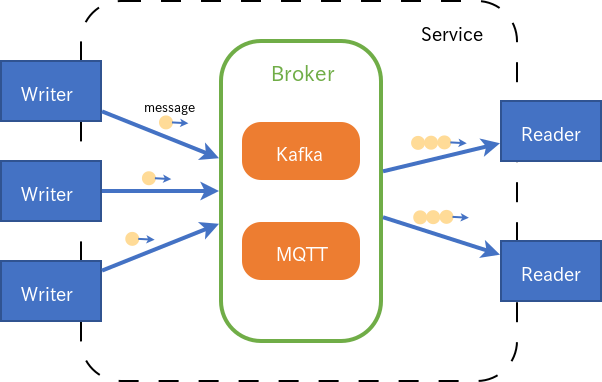

<!--
Copyright (C) 2019-2021 National Institute of Informatics

Licensed to the Apache Software Foundation (ASF) under one
or more contributor license agreements.  See the NOTICE file
distributed with this work for additional information
regarding copyright ownership.  The ASF licenses this file
to you under the Apache License, Version 2.0 (the
"License"); you may not use this file except in compliance
with the License.  You may obtain a copy of the License at

  http://www.apache.org/licenses/LICENSE-2.0

Unless required by applicable law or agreed to in writing,
software distributed under the License is distributed on an
"AS IS" BASIS, WITHOUT WARRANTIES OR CONDITIONS OF ANY
KIND, either express or implied.  See the License for the
specific language governing permissions and limitations
under the License.
-->

[English](README.en.md)

## リンク

* チュートリアル
    * [クイックスタートガイド (Python/Java版)](docs/tutorial/index.md)
    * [クイックスタートガイド (Android版)](docs/tutorial-android/index.md)
* [ユーザガイド](docs/userguide/index.md)
* [SINETStream性能測定結果](docs/performance/index.md)
* [プラグイン開発ガイド](docs/developer_guide/index.md)
* [SINETStreamサーバ構築手順](server/brokers/index.md)
* コンフィグサーバー
    * [github](https://github.com/nii-gakunin-cloud/sinetstream-config-server)
    * [manual](http://manual.config-server.sinetstream.net/manual/docs/home/index.html)
* ブリッジ
    * [github](https://github.com/nii-gakunin-cloud/sinetstream-bridge)
* [更新履歴](CHANGELOG.md)

## メッセージングシステムの概念

SINETStreamは
[トピックベースのPublish/Subscribeモデル](https://ja.wikipedia.org/wiki/%E5%87%BA%E7%89%88-%E8%B3%BC%E8%AA%AD%E5%9E%8B%E3%83%A2%E3%83%87%E3%83%AB)
のメッセージングシステムである。
Brokerを実現するバックエンドのメッセージングシステムとしてKafkaまたはMQTTを利用している。

SINETStreamではPublisherを`Writer`と呼び、Subscriberを`Reader`と呼ぶ。

Brokerの構成情報やBrokerとの通信パラメータをまとめたものをSINETStreamではサービスと呼ぶ。
WriterやReaderはサービスを指定するだけでブローカーに接続してメッセージの送受信ができる。

トピックとはブローカーにおける論理的なチャンネルであり、
Writer/Readerはトピックを指定してメッセージの送受信を行うことで異なる種類のメッセージ配信を1つのブローカー上で行える。

## ファイル構成

* [README.md](README.md)
    * このファイル
* python/
    * [README.md](python/README.md)
        * Python版SINETStreamのビルド手順
    * src/
        * Python版SINETStreamの共通部分
    * plugins/
        * broker/
            * kafka/
                * Python版SINETStreamのKafka固有部分
            * mqtt/
                * Python版SINETStreamのMQTT固有部分
            * s3/
                * Python版SINETStreamのS3固有部分
        * value_type/
            * image/
                * 画像メッセージのサポート
        * compression/
            * lz4/
                * LZ4圧縮のサンプル実装
    * sample/
        * サンプルプログラム
* java/
    * [README.md](java/README.md)
        * Java版SINETStreamのビルド手順
    * api/
        * Java版SINETStreamの共通部分
    * plugin-kafka/
        * Java版SINETStreamのKafka固有部分
    * plugin-mqtt/
        * Java版SINETStreamのMQTT固有部分
    * plugin-s3/
        * Java版SINETStreamのs3固有部分
    * plugin-type-image/
        * 画像メッセージのサポート
    * plugin-comp-lz4/
        * LZ4圧縮のサンプル実装
    * sample/
        * サンプルプログラム
* docs/
    * userguide/
        * [ユーザガイド](docs/userguide/index.md)
    * tutorial/
        * [クイックスタートガイド(Python/Java版)](docs/tutorial/index.md)
        * [クイックスタートガイド(Android版)](docs/tutorial-android/index.md)
    * developer_guide/
        * [開発者ガイド](docs/developer_guide/index.md)

## 動作環境
### Python/Java版

Python/Java版の`SINETStream API`は、以下のプログラム言語で実装される。

* Python 3.9以降
* Java 11

Python/Java版の`SINETStream API`は、以下のメッセージングシステムに対応する。

* [Apache Kafka](https://kafka.apache.org/) 3.8
* MQTT v3.1, v3.1.1, v5.0
    * [Eclipse Mosquitto](https://mosquitto.org/) v2.0.15
* S3
    * AWS S3
    * [MinIO](https://min.io/)

### Android版

Android版の`SINETStream API`は、以下のプログラム言語で実装される。

* Java 11
* Kotlin 1.7.10

Android版の`SINETStream API`は、以下のメッセージングシステムに対応する。

* MQTT v3.1, v3.1.1
    * [Eclipse Paho Android Client](https://www.eclipse.org/paho/index.php?page=clients/android/index.php)

> <em>注意</em> 
> `Eclipse Paho Android Client`プロジェクトのGitHubリポジトリ[eclipse/paho.mqtt.android](https://github.com/eclipse/paho.mqtt.android)
> は何年も放置状態となっている。
> Android 12で導入された[システム挙動変更](https://developer.android.com/about/versions/12/behavior-changes-12?hl=ja#pending-intent-mutability)
> の影響により、Android 12以降の環境で`Paho`のライブラリを使うと実行時エラーが発生する。
> 有志が上記GitHubに修正パッチを投稿しているが一向に反映されないため、
> `SINETStream`プロジェクトで独自に改修した版`PahoMqttAndroid-bugfix`を使うことにする。

Android版の`SINETStream API`が対応するOS条件は以下の通り。

* Android 8.0 (API level 26) 以降

> この制約条件は`SINETStreamメッセージ`の「シリアライザ／デシリアライザ」
> 機能で用いる`Apache Avro`ライブラリの[実装上の都合](https://www.mail-archive.com/dev@avro.apache.org/msg24138.html)に依るものである。

## 準備
### Python/Java版

SINETStreamでは、Brokerを実現するバックエンドのメッセージングシステムとしてKafkaまたはMQTTを利用している。
そのため、SINETStreamとともに、これらのメッセージングシステムのどちらかをインストールする必要がある。
チュートリアルパッケージでは、Dockerコンテナを利用して必要なソフトウェア一式（SINETStream, Kafka, MQTT）をインストールする方法を用意している。

1. Kafkaブローカーの設定
    * [Kafka Quickstart](https://kafka.apache.org/quickstart)
1. MQTTブローカーの設定
    * [Eclipse Mosquitto: Installing](https://github.com/eclipse/mosquitto#installing)
    * [Eclipse Mosquitto: Quick start](https://github.com/eclipse/mosquitto#quick-start)
1. SINETStreamのインストール
    * Python: `pip3 install --user sinetstream-kafka sinetstream-mqtt`
    * Java: Java版READMEを参照

Dockerコンテナをつかった
[クイックスタートガイド (Python/Java版)](docs/tutorial/index.md)
も参考のこと。

### Android版

Android版の`SINETStream API`は、メッセージングシステムのうちMQTTのみに対応し、
クライアント機能（`Writer`、`Reader`）を提供する。
このため、Android版のSINETStreamクライアントと対向するバックエンド側の`Broker`はMQTT一択となる。
上記Python/Java版の記述内容に沿って導入したバックエンドに関して、
MQTTブローカー部分をAndroid対向用に流用することで構わない。

Dockerコンテナをつかった
[クイックスタートガイド (Android版)](docs/tutorial-android/index.md)
も参考のこと。

## ライセンス

[Apache License, Version 2.0](https://www.apache.org/licenses/LICENSE-2.0).
