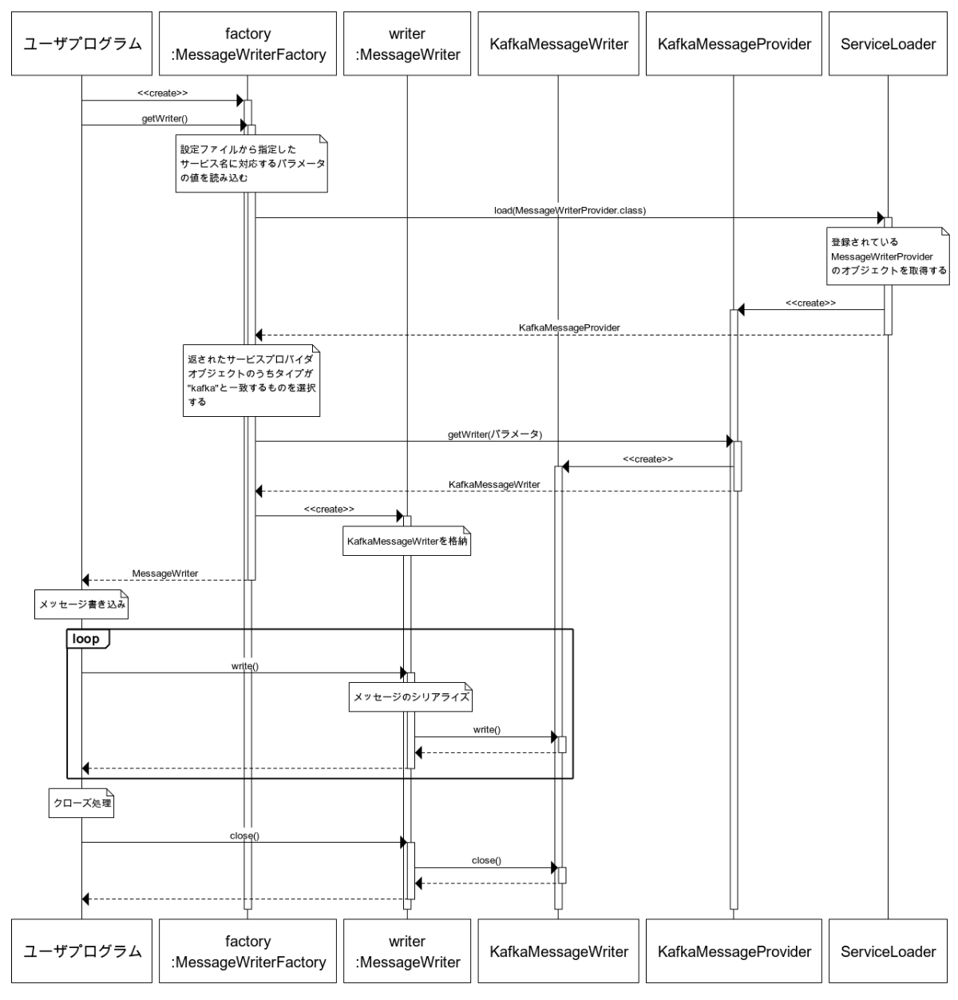

<!--
Copyright (C) 2020 National Institute of Informatics

Licensed to the Apache Software Foundation (ASF) under one
or more contributor license agreements.  See the NOTICE file
distributed with this work for additional information
regarding copyright ownership.  The ASF licenses this file
to you under the Apache License, Version 2.0 (the
"License"); you may not use this file except in compliance
with the License.  You may obtain a copy of the License at

  http://www.apache.org/licenses/LICENSE-2.0

Unless required by applicable law or agreed to in writing,
software distributed under the License is distributed on an
"AS IS" BASIS, WITHOUT WARRANTIES OR CONDITIONS OF ANY
KIND, either express or implied.  See the License for the
specific language governing permissions and limitations
under the License.
--->

# Developer Guide for Java messaging system plugin

This section describes the procedure for developing a Java plug-in to support a new messaging system with SINETStream.

## 1. Introduction

SINETStream v1.1 supports the following messaging systems:

* [Apache Kafka](https://kafka.apache.org/)
* [MQTT](http://mqtt.org/)

In order to use the above messaging systems via SINETStream, we have developed plugins, which implement SINETStream Service Provider Interface (SPI).
Another messaging systems can be used via SINETStream by developing a new plugin for each target system.

This document describes the steps to develop a plugin to support a new messaging system.

### 1.1 Target readers

Target readers of this document are as follows:

* A developer who wants to use a new messaging system via SINETStream.
* A developer who wants to know details of the SINETStream software.

### 1.2 Prerequisite knowledge

This document assumes that readers have the following knowledge:

* Java 8 
* How to use [ServiceLoader](https://docs.oracle.com/javase/jp/8/docs/api/java/util/ServiceLoader.html)
* How to use Java API and a configuration file of SINETStream.

## 2. The software architecture of SINETStream.

Before describing the procedure for developing a plugin, the software architecture of SINETStream required for development will be explained.

### 2.1 Module configuration

SINETStream module configuration is shown in the following figure:


The part shown in blue indicates the SINETStream modules which provide common functions that are independent of each messaging system.
The part indicated by the green frames show the SINET Stream plugins.
All of operations to each messaging system are called via its plugin implementing the SPI.

Below is a brief description of each module.

* Main components of SINETStream
    * API
        *
        * Defines the interface between an application program and SINETStream as a library.
    * SPI
        * Defines the interface between SINETStream and messaging system plugins.
    * Serializer
        * Convert the object received via the API into a byte array.
    * Deserializer
        * Convert the byte array received from a messaging system (via the SPI) into an object.
    * Metadata Inserter
        * Inserts metadata to a message.
        * Timestamp when message sends is inserted as metadata in SINETStream v1.1.
    * Metadata Extractor
        * Extracts metadata from a message.
    * Encryptor
        * Encrypts a message.
    * Decryptor
        * Decrypts an encrypted message. 
    * Configuration File Reader
        * Reads parameters written in a SINETStream configuration file.
    * Plugin Manager
        * Manages SINETStream plugins.
* Plugin
    * Kafka Plugin
        * Sends / receives messages to / from Kafka brokers.
        * Kafka plugin calls [Producer](https://kafka.apache.org/24/javadoc/index.html?org/apache/kafka/clients/producer/KafkaProducer.html) and [Consumer](https://kafka.apache.org/24/javadoc/index.html?org/apache/kafka/clients/consumer/KafkaConsumer.html) API of Apache Kafka in the plugin code.
    * MQTT Plugin
        * Sends / receives messages to / from MQTT brokers.
        * MQTT plugin calls [Eclipse Paho](https://www.eclipse.org/paho/clients/java/) API in the plugin code.

### 2.2 Process Sequence

We explain process sequences using MessageReader and MesageWriter classes that receives and sends a message via SINETStream.

#### 2.2.1 MessageReader

We show the sequence diagram when the following message reception program is executed.
Here we assume that the program receives messages from Kafka brokers.

```java
MessageReaderFactory<String> factory =
    MessageReaderFactory.<String>builder()
            .service("kafka-service")
            .build();

try (MessageReader<String> reader = factory.getReader()) {
    Message<String> msg;
    while (Objects.nonNull(msg = reader.read())) {
        System.out.print(msg.getValue());
    }
}
```


XXX 英語版の図が必要

Below is a brief description of the classes in the figure.

* User program
    * An application program which uses SINETStream.
* MessageReaderFactory
    * A factory class of `MessageReader`.
* MessageReader
    * An interface class that provides the SINETStream message reader API for user programs.
* KafkaMessageReader
    * A Kafka plugin class to receive messages from Kafka brokers.
* KafkaMessageProvider
    * Kafkaのサービスクラス
    * A common service class of Kafka.  (XXX これはPlugin内で定義されたclass??)
* ServiceLoader
    * Loads registered services.

#### 2.2.2 MessageWriter

We show the sequence diagram when the following message transmission program is executed.
Here we assume that the program sends messages to Kafka brokers.

```java
MessageWriterFactory<String> factory =
    MessageWriterFactory.<String>builder()
            .service("kafka-service")
            .build();

try (MessageWriter<String> writer = factory.getWriter()) {
    for (String msg : messages) {
        writer.write(msg);
    }
}
```


XXX 英語版の図が必要

Below is a brief description of the classes in the figure.

* User program
    * An application program which uses SINETStream.
* MessageWriterFactory
    * A factory class of `MessageWriter`.
* MessageWriter
    * An interface class of SINETStream that sends messages to brokers.
* KafkaMessageWriter
    * A Kafka plugin class to provide the SINETStream message writer API to a user program.
* KafkaMessageProvider
    * A common service class of Kafka.
* ServiceLoader
    * Loads registered services.

#### 2.2.3 AsyncMessageReader

以下に示す非同期APIのメッセージ受信処理を SINETStreamで行った場合のシーケンス図を示します。
ここではKafkaブローカーからメッセージを受信することを想定しています。

```java
MessageReaderFactory<String> factory =
    MessageReaderFactory.<String>builder()
            .service("kafka-service")
            .build();

try (AsyncMessageReader<String> reader = factory.getAsyncReader()) {
    reader.addOnMessageCallback((message) -> {
        System.out.print(msg.getValue());
    });

    // 他の処理
    otherTask();
}
```


図中のクラスについての簡単な説明を以下に記します。

* ユーザプログラム
    * SINETStreamを利用するユーザプログラム
* MessageReaderFactory
    * `AsyncMessageReader`のファクトリクラス
* AsyncMessageReader
    * ユーザプログラムに対して、SINETStreamの非同期メッセージ受信APIを提供するインタフェース
* KafkaAsyncMessageReader
    * Kafkaブローカーからメッセージを非同期受信するKafkaプラグインのクラス
* KafkaMessageProvider
    * Kafkaのサービスクラス
* ServiceLoader
    * 登録されているサービスをロードする

#### 2.2.4 AsyncMessageWriter

以下に示す非同期APIのメッセージ送信処理を SINETStreamで行った場合のシーケンス図を示します。
ここではKafkaブローカーにメッセージを送信することを想定しています。

```java
MessageWriterFactory<String> factory =
    MessageWriterFactory.<String>builder()
            .service("kafka-service")
            .build();

try (AsyncMessageWriter<String> writer = factory.getAsyncWriter()) {
    for (String msg : messages) {
        writer.write(msg)
            .then(r -> System.err.println("success"));
    }
}
```


図中のクラスについての簡単な説明を以下に記します。

* ユーザプログラム
    * SINETStreamを利用するユーザプログラム
* MessageWriterFactory
    * `MessageWriter`のファクトリクラス
* AsyncMessageWriter
    * ブローカーにメッセージを非同期で送信するSINETStreamのクラス
* KafkaMessageWriter
    * ユーザプログラムに対して、SINETStreamの非同期メッセージ送信APIを提供するインタフェース
* KafkaMessageProvider
    * Kafkaのサービスクラス
* ServiceLoader
    * 登録されているサービスをロードする

## 3. How to implement a plugin

### 3.1 Outline

SINETStream users can use a plugin using [ServiceLoader](https://docs.oracle.com/javase/jp/8/docs/api/java/util/ServiceLoader.html).
The following steps are required to develop a plugin.

* Create a provider configuration file.
* Implement service providers. (XXX 複数形でよい？)

Details of each step are described below.

### 3.2 Create a provider configuration file

Registering service providers in the provider configuration file allows ServiceLoader to find the plug-in.

Place the provider configuration file in `META-INF/services/` in the resource directory. 
The file name must be the service provider's fully qualified class name. 
In the case of service providers that support SINETStream message reception and transmission, the file names are as follows:

* A service provider to receive messages (sync API)
    * `jp.ad.sinet.stream.spi.MessageReaderProvider`
* A service provider to send messages (sync API)
    * `jp.ad.sinet.stream.spi.MessageWriterProvider`
* A service provider to receive messages (async API)
    * `jp.ad.sinet.stream.spi.AsyncMessageReaderProvider`
* A service provider to send messages (async API)
    * `jp.ad.sinet.stream.spi.AsyncMessageWriterProvider`

In the configuration file, the fully qualified class name of the implemented service provider class is described in the one-class-per-line manner.

For example, when you register the `jp.ad.sinet.stream.plugins.kafka.KafkaMessageProvider` class that sends messages to Kafka brokers, you need to create the configuration file `META-INF/services/jp.ad.sinet.stream.spi.MessageWriterProvider` and describe the following contents in the file.

```
jp.ad.sinet.stream.plugins.kafka.KafkaMessageProvider
```

SINETStreamには４つのサービスプロバイダがありますが、１つのプラグインで全てのサービスプロバイダに対応する必要はありません。
サポートするものに対応する構成ファイルのみを作成してください。
XXX

### 3.3 Implement service providers

#### 3.3.1 Service provider class to send messages (sync API)

To develop a service provider to send messages (sync API),
it is necessary to create an implementation class of the following interface class.

* `jp.ad.sinet.stream.spi.MessageWriterProvider`
    * Service provider interface.
* `jp.ad.sinet.stream.spi.PluginMessageWriter`
    * Interface to send messages.

The methods of `MessageWriterProvider` are described as follows:

* `PluginMessageWriter getWriter(WriterParameters params)`
    * Returns a Writer class that performs sending processing specific to the messaging system.
    * XXX NEW: 引数の`params`を通してSINETStreamの設定ファイルまたはファクトリクラス`MessageWriterFactory`で設定したパラメータが渡される
    * XXX OLD: 引数のparamsを通してSINETStreamの設定ファイルまたはMessageWriterのコンストラクタで設定したパラメータが渡される
    * XXX OLD: Received parameters described in the SINETStream configuration file or defined by the constructor of MessageWriter.
* `String getType()`
    * Returns the name of the messaging system type.
    * The processing specific to the messaging system is processed by each plugin in which the value returned by this method matches the value specified for `type` in the configuration file.

The main methods of `PluginMessageWriter` are shown below.

* `void write(byte[] message)`
    * Sends a message to brokers.
* `void close()`
    * Closes the connection with brokers.

#### 3.3.2 Service provider class to receive messages (sync API)

To develop a service provider to receive messages,
it is necessary to create an implementation class of the following interface class.

* `jp.ad.sinet.stream.spi.MessageReaderProvider`
    * Returns a Reader class that performs receiving processing specific to the messaging system.
* `jp.ad.sinet.stream.spi.PluginMessageReader`
    * Interface to receive messages.

The methods of `MessageReaderProvider` are described as follows:

* `PluginMessageReader getReader(ReaderParameters params)`
    * Returns a Reader class that performs receiving processing specific to the messaging system.
    * XXX NEW: 引数の`params`を通してSINETStreamの設定ファイルまたはファクトリクラス`MessageReaderFactory`で設定したパラメータが渡される
    * XXX OLD: 引数のparamsを通してSINETStreamの設定ファイルまたはMessageReaderのコンストラクタで設定したパラメータが渡される
    * XXX OLD: Received parameters described in the SINETStream configuration file or defined by the constructor of MessageReader.
* `String getType()`
    * Returns the name of the messaging system type.
    * The processing specific to the messaging system is processed by each plugin in which the value returned by this method matches the value specified for `type` in the configuration file.

The main methods of `PluginMessageReader` are shown below.

* `PluginMessageWrapper read()`
    * Receives messages from brokers.
* `void close()`
    * Closes the connection with brokers.

#### 3.3.3 メッセージ送信(非同期API)のためのクラス

メッセージ送信(非同期API)を行うサービスプロバイダを実装するには、
以下に示すインターフェースの実装クラスを作成する必要があります。

* `jp.ad.sinet.stream.spi.AsyncMessageWriterProvider`
    * サービスプロバイダインタフェース
* `jp.ad.sinet.stream.spi.PluginAsyncMessageWriter`
    * メッセージ送信処理のインタフェース

`AsyncMessageWriterProvider`のメソッドを以下に示します。

* `PluginAsyncMessageWriter getAsyncWriter(WriterParameters params)`
    * メッセージングシステム固有の送信処理を行うWriterクラスを返す
    * 引数の`params`を通してSINETStreamの設定ファイルまたはファクトリクラス`MessageWriterFactory`で設定したパラメータが渡される
* `String getType()`
    * メッセージングシステムのタイプを表す名前を返す
    * メッセージングシステム固有の処理については、このメソッドが返す値と設定ファイルの `type` に指定された値が一致したプラグインによって処理される

`PluginAsyncMessageWriter`の主なメソッドを以下に示します。

* `Promise<?, ? extends Throwable, ?> write(byte[] message)`
    * ブローカーにメッセージを送信する
    * 戻り値は[JDeferred](https://github.com/jdeferred/jdeferred) の`Promise`を返す
* `void close()`
    * ブローカーとの接続を切断する

#### 3.3.4 メッセージ受信(非同期API)のためのクラス

メッセージ受信(非同期API)を行うサービスプロバイダを実装するには、
以下に示すインターフェースの実装クラスを作成する必要がある。

* `jp.ad.sinet.stream.spi.AsyncMessageReaderProvider`
    * メッセージングシステム固有の受信処理を行うReaderクラスを返す
* `jp.ad.sinet.stream.spi.PluginAsyncMessageReader`
    * メッセージ受信処理のインタフェース

`AsyncMessageReaderProvider`のメソッドを以下に示します。

* `PluginAsyncMessageReader getAsyncReader(ReaderParameters params)`
    * メッセージングシステム固有の受信処理を行うReaderクラスを返す
    * 引数の`params`を通してSINETStreamの設定ファイルまたはファクトリクラス`MessageReaderFactory`で設定したパラメータが渡される
* `String getType()`
    * メッセージングシステムのタイプを表す名前を返す
    * メッセージングシステム固有の処理については、このメソッドが返す値と設定ファイルの `type` に指定された値が一致したプラグインによって処理される

`PluginAsyncMessageReader`の主なメソッドを以下に示します。

* `void addOnMessageCallback(Consumer<PluginMessageWrapper> onMessage)`
    * メッセージを受信したときに呼び出すコールバック関数`onMessage`を登録する
    * コールバック関数はSINETStreamがデシリアライズする前のメッセージをラップした`PluginMessageWrapper`のオブジェクトを引数で渡す

* `void addOnMessageCallback(Consumer<PluginMessageWrapper> onMessage, Consumer<Throwable> onFailure)`
    * メッセージ受信したときのコールバック関数`onMessage`、エラーが発生したときのコールバック関数`onFailure`を登録する
    * 引数に`null`が指定された場合、対応するコールバック関数は登録されない
    * コールバック関数`onFailure`はエラーが発生した際の例外オブジェクトが引数で渡される
* `void close()`
    * ブローカーとの接続を切断する

## 4. An example of a plugin implementation

An example is provided to show the steps for implementing a plug-in.

 Instead of accessing the actual broker,
data passing using `java.util.Queue` object in the process is realized as a SINETStream plugin in this example.

### 4.1 File organication

The following files need to be created:

* src/main/java/ssplugin/
    * QueueMessageProvider.java
    * QueueMessage.java
    * QueueMessageReader.java
    * QueueMessageWriter.java
    * QueueAsyncMessageReader.java
    * QueueAsyncMessageWriter.java
* src/main/resources/META-INF/services/
    * jp.ad.sinet.stream.spi.MessageReaderProvider
    * jp.ad.sinet.stream.spi.MessageWriterProvider
    * jp.ad.sinet.stream.spi.AsyncMessageReaderProvider
    * jp.ad.sinet.stream.spi.AsyncMessageWriterProvider
* build.gradle
* settings.gradle

### 4.2 Implementation classes

This section describes the classes to be implemented as plugins.

> Only the main processing is explained here. Refer to the link in "[Source code](#source-code)" to check the entire sample code.
XXX TODO check link

#### 4.2.1 QueueMessageProvider.java

QueueMessageProvider.java is an implementation class of provider interfaces, `MessageReaderProvider` and `MessageWriterProvider`.

```java
public class QueueMessageProvider implements MessageReaderProvider, MessageWriterProvider,
        AsyncMessageReaderProvider, AsyncMessageWriterProvider {

    private static final ConcurrentMap<String, BlockingQueue<QueueMessage>> queues = new ConcurrentHashMap<>();

    @Override
    public String getType() {
        return "queue";
    }

    @Override
    public PluginMessageReader getReader(ReaderParameters params) {
        String topic = params.getTopics().get(0);
        BlockingQueue<QueueMessage> queue = queues.computeIfAbsent(topic, key -> new LinkedBlockingQueue<>());
        return new QueueMessageReader(params, queue);
    }

    @Override
    public PluginMessageWriter getWriter(WriterParameters params) {
        String topic = params.getTopic();
        BlockingQueue<QueueMessage> queue = queues.computeIfAbsent(topic, key -> new LinkedBlockingQueue<>());
        return new QueueMessageWriter(params, queue);
    }

    @Override
    public PluginAsyncMessageReader getAsyncReader(ReaderParameters params) {
        String topic = params.getTopics().get(0);
        BlockingQueue<QueueMessage> queue = queues.computeIfAbsent(topic, key -> new LinkedBlockingQueue<>());
        return new QueueAsyncMessageReader(params, queue);
    }

    @Override
    public PluginAsyncMessageWriter getAsyncWriter(WriterParameters params) {
        String topic = params.getTopic();
        BlockingQueue<QueueMessage> queue = queues.computeIfAbsent(topic, key -> new LinkedBlockingQueue<>());
        return new QueueAsyncMessageWriter(params, queue);
    }
}
```

`getType()` returns the type name of the messaging system.
`getReader()` returns a `QueueMessageReader` object that implements `PluginMessageReader` of the plugin.
`getWriter()` returns a `QueueMessageWriter` object that implements `PluginMessageWriter` of the plugin in the same manner.
`getAsyncReader()`でプラグインの`PluginAsyncMessageReader`実装となる`QueueAsyncMessageReader`オブジェクトを返します。
`getAsyncWriter()`でプラグインの`PluginAsyncMessageWriter`実装となる`QueueAsyncMessageWriter`オブジェクトを返します。
XXX

The object `queues` of `BlockingQueue` are passed as an argument to the constructors of `QueueMessageReader`, `QueueMessageWriter`, `QueueAsyncMessageReader` and `QueueAsyncMessageWriter`.
The messages will be passed through the `queues`.

#### 4.2.2 QueueMessageReader.java

QueueMessageReader.java is a class that implements `PluginMessageReader`.

```java
public class QueueMessageReader implements PluginMessageReader {
(XXX omitted)
    @Override
    public PluginMessageWrapper read() {
        try {
            return queue.poll(receiveTimeout.getSeconds(), TimeUnit.SECONDS);
        } catch (InterruptedException e) {
            throw new SinetStreamIOException(e);
        }
    }
(XXX omitted)
}
```

`read()` is the method that receives messages from the messaging system and returns their values.
Here `read()` receives a message from the `queue` and returns its value.

#### 4.2.3 QueueMessageWriter.java

QueueMessageWriter.java is a class that implements `PluginMessageWriter`.

```java
public class QueueMessageWriter implements PluginMessageWriter {
(XXX omitted)
    @Override
    public void write(byte[] aByte) {
        QueueMessage msg = new QueueMessage(topic, aByte);
        try {
            queue.put(msg);
        } catch (InterruptedException e) {
            throw new SinetStreamIOException(e);
        }
    }
(XXX omitted)
}
```

`write()` is a method that sends the byte array to the messaging system.
Here, the byte array received as an argument is wrapped in the `QueueMessage` class and sent to `queue`.

#### 4.2.4 QueueAsyncMessageReader.java XXX

`PluginAsyncMessageReader`を実装したクラスになります。

```java
public class QueueAsyncMessageReader implements PluginAsyncMessageReader {
(中略)
    public QueueAsyncMessageReader(ReaderParameters params, BlockingQueue<QueueMessage> queue) {
(中略)
        executor = Executors.newSingleThreadExecutor();
        future = executor.submit(this::pollingTask);
    }

    private void pollingTask() {
        try {
            while (!closed.get()) {
                onMessage(queue.take());
            }
        } catch (InterruptedException e) {
            e.printStackTrace();
        }
    }

    private void onMessage(PluginMessageWrapper message) {
        for (Consumer<PluginMessageWrapper> callback : onMessageCallbacks) {
            try {
                callback.accept(message);
            } catch (Throwable ex) {
                onFailure(ex);
            }
        }
    }
(中略)
    @Override
    public void addOnMessageCallback(Consumer<PluginMessageWrapper> onMessage, Consumer<Throwable> onFailure) {
        if (Objects.nonNull(onMessage)) {
            onMessageCallbacks.add(onMessage);
        }
        if (Objects.nonNull(onFailure)) {
            onFailureCallbacks.add(onFailure);
        }
    }
(中略)
}
```

`addOnMessageCallback()`は、メッセージングシステムからメッセージの取得した際に呼び出すコールバック関数を登録します。
また、コンストラクタで起動した`executor`のスレッドで`pollingTask()` を実行し `queue` からのメッセージの取得を行います。
メッセージの取得に成功すると登録されているコールバック関数をメッセージを引数にして呼び出します。

#### 4.2.5 QueueAsyncMessageWriter.java XXX

`PluginAsyncMessageWriter`を実装したクラスになります。

```java
public class QueueAsyncMessageWriter implements PluginAsyncMessageWriter {
(中略)
    private final DefaultDeferredManager manager =
            new DefaultDeferredManager(Executors.newFixedThreadPool(4));
(中略)
    @Override
    public Promise<?, ? extends Throwable, ?> write(byte[] bytes) {
        if (closed.get()) {
            throw new SinetStreamIOException();
        }
        return manager.when(() -> enqueue(bytes));
    }

    private void enqueue(byte[] bytes) {
        QueueMessage msg = new QueueMessage(topic, bytes);
        try {
            queue.put(msg);
        } catch (InterruptedException e) {
            throw new SinetStreamIOException(e);
        }
    }
(中略)
}
```

`PluginAsyncMessageWriter`は非同期APIを想定しているので、メッセージ送信処理の`write()`では`queue`への追加を直接は行っていません。
`manager.when()`を呼び出すことで`manager`が管理するスレッドプールに`queue`へのメッセージ追加のタスクを依頼しています。
そのため`write()`はブロックせずに直ぐに返ります。

### 4.3 Create provider configuration files.

The following two files are created in `META-INF/services/` of the resource directory.

* `jp.ad.sinet.stream.spi.MessageReaderProvider`
```
ssplugin.QueueMessageProvider
```
* `jp.ad.sinet.stream.spi.MessageWriterProvider`
```
ssplugin.QueueMessageProvider
```
* `jp.ad.sinet.stream.spi.AsyncMessageReaderProvider`
```
ssplugin.QueueMessageProvider
```
* `jp.ad.sinet.stream.spi.AsyncMessageWriterProvider`
```
ssplugin.QueueMessageProvider
```

### 4.4 Create a jar file

The steps to create a plugin jar file are shown in the followings:

1. Install [Gradle](https://gradle.org)
    * [Installation procedure](https://gradle.org/install/)
2. Run gradle to create a jar file.
```bash
$ gradle jar
```
3. Confirm that a jar file has been created in `build/libs/`.
```bash
$ ls build/libs/
SINETStream-queue-1.2.0.jar
```

### 4.5 Source code

The followings are links to example files of the plugin implementations.

* src/main/java/ssplugin/
    * [QueueMessageProvider.java](https://github.com/nii-gakunin-cloud/sinetstream/blob/master/docs/developer_guide/sample/messaging-system/java/src/main/java/ssplugin/QueueMessageProvider.java)
    * [QueueMessage.java](https://github.com/nii-gakunin-cloud/sinetstream/blob/master/docs/developer_guide/sample/messaging-system/java/src/main/java/ssplugin/QueueMessage.java)
    * [QueueMessageReader.java](https://github.com/nii-gakunin-cloud/sinetstream/blob/master/docs/developer_guide/sample/messaging-system/java/src/main/java/ssplugin/QueueMessageReader.java)
    * [QueueMessageWriter.java](https://github.com/nii-gakunin-cloud/sinetstream/blob/master/docs/developer_guide/sample/messaging-system/java/src/main/java/ssplugin/QueueMessageWriter.java)
    * [QueueAsyncMessageReader.java](https://github.com/nii-gakunin-cloud/sinetstream/blob/master/docs/developer_guide/sample/messaging-system/java/src/main/java/ssplugin/QueueAsyncMessageReader.java)
    * [QueueAsyncMessageWriter.java](https://github.com/nii-gakunin-cloud/sinetstream/blob/master/docs/developer_guide/sample/messaging-system/java/src/main/java/ssplugin/QueueAsyncMessageWriter.java)
* src/main/resources/META-INF/services/
    * [jp.ad.sinet.stream.spi.MessageReaderProvider](https://github.com/nii-gakunin-cloud/sinetstream/blob/master/docs/developer_guide/sample/messaging-system/java/src/main/resources/META-INF/services/jp.ad.sinet.stream.spi.MessageReaderProvider)
    * [jp.ad.sinet.stream.spi.MessageWriterProvider](https://github.com/nii-gakunin-cloud/sinetstream/blob/master/docs/developer_guide/sample/messaging-system/java/src/main/resources/META-INF/services/jp.ad.sinet.stream.spi.MessageWriterProvider)
    * [jp.ad.sinet.stream.spi.AsyncMessageReaderProvider](https://github.com/nii-gakunin-cloud/sinetstream/blob/master/docs/developer_guide/sample/messaging-system/java/src/main/resources/META-INF/services/jp.ad.sinet.stream.spi.AsyncMessageReaderProvider)
    * [jp.ad.sinet.stream.spi.AsyncMessageWriterProvider](https://github.com/nii-gakunin-cloud/sinetstream/blob/master/docs/developer_guide/sample/messaging-system/java/src/main/resources/META-INF/services/jp.ad.sinet.stream.spi.AsyncMessageWriterProvider)
* [build.gradle](https://github.com/nii-gakunin-cloud/sinetstream/blob/master/docs/developer_guide/sample/messaging-system/java/build.gradle)
* [settings.gradle](https://github.com/nii-gakunin-cloud/sinetstream/blob/master/docs/developer_guide/sample/messaging-system/java/settings.gradle)
