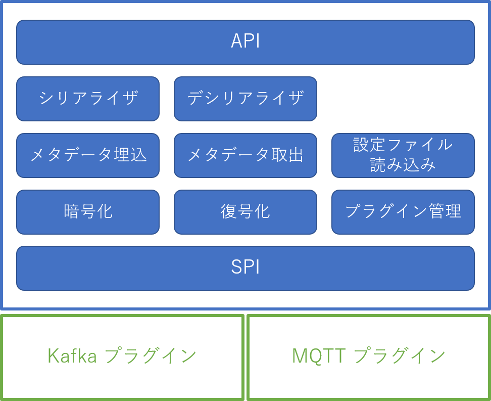
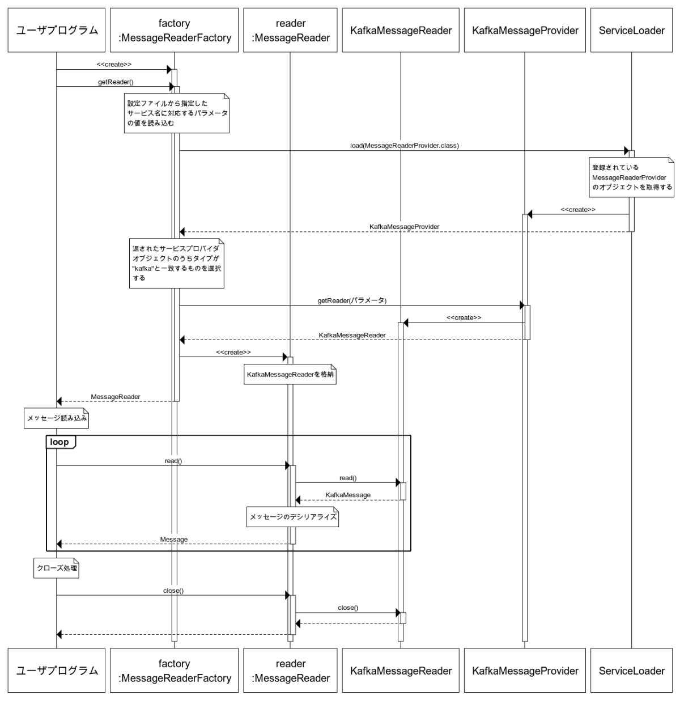
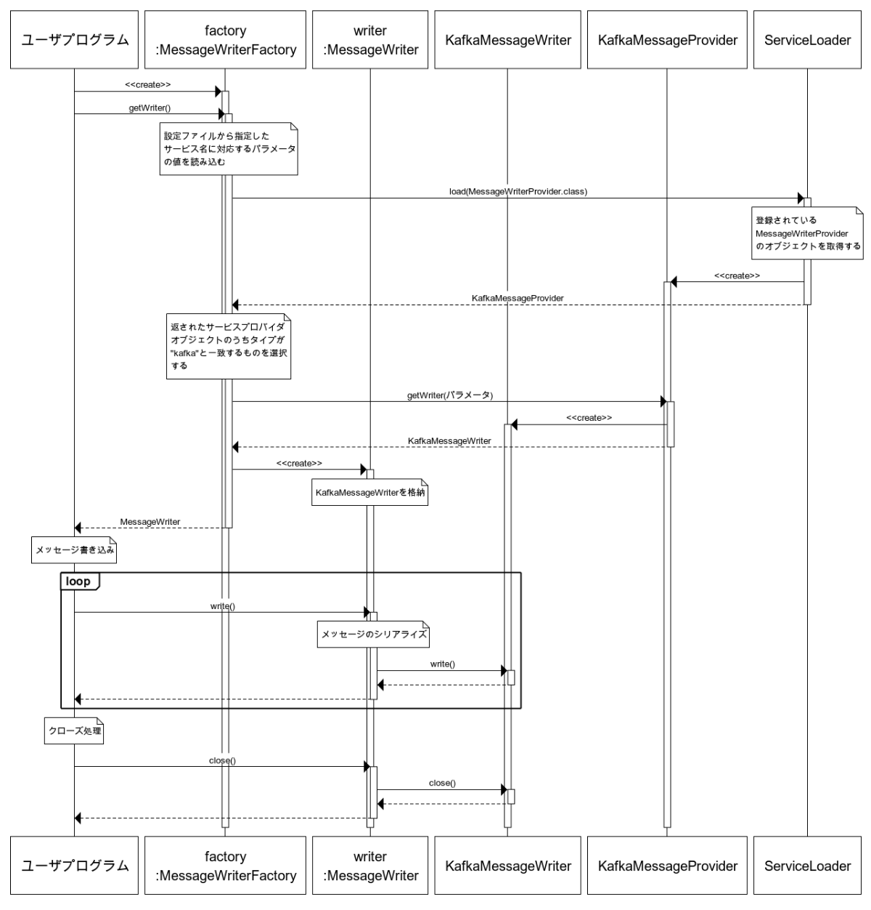

<!--
Copyright (C) 2020 National Institute of Informatics

Licensed to the Apache Software Foundation (ASF) under one
or more contributor license agreements.  See the NOTICE file
distributed with this work for additional information
regarding copyright ownership.  The ASF licenses this file
to you under the Apache License, Version 2.0 (the
"License"); you may not use this file except in compliance
with the License.  You may obtain a copy of the License at

  http://www.apache.org/licenses/LICENSE-2.0

Unless required by applicable law or agreed to in writing,
software distributed under the License is distributed on an
"AS IS" BASIS, WITHOUT WARRANTIES OR CONDITIONS OF ANY
KIND, either express or implied.  See the License for the
specific language governing permissions and limitations
under the License.
--->

# プラグイン開発ガイド(Messaging system / Java)

新たなメッセージングシステムをSINETStream (Java)で扱えるようにするためのプラグインを開発する手順について説明します。

## はじめに

SINETStream v1.1では以下に示すメッセージングシステムに対応しています。

* [Apache Kafka](https://kafka.apache.org/)
* [MQTT](http://mqtt.org/)

上記のメッセージングシステムに対応するための処理はプラグインとして実装されています。
さらに、新たなプラグインを実装することで、上記に示したメッセージングシステム以外のものを
SINETStreamで扱えるようになります。

このドキュメントでは新たなメッセージングシステムをサポートするためのプラグインを開発する手順について説明します。

### 対象者

このドキュメントが対象としている読者を以下に示します。

* SINETStreamで新たなメッセージングシステムを利用できるようにしたい開発者
* SINETStream内部の詳細について理解したい開発者

### 前提知識

このドキュメントの説明は、以下の知識を有していることを前提としています。

* Java 8 
* [ServiceLoader](https://docs.oracle.com/javase/jp/8/docs/api/java/util/ServiceLoader.html)の利用方法
* SINETStream の Java APIの利用方法、設定ファイルの記述方法

## SINETStream の内部構造について

プラグインを開発する手順を説明する前に、開発の際に必要となるSINETStreamの内部構造について説明します。

### モジュール構成

SINETStreamのモジュール構成を以下の図に示します。



青枠で示した部分がSINETStream本体です。この部分はメッセージングシステムによらない機能を提供
しています。 緑枠で示した部分がSINETStreamのプラグインです。メッセージングシステムとのインター
フェイスはこの部分に閉じた実装となります。

モジュールの各部分についての簡単な説明を以下に記します。

* SINETStream本体
    * API
        * ライブラリとしてSINETStreamを利用する場合のインターフェースを定める
    * SPI
        * SINETStream本体とプラグインとの間のインターフェースを定める
    * シリアライザ
        * APIが受け取ったオブジェクトをバイト列に変換する機能
    * デシリアライザ
        * メッセージングシステムから取得したバイト列をオブジェクトに変換する機能
    * メタデータの埋め込み
        * メッセージにメタデータを付加する機能
        * SINETStream v1.1 で付加するメタデータはメッセージ送信のタイムスタンプとなる
    * メタデータの取り出し
        * メッセージに付加されているメタデータを取り出す機能
    * 暗号化
        * メッセージの暗号化を行う機能
    * 復号化
        * 暗号化されたメッセージを復号する機能
    * 設定ファイル読み込み
        * SINETStreamの設定ファイルを読み込む機能
    * プラグイン管理
        * SINETStreamのプラグインを管理する機能
* プラグイン
    * Kafkaプラグイン
        * Kafkaブローカとの間でメッセージの送受信を行う機能
        * 実際の処理はApache Kafka [Producer](https://kafka.apache.org/24/javadoc/index.html?org/apache/kafka/clients/producer/KafkaProducer.html), [Consumer](https://kafka.apache.org/24/javadoc/index.html?org/apache/kafka/clients/consumer/KafkaConsumer.html)の機能を呼び出すことで実現している
    * MQTTプラグイン
        * MQTTブローカとの間でメッセージの送受信を行う機能
        * 実際の処理は[eclipse paho](https://www.eclipse.org/paho/clients/java/)の機能を呼び出すことで実現している

### 処理シーケンス

SINETStreamでメッセージの送受信を行うためのクラスMessageReader, MesageWriterの処理シーケンスについて説明します。

#### MessageReader

以下に示すメッセージ受信処理を SINETStreamで行った場合のシーケンス図を示します。
ここではKafkaブローカーからメッセージを受信することを想定しています。

```java
MessageReaderFactory<String> factory =
    MessageReaderFactory.<String>builder()
            .service("kafka-service")
            .build();

try (MessageReader<String> reader = factory.getReader()) {
    Message<String> msg;
    while (Objects.nonNull(msg = reader.read())) {
        System.out.print(msg.getValue());
    }
}
```



図中のクラスについての簡単な説明を以下に記します。

* ユーザプログラム
    * SINETStreamを利用するユーザプログラム
* MessageReaderFactory
    * `MessageReader`のファクトリクラス
* MessageReader
    * ユーザプログラムに対して、SINETStreamのメッセージ受信APIを提供するインタフェース
* KafkaMessageReader
    * Kafkaブローカーからメッセージを受信するKafkaプラグインのクラス
* KafkaMessageProvider
    * Kafkaのサービスクラス
* ServiceLoader
    * 登録されているサービスをロードする
    
#### MessageWriter

以下に示すメッセージ送信処理を SINETStreamで行った場合のシーケンス図を示します。
ここではKafkaブローカーにメッセージを送信することを想定しています。

```java
MessageWriterFactory<String> factory =
    MessageWriterFactory.<String>builder()
            .service("kafka-service")
            .build();

try (MessageWriter<String> writer = factory.getWriter()) {
    for (String msg : messages) {
        writer.write(msg)
    }
}
```



図中のクラスについての簡単な説明を以下に記します。

* ユーザプログラム
    * SINETStreamを利用するユーザプログラム
* MessageWriterFactory
    * `MessageWriter`のファクトリクラス
* MessageWriter
    * ブローカーにメッセージを送信するSINETStreamのクラス
* KafkaMessageWriter
    * ユーザプログラムに対して、SINETStreamのメッセージ送信APIを提供するインタフェース
* KafkaMessageProvider
    * Kafkaのサービスクラス
* ServiceLoader
    * 登録されているサービスをロードする


## プラグインの実装方法

### 概要

SINETStreamでは [ServiceLoader](https://docs.oracle.com/javase/jp/8/docs/api/java/util/ServiceLoader.html) を用いてプラグインを実現しています。  
プラグインを作成するためには以下の作業が必要となります。

* プロバイダ構成ファイルの作成
* サービスプロバイダの実装

それぞれの作業項目の詳細について以下に記します。

### プロバイダ構成ファイルの作成

プロバイダ構成ファイルにサービスプロバイダを登録することで、
ServiceLoaderがプラグインを見つけることができるようになります。  

構成ファイルはリソースディレクトリの`META-INF/services/`に配置します。
ファイル名はサービスプロバイダの完全修飾クラス名にする必要があります。
SINETStreamのメッセージ受信、送信に対応するサービスプロバイダの場合、以下のファイル名となります。

* メッセージ受信に対応するサービスプロバイダ
    * `jp.ad.sinet.stream.spi.MessageReaderProvider`
* メッセージ送信に対応するサービスプロバイダ
    * `jp.ad.sinet.stream.spi.MessageWriterProvider`
    
構成ファイルには、サービスプロバイダの実装クラスを完全修飾名で１クラス1行で記述します。

例えば Kafkaブローカーにメッセージ送信を行うクラス`jp.ad.sinet.stream.plugins.kafka.KafkaMessageProvider`を登録する場合、
以下の内容を構成ファイル`META-INF/services/jp.ad.sinet.stream.spi.MessageWriterProvider`に記します。

```
jp.ad.sinet.stream.plugins.kafka.KafkaMessageProvider
```

### サービスプロバイダの実装

#### メッセージ送信のためのクラス

メッセージ送信を行うサービスプロバイダを実装するには、
以下に示すインターフェースの実装クラスを作成する必要があります。

* `jp.ad.sinet.stream.spi.MessageWriterProvider`
    * サービスプロバイダインタフェース
* `jp.ad.sinet.stream.spi.PluginMessageWriter`
    * メッセージ送信処理のインタフェース
    
`MessageWriterProvider`のメソッドを以下に示します。

* `PluginMessageWriter getWriter(WriterParameters params)`
    * メッセージングシステム固有の送信処理を行うWriterクラスを返す
    * 引数の`params`を通してSINETStreamの設定ファイルまたは`MessageWriter`のコンストラクタで設定したパラメータが渡される
* `String getType()`
    * メッセージングシステムのタイプを表す名前を返す
    * メッセージングシステム固有の処理については、このメソッドが返す値と設定ファイルの `type` に指定された値が一致したプラグインによって処理される
    
`PluginMessageWriter`の主なメソッドを以下に示します。

* `void write(byte[] message)`
    * ブローカーにメッセージを送信する
* `void close()`
    * ブローカーとの接続を切断する


#### メッセージ受信のためのクラス

メッセージ受信を行うサービスプロバイダを実装するには、
以下に示すインターフェースの実装クラスを作成する必要がある。

* `jp.ad.sinet.stream.spi.MessageReaderProvider`
    * メッセージングシステム固有の受信処理を行うReaderクラスを返す
* `jp.ad.sinet.stream.spi.PluginMessageReader`
    * メッセージ受信処理のインタフェース

`MessageReaderProvider`のメソッドを以下に示します。

* `PluginMessageReader getReader(ReaderParameters params)`
    * メッセージングシステム固有の受信処理を行うReaderクラスを返す
    * 引数の`params`を通してSINETStreamの設定ファイルまたは`MessageReader`のコンストラクタで設定したパラメータが渡される
* `String getType()`
    * メッセージングシステムのタイプを表す名前を返す
    * メッセージングシステム固有の処理については、このメソッドが返す値と設定ファイルの `type` に指定された値が一致したプラグインによって処理される

`PluginMessageReader`の主なメソッドを以下に示します。

* `PluginMessageWrapper read()`
    * ブローカーのメッセージを受信する
* `void close()`
    * ブローカーとの接続を切断する

## プラグインの実装例

プラグイン実装の具体的な手順を示すために実装例を示します。

ここで示す実装例では実際のブローカーにアクセスするのではなく、プロセス内で
`java.util.Queue`オブジェクトを利用したデータの受け渡しを行う処理をSINETStreamのプラグインとして実現します。

### ファイル構成

以下のファイルを作成します。

* src/main/java/ssplugin/
    * QueueMessageProvider.java
    * QueueMessage.java
    * QueueMessageReader.java
    * QueueMessageWriter.java
* src/main/resources/META-INF/services/
    * jp.ad.sinet.stream.spi.MessageReaderProvider
    * jp.ad.sinet.stream.spi.MessageWriterProvider
* build.gradle
* settings.gradle

### 実装クラス

プラグインとして実装するクラスについて説明します。

> ここでは主な処理についてのみの説明となります。サンプルコード全体を確認する場合は「[ソースコード](#ソースコード)」のリンク先を参照してください。

#### QueueMessageProvider.java

プラグインのプロバイダインタフェース`MessageReaderProvider`, `MessageWriterProvider`を実装したクラスになります。

```java
public class QueueMessageProvider implements MessageReaderProvider, MessageWriterProvider {

    private static final ConcurrentMap<String, BlockingQueue<QueueMessage>> queues = new ConcurrentHashMap<>();

    @Override
    public PluginMessageReader getReader(ReaderParameters params) {
        String topic = params.getTopics().get(0);
        BlockingQueue<QueueMessage> queue = queues.computeIfAbsent(topic, key -> new LinkedBlockingQueue<>());
        return new QueueMessageReader(params, queue);
    }

    @Override
    public PluginMessageWriter getWriter(WriterParameters params) {
        String topic = params.getTopic();
        BlockingQueue<QueueMessage> queue = queues.computeIfAbsent(topic, key -> new LinkedBlockingQueue<>());
        return new QueueMessageWriter(params, queue);
    }

    @Override
    public String getType() {
        return "queue";
    }
}
```

`getType()`でメッセージングシステムのタイプ名を返します。
`getReader()`でプラグインの`PluginMessageReader`実装となる`QueueMessageReader`オブジェクトを返します。
同様に`getWriter()`でプラグインの`PluginMessageWriter`実装となる`QueueMessageWriter`オブジェクトを返します。

`QueueMessageReader`, `QueueMessageWriter`のコンストラクタには `BlockingQueue`のオブジェクト `queue`を引数で渡します。
`queue`を通してメッセージが受け渡されことになります。

#### QueueMessageReader.java

`PluginMessageReader`を実装したクラスになります。

```java
public class QueueMessageReader implements PluginMessageReader {
(中略)
    @Override
    public PluginMessageWrapper read() {
        try {
            return queue.poll(receiveTimeout.getSeconds(), TimeUnit.SECONDS);
        } catch (InterruptedException e) {
            throw new SinetStreamIOException(e);
        }
    }
(中略)
}
```

`read()`はメッセージングシステムからメッセージの取得を行い、その値を返すメソッドになります。
ここでは `queue` からメッセージを取得して、その値を返しています。

#### QueueMessageWriter.java

`PluginMessageWriter`を実装したクラスになります。

```java
public class QueueMessageWriter implements PluginMessageWriter {
(中略)
    @Override
    public void write(byte[] aByte) {
        QueueMessage msg = new QueueMessage(topic, aByte);
        try {
            queue.put(msg);
        } catch (InterruptedException e) {
            throw new SinetStreamIOException(e);
        }
    }
(中略)
}
```

`write()`は引数で渡されたバイト列をメッセージングシステムに送信するメソッドになります。
ここでは、引数で受け取ったバイト列を`QueueMessage`クラスでラップして `queue` に送っています。

### プロバイダ構成ファイルの作成

リソースディレクトリの`META-INF/services/`に２つの構成ファイルを以下の内容で作成します。

* `jp.ad.sinet.stream.spi.MessageReaderProvider`
```
ssplugin.QueueMessageProvider
```
* `jp.ad.sinet.stream.spi.MessageWriterProvider`
```
ssplugin.QueueMessageProvider
```

### jarファイルの作成

プラグインのjarファイルを作成する手順を以下に示します。

1. [Gradle](https://gradle.org)をインストールする
    * 参考: [インストール手順](https://gradle.org/install/)
2. gradle を実行して jar ファイルを作成する
```bash
$ gradle jar
```
3. `build/libs/`にjarファイルが作成されたことを確認する
```bash
$ ls build/libs/
SINETStream-queue-1.0.0.jar
```

### ソースコード
プラグインの実装例となるファイルへのリンクを以下に示します。

* src/main/java/ssplugin/
    * [QueueMessageProvider.java](https://github.com/nii-gakunin-cloud/sinetstream/blob/master/docs/developer_guide/sample/messaging-system/java/src/main/java/ssplugin/QueueMessageProvider.java)
    * [QueueMessage.java](https://github.com/nii-gakunin-cloud/sinetstream/blob/master/docs/developer_guide/sample/messaging-system/java/src/main/java/ssplugin/QueueMessage.java)
    * [QueueMessageReader.java](https://github.com/nii-gakunin-cloud/sinetstream/blob/master/docs/developer_guide/sample/messaging-system/java/src/main/java/ssplugin/QueueMessageReader.java)
    * [QueueMessageWriter.java](https://github.com/nii-gakunin-cloud/sinetstream/blob/master/docs/developer_guide/sample/messaging-system/java/src/main/java/ssplugin/QueueMessageWriter.java)
* src/main/resources/META-INF/services/
    * [jp.ad.sinet.stream.spi.MessageReaderProvider](https://github.com/nii-gakunin-cloud/sinetstream/blob/master/docs/developer_guide/sample/messaging-system/java/src/main/resources/META-INF/services/jp.ad.sinet.stream.spi.MessageReaderProvider)
    * [jp.ad.sinet.stream.spi.MessageWriterProvider](https://github.com/nii-gakunin-cloud/sinetstream/blob/master/docs/developer_guide/sample/messaging-system/java/src/main/resources/META-INF/services/jp.ad.sinet.stream.spi.MessageWriterProvider)
* [build.gradle](https://github.com/nii-gakunin-cloud/sinetstream/blob/master/docs/developer_guide/sample/messaging-system/java/build.gradle)
* [settings.gradle](https://github.com/nii-gakunin-cloud/sinetstream/blob/master/docs/developer_guide/sample/messaging-system/java/settings.gradle)
