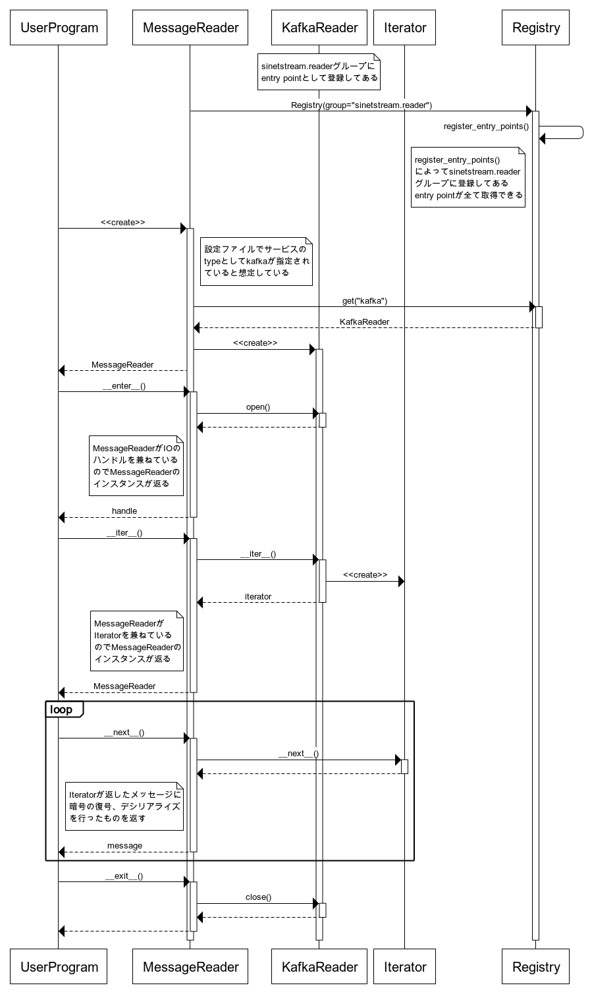
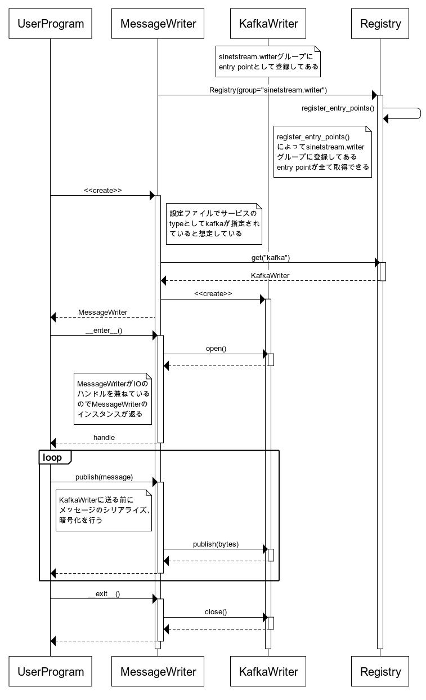

<!--
Copyright (C) 2020 National Institute of Informatics

Licensed to the Apache Software Foundation (ASF) under one
or more contributor license agreements.  See the NOTICE file
distributed with this work for additional information
regarding copyright ownership.  The ASF licenses this file
to you under the Apache License, Version 2.0 (the
"License"); you may not use this file except in compliance
with the License.  You may obtain a copy of the License at

  http://www.apache.org/licenses/LICENSE-2.0

Unless required by applicable law or agreed to in writing,
software distributed under the License is distributed on an
"AS IS" BASIS, WITHOUT WARRANTIES OR CONDITIONS OF ANY
KIND, either express or implied.  See the License for the
specific language governing permissions and limitations
under the License.
--->

# プラグイン開発ガイド(Messaging system / Python)

新たなメッセージングシステムをSINETStream (Python)で扱えるようにするためのプラグインを開発する手順について説明します。

## はじめに

SINETStream v1.1では以下に示すメッセージングシステムに対応しています。

* [Apache Kafka](https://kafka.apache.org/)
* [MQTT](http://mqtt.org/)

上記のメッセージングシステムに対応するための処理はプラグインとして実装されています。
さらに、新たなプラグインを実装することで、上記に示したメッセージングシステム以外のものを
SINETStreamで扱えるようになります。

このドキュメントでは新たなメッセージングシステムをサポートするためのプラグインを開発する手順について説明します。

### 対象者

このドキュメントが対象としている読者を以下に示します。

* SINETStreamで新たなメッセージングシステムを利用できるようにしたい開発者
* SINETStream内部の詳細について理解したい開発者

### 前提知識

このドキュメントの説明は、以下の知識を有していることを前提としています。

* Python 3
* [setuptools](https://setuptools.readthedocs.io/en/latest/)による配布パッケージの作成手順
* SINETStream の Python APIの利用方法、設定ファイルの記述方法

## SINETStream の内部構造について

プラグインを開発する手順を説明する前に、開発の際に必要となるSINETStreamの内部構造について説明します。

### モジュール構成

SINETStreamのモジュール構成を以下の図に示します。


青枠で示した部分がSINETStream本体です。この部分はメッセージングシステムによらない機能を提供
しています。 緑枠で示した部分がSINETStreamのプラグインです。
メッセージングシステム固有の処理は緑枠で示したプラグインに閉じた実装となっています。

モジュールの各部についての簡単な説明を以下に記します。

* SINETStream本体
    * API
        * SINETStreamをライブラリとして利用する場合のインターフェース(API)を定める
    * SPI
        * SINETStream本体とプラグインとの間のインターフェースを定める
    * シリアライザ
        * APIが受け取ったオブジェクトをバイト列に変換する
    * デシリアライザ
        * メッセージングシステムから取得したバイト列をオブジェクトに変換する
    * メタデータの埋め込み
        * メッセージにメタデータを付加する
        * SINETStream v1.1 ではメッセージ送信時のタイムスタンプを付加している
    * メタデータの取り出し
        * メッセージに付加されているメタデータを取り出す
    * 暗号化
        * メッセージの暗号化を行う
    * 復号化
        * 暗号化されたメッセージを復号する
    * 設定ファイル読み込み
        * SINETStreamの設定ファイルを読み込む
    * プラグイン管理
        * SINETStreamのプラグインを管理する
* プラグイン
    * Kafkaプラグイン
        * Kafkaブローカとの間でメッセージの送受信を行う機能
        * 実際の処理は[kafka-python](https://github.com/dpkp/kafka-python)の機能を呼び出すことで実現している
    * MQTTプラグイン
        * MQTTブローカとの間でメッセージの送受信を行う機能
        * 実際の処理は[eclipse paho](https://www.eclipse.org/paho/clients/python/)の機能を呼び出すことで実現している

### 処理シーケンス

SINETStreamでメッセージの送受信を行うためのクラスMessageReader, MesageWriterの処理シーケンスについて説明します。

#### MessageReader

以下に示すようなメッセージ受信処理を SINETStreamで行った場合のシーケンス図を示します。
ここではKafkaブローカーからメッセージを受信することを想定しています。

```python
with MessageReader(service='kafka-service') as reader:
    for message in reader:
        System.out.println(message)
```



図中のクラスについての簡単な説明を以下に記します。

* UserProgram
    * SINETStreamを利用するプログラム
* MessageReader
    * ブローカーからメッセージを受信するSINETStreamのクラス
* KafkaReader
    * Kafkaブローカーからメッセージを受信するKafkaプラグインのクラス
* Iterator
    * Kafkaブローカーから受信したメッセージをひとつづつ返すイテレータ
* Registry
    * 登録されているプラグインを管理するクラス
    
#### MessageWriter

以下に示すようなメッセージ送信処理を SINETStreamで行った場合のシーケンス図を示します。
ここではKafkaブローカーにメッセージを送信することを想定しています。

```python
with MessageWriter(service='kafka-service') as writer:
    for message in messages:
        writer.publish(message)
```



図中のクラスについての簡単な説明を以下に記します。

* UserProgram
    * SINETStreamを利用するプログラム
* MessageWriter
    * ブローカーにメッセージを送信するSINETStreamのクラス
* KafkaWriter
    * Kafkaブローカーにメッセージ送信を行うKafkaプラグインのクラス
* Registry
    * 登録されているプラグインを管理するクラス

## プラグインの実装方法

### 概要

[Python Packaging User Guide - Creating and discovering plugins](https://packaging.python.org/guides/creating-and-discovering-plugins/)
にあるように Python でプラグインを作成する場合、主に３つの方法があります。

1. 命名規則を用いる方法
1. 名前空間パッケージを用いる方法
1. パッケージメタデータを用いる方法

SINETStreamでは３番目のパッケージメタデータを用いてプラグインを実現しています。

SINETStreamのプラグインを作成するためには以下の作業が必要となります。

* プラグインに定められているメソッドを実装したクラスの作成
* パッケージメタデータの作成

それぞれの作業項目の詳細について以下に記します。

### プラグインに定められているメソッドを実装したクラスの作成

プラグインで必要となるメソッドはメッセージを受信するためのクラスと
メッセージを送信するためのクラスで異なります。それぞれについて順に説明します。

#### メッセージ受信のためのクラス

メッセージ受信を行うプラグインで必要となるメソッドについて説明します。

メッセージ受信を行うプラグインのクラスでは、以下の３つのメソッドを実装する必要があります。

* `open()`
    * ブローカーに接続を行うメソッド
* `close()`
    * ブローカーとの接続を切断するメソッド
* `__iter__()`
    * ブローカーから受信したメッセージのイテレータを返すメソッド
    * 返り値は[イテレータオブジェクト](https://docs.python.org/ja/3.8/library/stdtypes.html#typeiter)でなくてはならない
    * イテレータが返す、個々のメッセージは次の３つの値からなるタプルでなくてはならない
        * メッセージのバイト列(メッセージングシステム依存のヘッダやメタデータを除いたペイロード部分の値。型は`bytes`)
        * 受信したメッセージに対応するトピック名
        * メッセージングシステム依存のメッセージオブジェクト
    * コンストラクタの`params['receive_timeout_ms']`で指定された時間(ミリ秒)の間にメッセージが受信できなかった場合は、イテレータは`StopIterator`の例外を送出しなくてはならない
    * `params['receive_timeout_ms']`が指定されていなかった場合はメッセージを受信するまでブロックする
    
プラグインが上記のメソッドを実装することを確認するために、抽象基底クラス `sinetstream.spi.PluginMessageReader`
を利用することができます。`PluginMessageReader`では上記の３つのメソッドが抽象メソッドとして定義されています。
    
メッセージ受信を行うクラスのコンストラクタは引数から `params` を受け取ります。`params`には、
SINETStreamの設定ファイル、あるいは`MessageReader`のコンストラクタで指定されたパラメータが
`dict`型の変数として渡されます。

#### メッセージ送信のためのクラス

メッセージ送信を行うプラグインで必要となるインターフェースについて説明します。

メッセージ送信を行うプラグインのクラスでは、以下の３つのメソッドを実装する必要があります。

* `open()`
    * ブローカーに接続を行うメソッド
* `close()`
    * ブローカーとの接続を切断するメソッド
* `publish(message)`
    * ブローカーにメッセージを送信するメソッド
    * `message`の型は `bytes` でなくてはならない
    
プラグインが上記のメソッドを実装することを確認するために、抽象基底クラス `sinetstream.spi.PluginMessageWriter`
を利用することができます。`PluginMessageWriter`では上記の３つのメソッドが抽象メソッドとして定義されています。

メッセージ送信を行うクラスのコンストラクタは引数から `params` を受け取ります。`params`には、
SINETStreamの設定ファイル、あるいは`MessageWriter`のコンストラクタで指定されたパラメータが
`dict`型の変数として渡されます。

### パッケージメタデータの作成

[setuptools](http://setuptools.readthedocs.io/)のエントリポイントにクラスを
登録することで、SINETStreamがプラグインを見つけることができるようになります。
これは登録されたエントリポイントをsetuptoolsが検出する機能を利用して実現して
います。setuptoolsはPythonの配布パッケージのビルドなどを行うためのツールです。

登録されているエントリポイントからSINETStreamで必要となるクラスを探し出すこと
ができるようにするためには、エントリポイントのグループと名前を適切に設定する
必要があります。

SINETStreamではグループを`MessageReader`, `MessageWriter`のどちらから利用する
のかを識別するために用いています。以下に示すどちらかのグループを指定してくだ
さい。

* `sinetstream.reader`
    * `MessageReader`から呼び出されるメッセージ受信を行うプラグインのグループ
* `sinetstream.writer`
    * `MessageWriter`から呼び出されるメッセージ送信を行うプラグインのグループ
    
エントリポイントにはグループ内で識別するための名前がつけられます。SINETSteramでは
エントリポイントに付けられた名前が、メッセージングシステムのタイプに対応づけられます。

例えばKafkaプラグインのメッセージ送信を行うクラス
`sinetstream_plugins.kafka:KafkaWriter` に対応するエントリポイントは
`sinetstream.writer`グループに所属する `kafka` という名前にします。

パッケージメタデータに上記の例のエントリポイントに対応する設定を行うには `setup.cfg` に
以下の記述を行います。

```
[options.entry_points]
sinetstream.writer =
    kafka = sinetstream_plugins.kafka:KafkaWriter
```

エントリポイントの詳細については
[setuptools documentation - Entry Points](https://setuptools.readthedocs.io/en/latest/pkg_resources.html#entry-points)
を参照してください。


## プラグインの実装例

プラグインを実装する具体的な手順を示すために、簡単な実装例を示します。

ここで示す実装例では実際のブローカーにアクセスするのではなく、プロセス内で
`queue.Queue`オブジェクトを利用したデータの受け渡しを行う処理をSINETStreamのプラグインとして実現します。

### ファイル構成

以下のファイルを作成します。

* src/ssplugin/queue.py
    * SINETStreamプラグインの実装
* setup.py
    * パッケージングを行う際のコマンドラインインタフェース
* setup.cfg
    * `setup.py`の設定ファイル

### プラグイン実装

プラグインの実装を行うモジュールファイル`queue.py`について説明します。

#### モジュールレベル

`queue.Queue`を格納するdict型変数をモジュールレベルで定義します。

```python
queues = defaultdict(Queue)
```

`queues`はトピック名をキー、`Queue`オブジェクトを値とする dict変数です。
`defaultdict`を利用することで、トピック名に対応する値が `queues`に無い場合は
自動的に作成された `Queue`オブジェクトが取得できます。

#### メッセージ送信のためのクラス

メッセージ送信を行うプラグインのクラス`QueueWriter`を実装します。

まずクラス定義を行います。

```python
class QueueWriter(PluginMessageWriter):
```

ここでは抽象基底クラス`PluginMessageWriter`を継承したクラスを定義します。
プラグインクラスの実装において`PluginMessageWriter`を継承することは必須ではありません。
しかし開発環境によっては抽象基底クラスを継承することにより、
プラグイン実装に必要となるメソッドに関する情報などの支援を受けられる場合があります。

次にコンストラクタを定義します。

```python
    def __init__(self, params):
        self._queue = None
        self._topic = params.get('topic')
        if self._topic is None or not isinstance(self._topic, str):
            raise InvalidArgumentError()
```

引数の`params`にはSINETStreamの設定ファイル、あるいは`MessageWriter`のコンストラクタで指定されたパラメータが
`dict`型の変数として渡されます。ここでは、パラメータ`topic`の値を送信対象のトピック名としてインスタンス変数に
格納しています。

次にプラグインで実装する必要のあるメソッドを定義します。

```python
    def open(self):
        self._queue = queues[self._topic]

    def close(self):
        self._queue = None

    def publish(self, value):
        self._queue.put(value)
```

`open()`の際に `queues`からトピック名に対応する `Queue`のオブジェクトを取得します。
`publish(value)`では `open()`の際に格納した `Queue`オブジェクトにメッセージを`put()`します。
`publish()`で送られたメッセージは `Queue`オブジェクトを通して受信側に受け渡されます。

#### メッセージ受信のためのクラス

メッセージ受信を行うプラグインのクラス`QueueReader`を実装します。

まずクラス定義を行います。

```python
class QueueReader(PluginMessageReader):
```

ここでは抽象基底クラス`PluginMessageReader`を継承したクラスを定義します。

次にコンストラクタを定義します。

```python
    def __init__(self, params):
        self._queue = None
        self._topic = params.get('topic')
        if self._topic is None or not isinstance(self._topic, str):
            raise InvalidArgumentError()
        timeout_ms = params.get('receive_timeout_ms', inf)
        self._timeout = timeout_ms / 1000.0 if timeout_ms != inf else None
```

引数の`params`にはSINETStreamの設定ファイル、あるいは`MessageReader`のコンストラクタで指定されたパラメータが
`dict`型の変数として渡されます。ここでは、パラメータ`topic`の値を受信対象のトピック名としてインスタンス変数に
格納しています。また`receive_timeout_ms`をメッセージ受信のタイムアウト値(ms)としてインスタンス変数に格納します。

次にプラグインで実装する必要のあるメソッドを定義します。

```python
    def open(self):
        self._queue = queues[self._topic]

    def close(self):
        self._queue = None

    def __iter__(self):
        while True:
            try:
                value = self._queue.get(timeout=self._timeout)
                raw = value
                yield value, self._topic, raw
            except Empty:
                raise StopIteration()

```

`open()`の際に `queues`からトピック名に対応する `Queue`のオブジェクトを取得します。
`__iter__(value)`は `open()`の際に格納した `Queue`オブジェクトからメッセージ取得するイテレータを返します。
`MessageWriter`で送信されたメッセージは`Queue`オブジェクトを通して受け取ることができます。

### パッケージング

#### `setup.py`, `setup.cfg`の作成

パッケージングを行う際のコマンドラインインタフェースとなる `setup.py` とその設定ファイル `setup.cfg` を作成します。

まず `setup.py` を作成します。設定については全て`setup.cfg`で行うので `setup.py`は必要最小限なものとします。

```python
from setuptools import setup
setup()
```

次に `setup.cfg` を作成します。

```
[metadata]
name = sinetstream-queue
version = 1.0.0

[options]
package_dir=
    =src
packages = find_namespace:
zip_safe = False
namespace_packages =
  ssplugin
install_requires =
  sinetstream>=1.1.0
python_requires = >= 3.6

[options.packages.find]
where = src

[options.entry_points]
sinetstream.reader =
    queue = ssplugin.queue:QueueReader
sinetstream.writer =
    queue = ssplugin.queue:QueueWriter
```

プラグインに直接関わる設定は `options.entry_points`セクションです。
`sinetstream.reader`, `sinetstream.writer`がメッセージ受信、メッセージ送信のプラグインに対応するグループになります。
各グループに対して (メッセージングシステムのタイプ名)=(パッケージ名:クラス名) を指定しています。

#### パッケージの作成

```bash
$ python setup.py bdist_wheel
running bdist_wheel
running build
running build_py
(中略)
$ ls dist/
dist/sinetstream_queue-1.0.0-py3-none-any.whl
```

### ソースコード
ここまで記した実装例のファイルへのリンクを以下に示します。
* [src/ssplugin/queue.py](https://github.com/nii-gakunin-cloud/sinetstream/blob/master/docs/developer_guide/sample/messaging-system/python/src/ssplugin/queue.py)
* [setup.py](https://github.com/nii-gakunin-cloud/sinetstream/blob/master/docs/developer_guide/sample/messaging-system/python/setup.py)
* [setup.cfg](https://github.com/nii-gakunin-cloud/sinetstream/blob/master/docs/developer_guide/sample/messaging-system/python/setup.cfg)
