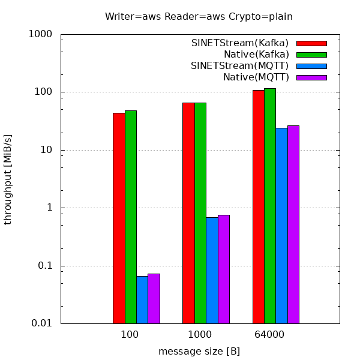
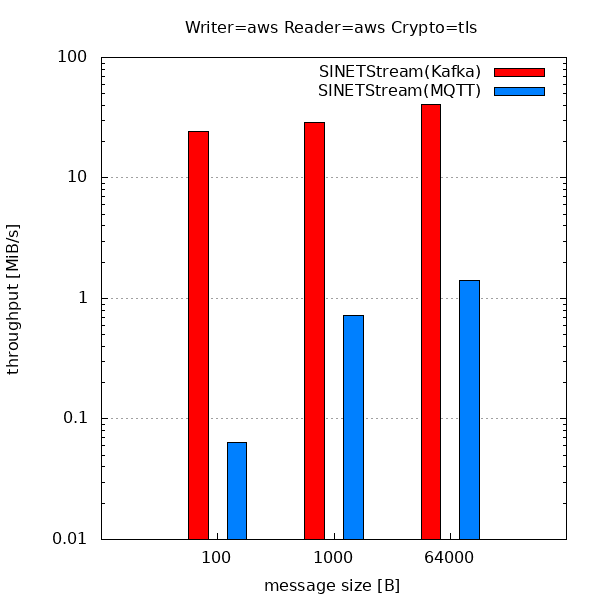
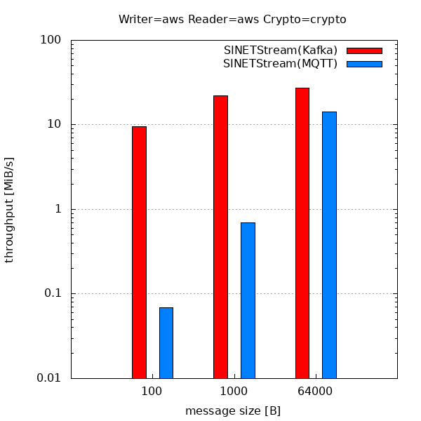
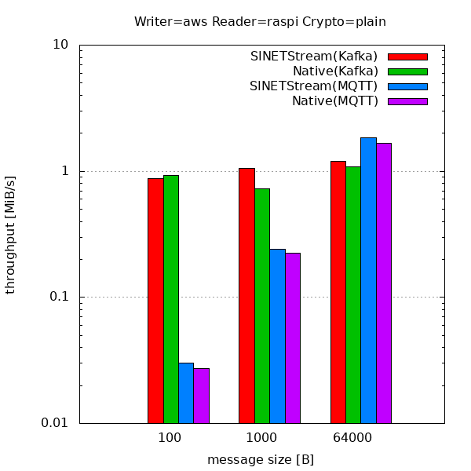
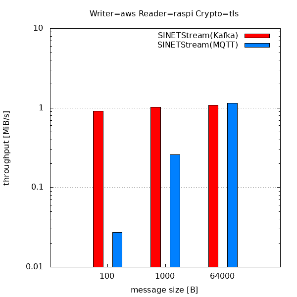
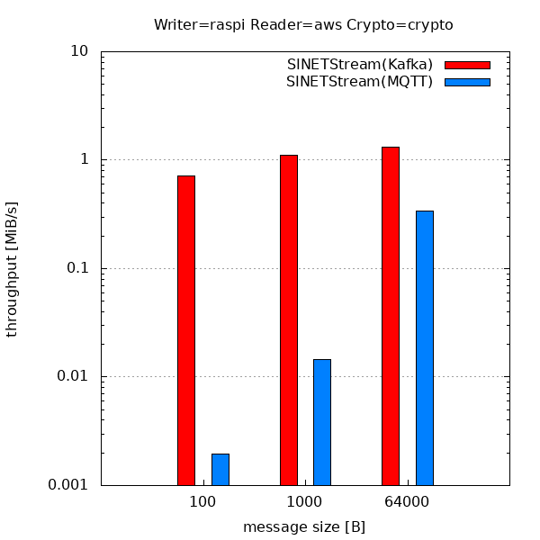
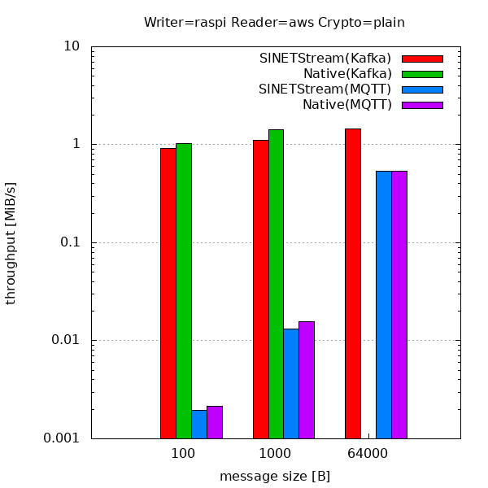
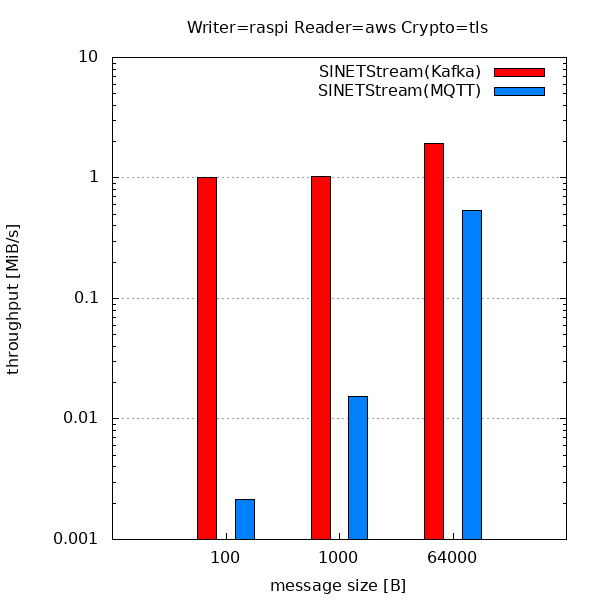

<!--
Copyright (C) 2020 National Institute of Informatics

Licensed to the Apache Software Foundation (ASF) under one
or more contributor license agreements.  See the NOTICE file
distributed with this work for additional information
regarding copyright ownership.  The ASF licenses this file
to you under the Apache License, Version 2.0 (the
"License"); you may not use this file except in compliance
with the License.  You may obtain a copy of the License at

  http://www.apache.org/licenses/LICENSE-2.0

Unless required by applicable law or agreed to in writing,
software distributed under the License is distributed on an
"AS IS" BASIS, WITHOUT WARRANTIES OR CONDITIONS OF ANY
KIND, either express or implied.  See the License for the
specific language governing permissions and limitations
under the License.
--->

[日本語](index.md)

**準備中** (2020-06-05 18:05:13 JST)

# Performance measurement of SINETStream

Published: December 13, 2019

In this site, we report the performance measurement results of SINETStream performed by the SINETStream development team at the Center for Cloud Research and Development, National Institute of Informatics.
We plan to update the report regularly.

## Measurement methods and environment

The following three types of programs were prepared, and the performance of writing/reading data via SINETStream was measured.

* Writer: writes data to Broker
* Broker: SINETStream brokers using Kafka and MQTT as back-end systems
* Reader: reads data from Broker

The measurement environment is as follows.

### LAN environment

Writer, Broker, and Reader are all deployed on the server which is connected to the same LAN, and all communications are performed via LAN

* Server specifications: Amazon EC2 m5.large, AZ=ap-northeast-1a, vCPU=2, CentOS7
* Network specifications: Up to 10Gbps

### Mobile environment

Writer and Reader are deployed on devices which are connected to the SINET mobile network, and communications between Writer and Broker and between Broker and Reader are performed via the mobile network.

* Device specifications: Raspberry Pi 3 Model B Plus Rev 1.3
* Broker implementation is the same as in the LAN environment

### Software

* kafka_2.12-2.3.0 (Kafka broker)
* mosquitto-1.6.2 (MQTT broker)
* SINETStream 1.0.0
    * [Measurement program](https://github.com/nii-gakunin-cloud/sinetstream/tree/master/java/sample/perf)
        * `test.sh`: Performance measurement without encryption
        * `test-tls.sh`: Performance measurement with TLS communication encryption
        * `test-crypto.sh`: Performance measurement with data encryption

## Communication performance of mobile network

### ping (RTT)

| source -> destination | minimum | average | maximum | standard deviation |
| ---: | ---: | ---: | ---: | ---: |
| raspi -> aws | 28.049 ms | 37.384 ms | 47.254 ms | 5.403 ms |

### iperf3 (throughput)

| source -> destination | average throughput |
| ---: | ---: |
| raspi -> aws | 12.1 Mbits/s |
| aws -> raspi | 9.90 Mbits/s |

## The performance of SINETStream

We compare the performance measurement results with four messaging system settings:
(1) native Kafka, (2) native MQTT, (3) SINETStream with Kafka backend, and (4) SINETStream with MQTT backend.

The horizontal axis shows the sending message size (100B, 1KB, 64KB), and the vertical axis shows the throughput.

The evaluation results in a mobile environment are considered to be limited by the performance of the mobile network.

1. Comparison of SINETStream and Native (LAN environment, no encryption)  
   
1. SINETStream performance (LAN environment, communication encryption by TLS)  
   
1. SINETStream performance (LAN environment, data encryption)  
   
1. Comparison between SINETStream and Native (Reader side mobile environment, no encryption)  
   
1. SINETStream performance (mobile environment on Reader side, communication encryption by TLS)  
   
1. SINETStream performance (mobile environment on Reader side, data encryption)  
   
1. Comparison of SINETStream and Native (Writer side mobile environment, no encryption)  
   
1. SINETStream performance (Writer-side mobile environment, communication encryption by TLS)  
   
1. SINETStream performance (mobile environment on Writer side, data encryption)  
   
