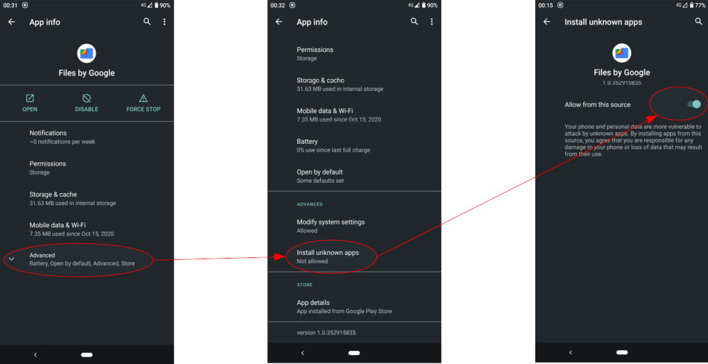
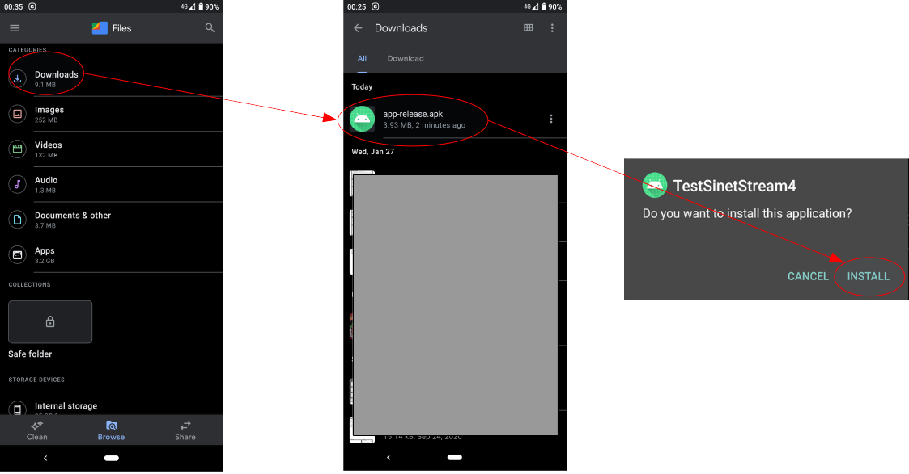
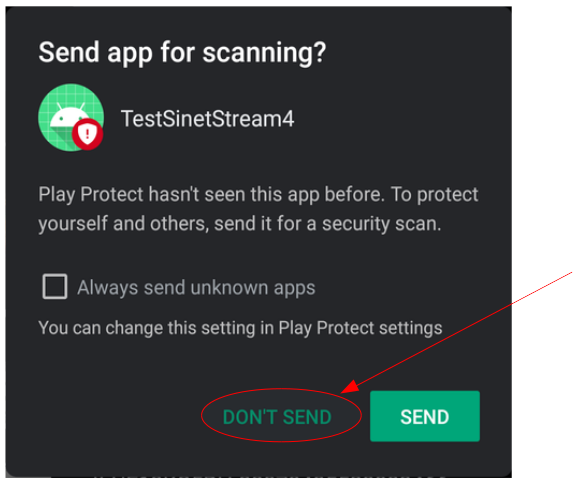

<!--
Copyright (C) 2020-2021 National Institute of Informatics

Licensed to the Apache Software Foundation (ASF) under one
or more contributor license agreements.  See the NOTICE file
distributed with this work for additional information
regarding copyright ownership.  The ASF licenses this file
to you under the Apache License, Version 2.0 (the
"License"); you may not use this file except in compliance
with the License.  You may obtain a copy of the License at

  http://www.apache.org/licenses/LICENSE-2.0

Unless required by applicable law or agreed to in writing,
software distributed under the License is distributed on an
"AS IS" BASIS, WITHOUT WARRANTIES OR CONDITIONS OF ANY
KIND, either express or implied.  See the License for the
specific language governing permissions and limitations
under the License.
-->

[日本語](TUTORIAL-android-install.md)

# TUTORIAL - Installation of the sample Android application

<em>Table of contents</em>
<pre>
1. Introduction
2. The working policy
3. Preparations
4. Download the binary APK file and install it
4.1 Get the APK
4.2 Install the APK to the target Android device
5. Install an APK by building from source
5.1 Preparations for the Android development environment
5.2 Get the source code
5.3 Load the source tree into the Android Studio
5.4 Preparations on the Android device
5.5 Build and install an APK to the Android device
</pre>


## 1. Introduction

We describe detailed procedures about how to install the tutorial
sample application to your Android devices.

The Android screenshots in this document have taken on a Google
Pixel4 device, which runs Android 11.
There may by some differences in screen layout or explanatory
system messages depending on the running environment.
Please read through accordingly.


## 2. The working policy

There are two significant choices on the installation works.

* Download the binary `Android application package` (called as `APK`)
on the target Android device, and directly install the `APK` by manual
operations.


* Download the source tree which is publicly available on `GitHub`.
* Build an `APK` by yourself on your workstation.
* Install the generated `APK` to the target Android device via USB cable.


The former is aimed for the ones those who want to try and experience
the tutorial application quickly.
The latter is aimed for the developers those who intend to work further
based on the source code.


## 3. Preparations

No matter what if you are going to use the downloaded `APK` as is,
or to build an `APK` by yourself from source tree, you need to take
some steps on the target Android device.

This is a restriction coming from the fact that the `APK` is crafted
privately, not distributed from the official
[Google Play](https://play.google.com/store/apps).

That is, you need to explicitly set your Android device to allow
installing the `Unknown Application` which is not under the
`Google Play` control.

Go through following steps.

* Prepare a file management application
  * You can use any application which can handle `APK` files downloaded
from the Internet.
  * Your Android device may already have a file management application,
something like a "File Manager".
  * In this document, we suppose to use the Google application
[Files by Google](https://play.google.com/store/apps/details?id=com.google.android.apps.nbu.files)
and describe operations accordingly.

* Allow installation of "Unknown applications"
  * Open the `Settings` screen of the `Files` application as follows.
```
    Home
    --> Settings
      --> Apps & notifications
        --> Click `SEE ALL xxx APPS` shown in the middle of the screen.
          --> Choose `Files` item
```
  * On the `App info` screen of the `Files` application (left in the
figure), expand the `Advanced` item and click the `Install unknown
apps` item (center in the figure).

  > Depending on the Android version, this `Install unknown apps` item
  > may not be displayed.
  > In such case, skip this step and go ahead.

  * In the `Install unknown apps` screen (right in the figure), item
`Allow from this source` is disabled and grayed out as default.
Slide the switch toward right to enable this item.



Once the target application has installed, revert the above settings
`Allow from this source` to disabled.


## 4. Download the binary APK file and install it
### 4.1 Get the APK

Open the Android `Chrome` application and access to the following URL
to download the target file `xxx.apk`.

* STEP1: `Echo`, the text send/recv application
[sinetstream-android-echo v1.5.2](https://github.com/nii-gakunin-cloud/sinetstream-android-echo/releases/download/v1.5.2/sinetstream-android-echo-v1.5.2.apk)

* STEP2: `Sensor`, the sensor data publishing application
[sinetstream-android-sensor-publisher v1.5.2](https://github.com/nii-gakunin-cloud/sinetstream-android-sensor-publisher/releases/download/v1.5.2/sinetstream-android-sensor-publisher-v1.5.2.apk)

Once download has succeeded, the `APK` will be placed under `Downloads`
directory of the Android device.


### 4.2 Install the APK to the target Android device

Once you start the `Files` application for file manipulation on Android,
you can see the categories list (left in the figure).

If you click `Downloads`, you can see the list of files in `Downloads`
screen (center in the figure). Choose the target `xxx.apk` from there.
Now, a dialog pops up to confirm if you want to install the application.
Click `INSTALL` here.


> The above figure is a sample. Read application names accordingly.

Because this is a direct installation from a private repository, instead
of the `Google Play`, a confirmation dialog
[Google Play Protect](https://developers.google.com/android/play-protect)
immediately pops up (The figure below).
This dialog asks if you are willing to install an application
from unknown developer.

The tutorial applications are developed by ourself, `the National
Institute of Informatics (NII)`, so just click `INSTALL ANYWAY`
and go ahead.
This `Play Protect` confirmation is done at the first installation
time only.


Now, another confirmation dialog pops up (The figure below).
This is a check if you want scan this application and send the result
to the `Play Protect`.

Click `DONT SEND` to skip. This application scanning procedure also
done at the first installation time only.



Now you are done!
When everything has finished, a toast message which tells
"installation succeed" will be briefly shown.

\<Reference\><br>
[Help protect against harmful apps with Google Play Protect](https://support.google.com/googleplay/answer/2812853)


## 5. Install an APK by building from source
### 5.1 Preparations for the Android development environment

Install the latest
[Android Studio](https://developer.android.com/studio)
to your workstation (Windows, Mac, Linux or Chrome OS).
Beware the system requirements such like operation system version,
CPU type and memory amount.

\<Reference\><br>
[Install Android Studio](https://developer.android.com/studio/install)


### 5.2 Get the source code

Sample applications in this tutorial are publicly available on `GitHub`.
Download the entire source tree by `git` command to your workstation.

* STEP1: `Echo` (sinetstream-android-echo)
```console
    PC% cd $HOME/StudioProjects
    PC% git clone https://github.com/nii-gakunin-cloud/sinetstream-android-echo.git
```

* STEP2: `Sensor` (sinetstream-android-sensor-publisher)
```console
    PC% cd $HOME/StudioProjects
    PC% git clone https://github.com/nii-gakunin-cloud/sinetstream-android-sensor-publisher.git
```

### 5.3 Load the source tree into the Android Studio

Once the `Android Studio` has started, initial window pops up.


If you click `Open an Existing Project`, file explorer dialog pops up.
Choose the directory for the previously downloaded source tree.


> The above figure is a sample. Read file/directory names accordingly.


### 5.4 Preparations on the Android device

To install the `APK` to the target Android device, you need to enable
the `USB debugging` in the `Developer options`.
Due to the sensitive nature of `Developer options`, this is a hidden
option in the Android `Settings` screen.
Take the following steps.

* Enable developer options
```
    Home
    --> Settings
      --> About phone
        --> Tap the `Build number` item 7 times in a row.
          --> Input the unlock screen code
```

* Enable USB debugging
```
    Home
    --> Settings
      --> About phone
        --> System
          --> Expand the `Advanced` menu
            --> Developer options
              --> USB debugging
```

\<Reference\><br>
[Configure on-device developer options](https://developer.android.com/studio/debug/dev-options#enable)


### 5.5 Build and install an APK to the Android device

* Connect the target Android device to your workstation by a USB cable.
Beware `screen lock` is cleared beforehand.

* If the target Android device is `USB debugging` enabled, the `Android
Debug Bridge (adb)` challenges for the device authentication.

* Answer `OK` to the confirmation dialog on the target Android device,
so that the device is recognized by the `adb`.

* In the `Android Studio` which currently opens the sample application
project, press the `RUN` button (the green triangle toward right) to
build an `APK` and install it to the Android device.


> The above figure is a sample. Read file/directory names accordingly.

\<Reference\><br>
[Run apps on a hardware device](https://developer.android.com/studio/run/device#connect)

