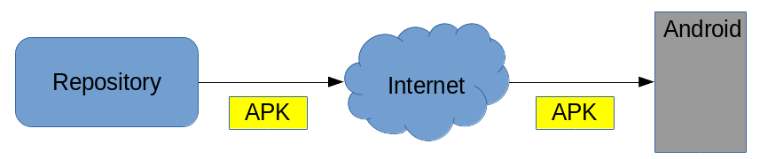
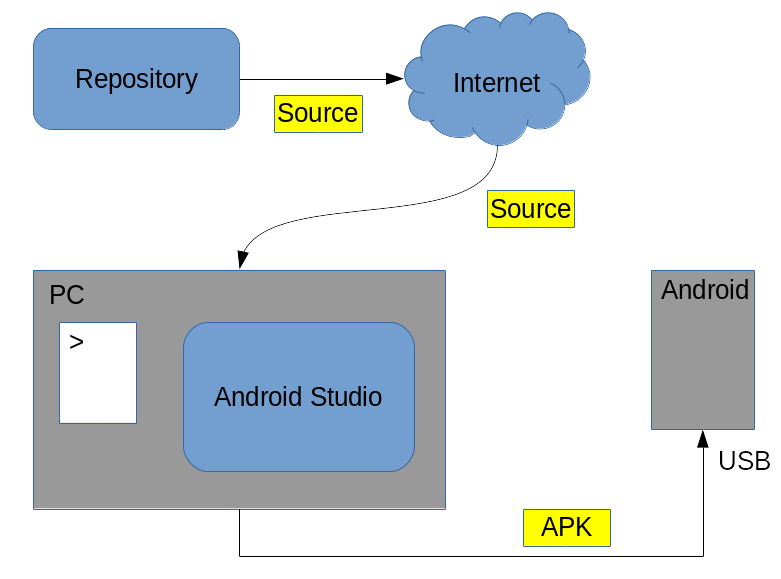
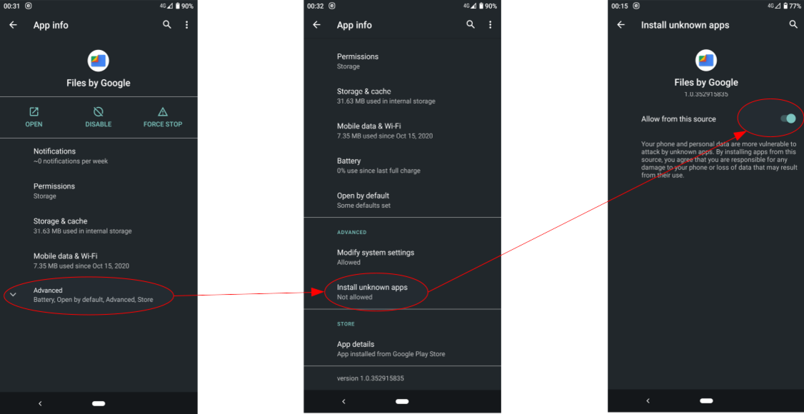
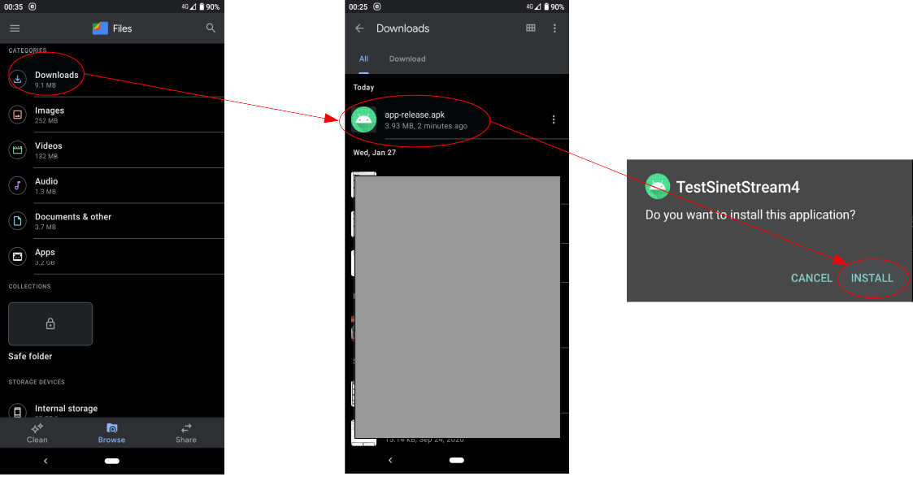
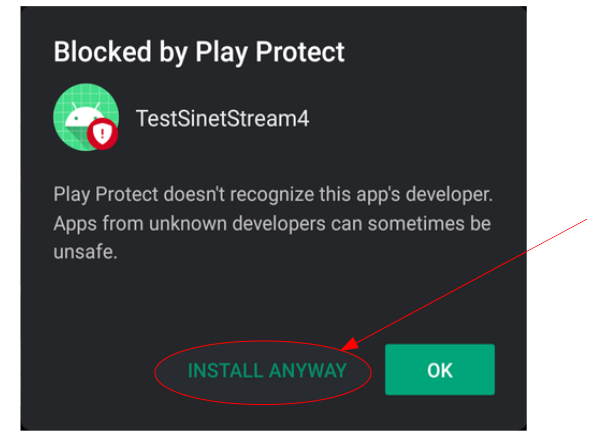
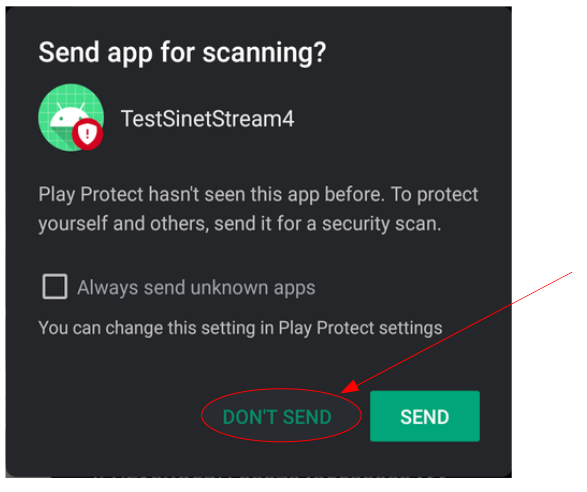
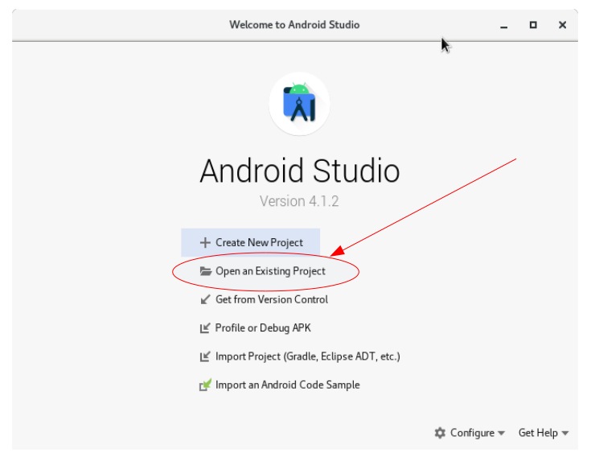
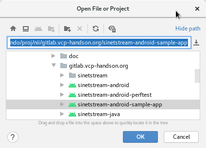
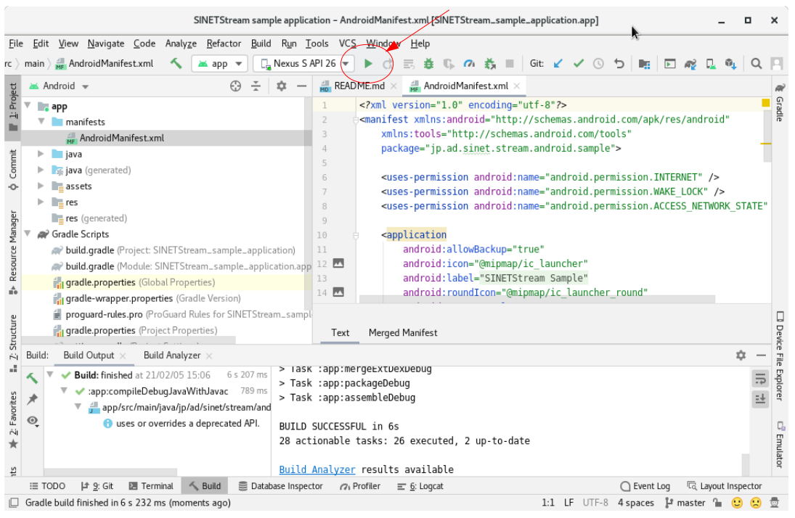

<!--
Copyright (C) 2020-2021 National Institute of Informatics

Licensed to the Apache Software Foundation (ASF) under one
or more contributor license agreements.  See the NOTICE file
distributed with this work for additional information
regarding copyright ownership.  The ASF licenses this file
to you under the Apache License, Version 2.0 (the
"License"); you may not use this file except in compliance
with the License.  You may obtain a copy of the License at

  http://www.apache.org/licenses/LICENSE-2.0

Unless required by applicable law or agreed to in writing,
software distributed under the License is distributed on an
"AS IS" BASIS, WITHOUT WARRANTIES OR CONDITIONS OF ANY
KIND, either express or implied.  See the License for the
specific language governing permissions and limitations
under the License.
-->

[English](TUTORIAL-android-install.en.md)

# チュートリアル - Androidサンプルアプリケーションの導入

<em>目次</em>
<pre>
1. 概要
2. 作業方針
3. 事前準備
4. バイナリ版APKを入手して導入する方法
4.1 APKの入手
4.2 APKのAndroid端末への導入
5. ソースコードから自前でAPKをビルドして導入する方法
5.1 Android開発環境の準備
5.2 ソースコードの入手
5.3 Android Studioへのソースコードの読み込み
5.4 Android端末側の準備
5.5 開発機材でのビルドおよびAndroid端末への導入
</pre>


## 1. 概要

Android版サンプルアプリケーションをお手元のAndroid端末に導入する方法について、
具体的な手順を概説します。

本書で例示するAndroid画面イメージは`Android 10`の環境で採取したものなので、
OS違いにより画面構成や文言表現が多少変わるかもしれません。
お手元のAndroid端末の動作環境に合わせて適宜読み替えてください。


## 2. 作業方針

作業上の大きな選択肢として、以下の2つの方式があります。

* バイナリ版の`Androidアプリケーションパッケージ`（以下`APK`と略記）を対象Android端末にダウンロードし、Android端末上の操作で直接導入する。



* GitHubで公開中のソースコードを手元の開発環境でビルドし、生成`APK`を対象Android端末にUSBケーブルで繋いで導入する。



前者はお手軽に試したい方向け、後者は本ソースコードを元に開発することを視野に入れた方向けです。


## 3. 事前準備

バイナリ版を導入するにせよ、ソースから自前で構築するにせよ、
[Google Play](https://play.google.com/store/apps)
経由でない`APK`をAndroid端末に導入するには一手間必要です。
すなわち、`Google Play`の管理下にない「出所不明のアプリケーション」をお手元のAndroid端末に導入しても良いことを明示的に設定する必要があります。

以下の手順を実行してください。

* ファイル管理アプリケーションの準備
  * インターネット経由でダウンロードしたファイル（AudioやVideoなどの種別のうちApplication）を操作できれば何でも良いです。
  * お手元のAndroid端末の購入時にファイル操作用アプリケーションが（ファイルマネージャなどの名前で）事前導入されているかもしれません。
  * ここではGoogleの純正アプリケーション
[Files by Google](https://play.google.com/store/apps/details?id=com.google.android.apps.nbu.files)
で操作することを前提に記述します。

* 不明アプリケーションの導入許可
  * 下記操作によりファイル管理アプリケーション`Files`の設定画面を開きます。
```
    ホーム画面(Home)
    --> 設定(Settings)
      --> アプリと通知(Apps & notifications)
        --> 画面上部`最近開いたアプリ`(Recently opened apps)欄の
            `xxx個のアプリをすべて表示`（SEE ALL xxx APPS）
          --> ファイル（Files）を選択
```
  * `Files`の情報表示画面（下図左端）で`詳細設定`を展開表示して、項目`不明なアプリのインストール`（下図中央）を押下します。

  > お手元の実行環境によっては「不明なアプリのインストール」が表示され
  > ないかもしれません。
  > その場合は以下の操作をスキップして次に進んでください。

  * 初期状態では項目`この提供元のアプリを許可`が無効（灰色表示）なので、つまみを右にずらして有効にしてください（下図右端）。



所用のアプリケーションの導入が終わったら、上記設定は元に戻してください。


## 4. バイナリ版`APK`を入手して導入する方法
### 4.1 `APK`の入手

Android端末のブラウザ`Chrome`で以下のURLにアクセスし、対象のファイル`xxx.apk`を手元にダウンロードしてください。

* STEP1: テキスト送受信アプリ
[sinetstream-android-echo v1.5.2](https://github.com/nii-gakunin-cloud/sinetstream-android-echo/releases/download/v1.5.2/sinetstream-android-echo-v1.5.2.apk)
* STEP2: センサ情報収集アプリ
[sinetstream-android-sensor-publisher v1.5.2](https://github.com/nii-gakunin-cloud/sinetstream-android-sensor-publisher/releases/download/v1.5.2/sinetstream-android-sensor-publisher-v1.5.2.apk)

入手に成功すれば、Android端末上の`Downloads`ディレクトリ配下に格納されます。


### 4.2 `APK`のAndroid端末への導入

Android端末のファイル操作アプリケーション`Files`を起動すると、ディレクトリ一覧（下図左端）が表示されます。

ここで`Downloads`を選択するとインターネットから入手したファイル一覧（下図中央）が表示されますので、`xxx.apk`を選択します。
当該アプリを導入しても良いか確認するダイアログ（画面右端）が表示されますので、`INSTALL`を選択してください。

なお、下図右端で示した確認ダイアログでは、試験用アプリケーション名称とアイコン画像が表示されていますが、実際は目的のものが表示されます。



`Google Play`経由ではなく私的なサーバからの導入となるため、いわゆる野良アプリを導入して良いか
[Google Play Protect](https://developers.google.com/android/play-protect)
による事前確認が走ります（下図）。
対象としているのはNII開発のサンプルアプリケーションであるため、ここでは構わず`INSTALL ANYWAY`を選択して導入操作を進めてください。
この`Play Protect`確認は最初の導入時のみとなります。



前項の続きとなりますが、セキュリティ検査のため本アプリを不明なものとして`Play Protect`に送るか確認されます（下図）。

`DONT SEND`を選択してスキップしてください。このアプリケーション検査手続きも導入時の最初の1回だけの実行です。



無事にアプリケーション導入作業が完了すると、画面下側に「導入成功」の旨のポップアップメッセージが短時間表示されます。

＜参考＞
[Google Playプロテクトを使用して有害なアプリから保護する](https://support.google.com/googleplay/answer/2812853)


## 5. ソースコードから自前で`APK`をビルドして導入する方法
### 5.1 Android開発環境の準備

お手元の適当な機材（Windows, Mac, Linux, Chrome OS）に最新の
[Android Studio](https://developer.android.com/studio)
を導入してください。
開発機材のOS、CPU性能や所用メモリ量などシステム要件にご注意ください。

＜参考＞
[Android Studioのインストール](https://developer.android.com/studio/install)


### 5.2 ソースコードの入手

サンプルアプリケーションはGitHubで公開されています。
お手元の開発環境に`git`コマンドでソース一式をダウンロードしてください。

* STEP1: テキスト送受信アプリ(sinetstream-android-echo)
```console
    PC% cd $HOME/StudioProjects
    PC% git clone https://github.com/nii-gakunin-cloud/sinetstream-android-echo.git
```

* STEP2: センサ情報収集アプリ(sinetstream-android-sensor-publisher)
```console
    PC% cd $HOME/StudioProjects
    PC% git clone https://github.com/nii-gakunin-cloud/sinetstream-android-sensor-publisher.git
```

### 5.3 Android Studioへのソースコードの読み込み

`Android Studio`を起動し、入手したソースディレクトリを開いてください。



上図の初期画面から項目`Open an Existing Project`を選択すると、
取り込み用のプロジェクト選択画面が表示されます。
事前に取得したソースコードのディレクトリを指定してください。


> 上図は操作イメージです。ディレクトリ名などは読み替えてください。

### 5.4 Android端末側の準備

自前でビルドした`APK`を対象のAndroid端末に導入するには、事前に実機上で`開発者向けオプション`の`USBデバッグ`機能を有効に必要があります。
内容の性質上、これはAndroidの`設定`画面の隠しオプションとなっています。
以下の手順で有効化してください。

* 開発者向けオプションの有効化
```
    ホーム画面(Home)
    --> 設定(Settings)
      --> この電話について(About phone)
        --> `ビルド番号`(Build number)の欄を`7回`連続タップ
          --> 画面ロック解除コード入力
```

* USBデバッグの有効化
```
    ホーム画面(Home)
    --> 設定(Settings)
      --> システム(System)
        --> `詳細設定`(Advanced)を展開表示
          --> 開発者向けオプション(Developer options)
            --> USBデバッグ(USB debugging)
```

＜参考＞
[開発者向けオプションとUSBデバッグの有効化](https://developer.android.com/studio/debug/dev-options#enable)


### 5.5 開発機材でのビルドおよびAndroid端末への導入

* 対象のAndroid端末に`スクリーンロックがかかっていない状態`で、開発用機材とUSBケーブルで接続します。

* Android端末でUSBデバッグが有効化されていると、Android端末制御用のツール`Android Debug Bridge（adb）`により機材認証を求めるダイアログが表示されるので、これを了承します。

* サンプルアプリケーションのプロジェクトを開いたAndroidStudioにて、実行アイコン(右向き緑色矢印)を押下すると、ビルドとAndroid端末への導入が実行されます。


> 上図は操作イメージです。ディレクトリ名などは読み替えてください。

＜参考＞
[ハードウェアデバイス上でのアプリの実行](https://developer.android.com/studio/run/device#connect)

