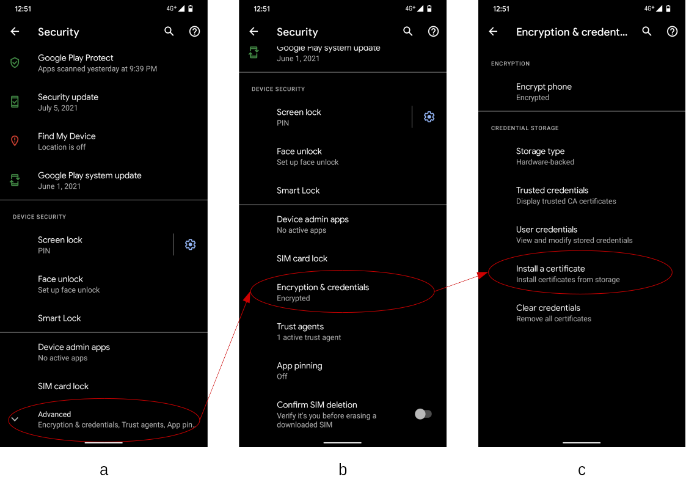
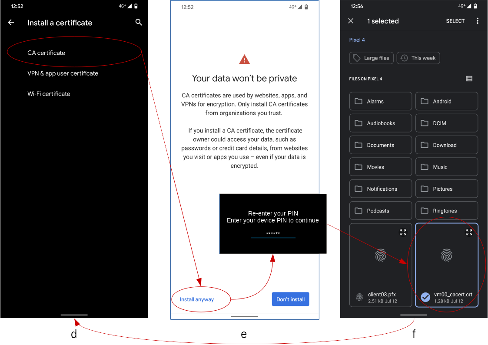
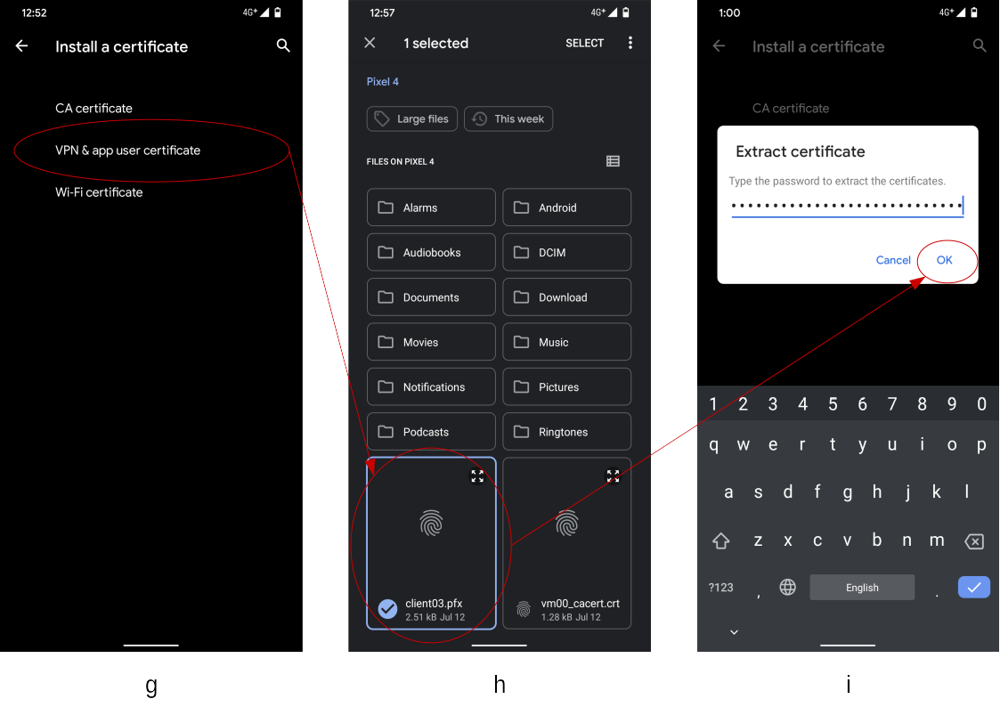
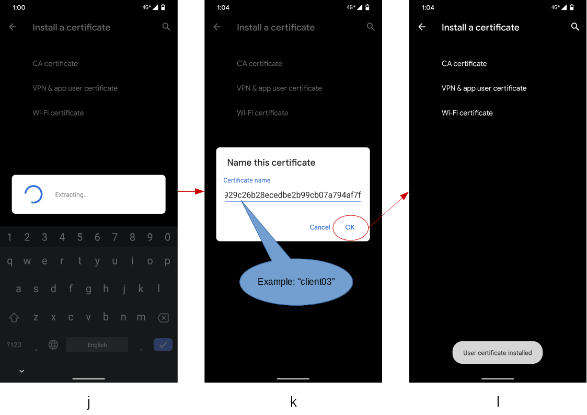
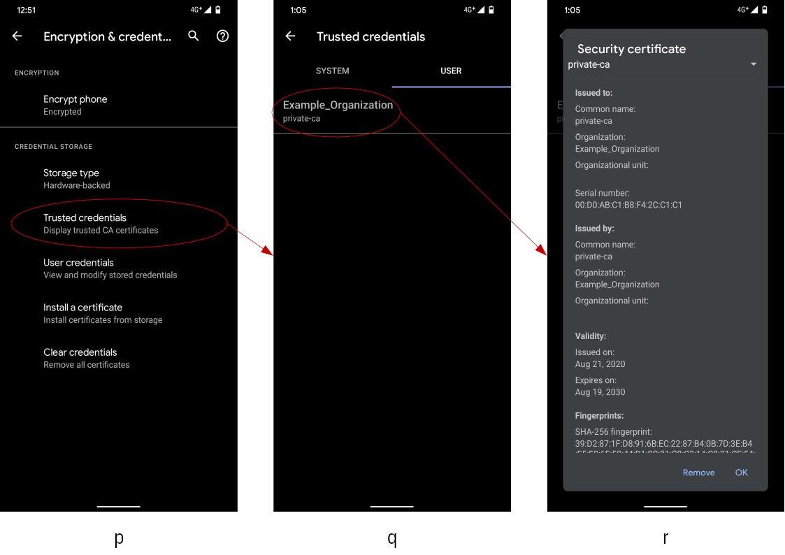
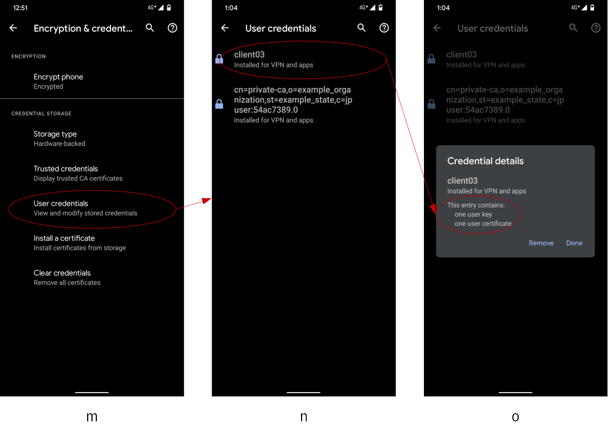
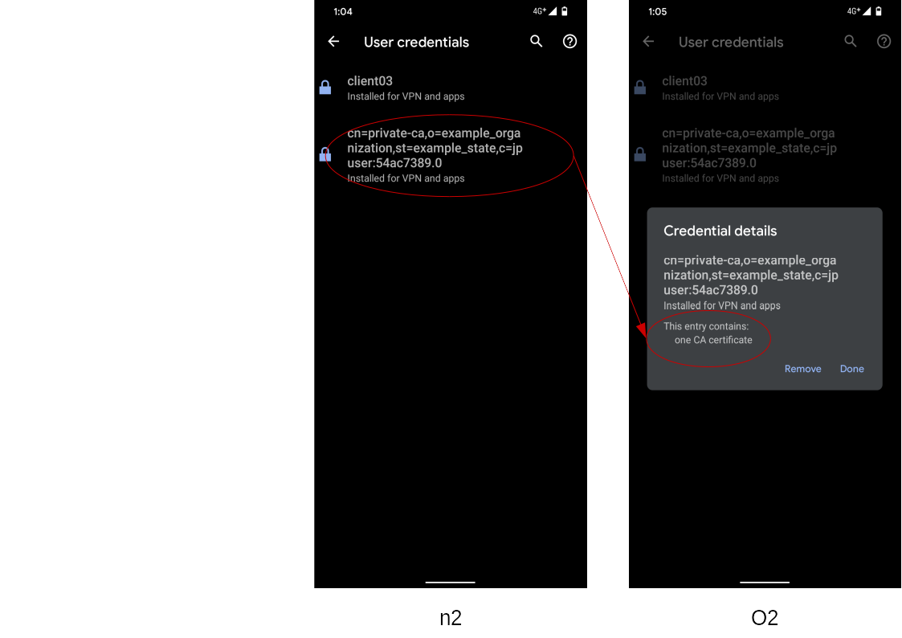

<!--
Copyright (C) 2021 National Institute of Informatics

Licensed to the Apache Software Foundation (ASF) under one
or more contributor license agreements.  See the NOTICE file
distributed with this work for additional information
regarding copyright ownership.  The ASF licenses this file
to you under the Apache License, Version 2.0 (the
"License"); you may not use this file except in compliance
with the License.  You may obtain a copy of the License at

  http://www.apache.org/licenses/LICENSE-2.0

Unless required by applicable law or agreed to in writing,
software distributed under the License is distributed on an
"AS IS" BASIS, WITHOUT WARRANTIES OR CONDITIONS OF ANY
KIND, either express or implied.  See the License for the
specific language governing permissions and limitations
under the License.
-->

[日本語](TUTORIAL-android-keychain.md)

# TUTORIAL - Installation of certificates in the system credential storage

<em>Table of contents</em>
<pre>
1. Introduction
2. Who should read this?
3. Preparations
3.1 Prepare SSL/TLS certificate files
3.1.1 Self-signed server certificate
3.1.2 Client certificate
3.2 Prepare a file management application
3.3 Set screen lock
4. Obtain SSL/TLS certificate files
4.1 Obtain via network
4.2 Obtain via offline works
5. Install SSL/TLS certificate files
5.1 Guide to the certificate installation screen
5.2 Install a self-signed server certificate
5.3 Install a client certificate
5.4 Check the installed self-signed server certificate
5.5 Check the installed client certificate
</pre>


## 1. Introduction

When an Android device connects to the peer broker using SSL/TLS,
the broker requests to present a client certificate and/or a
self-signed server certificate to the Android device, depending on
the broker setting.
That is, you need to pre-install the required SSL/TLS certificates
on the Android device.

There are two options how an Android application access to the
SSL/TLS certificates.
<pre>
* a) When you implement an Android application, embed the SSL/TLS certificate files as the asset of the program.
* b) Pre-install the required certificates in the system credential storage, and refer them on application runtime.
</pre>

On the latter case `b)`, you do not have to embed any sensitive
information such like SSL/TLS certificates in a program.
<pre>
* Even if the Android device has lost or stolen, sensitive information will not be leaked to the third party.
* Upon the expiration of SSL/TLS certificates, you can update them without modifying the program.
</pre>
That is, you can reduce security threats because of above points.
In this document, we focus on the case `b)` and present concrete
procedures about how to install the SSL/TLS certificates in the
Android system credential storage (`KeyChain`) [1].

The screen shots on this document are taken on a Google Pixel 4
(Android 11) device.
There may be some differences of screen appearances or descriptive
expressions depending on the OS version.
Please read accordingly, based on the running environment of your
Android device.

[1] [Security features](https://developer.android.com/training/articles/keystore#SecurityFeatures)


## 2. Who should read this document?

If an Android device going to connect to a broker using SSL/TLS,
required certificates must have prepared on the Android device.
It depends the security policy on the broker side that determines
what kind of certificates are required on the Android side.

* Is the broker that an Android device going to connect trustworthy?
  * Use a server certificate signed by a commercial certificate
authority (CA)[2], such like VeriSign
    --> Nothing to do on the Android side.
  * Use a server certificate signed by the broker itself
    --> The Android device must install the self-signed server certificate.

* Is the Android device that going to connect to the broker trustworthy?
  * The broker DOES trust the connecting Android device
    --> Nothing to do on the Android side.
  * The broker challenges the connecting Android device
    --> The Android device must install the designated client certificate.

To summarize, if your Android device connects to the broker which
`uses a server certificate signed by a commercial CA, and does not
require any client certificate`, then you can finish here.
Otherwise, install appropriate SSL/TLS certificates on your Android
device referring the following descriptions.

[2] [Certificate authority](https://en.wikipedia.org/wiki/Certificate_authority)


## 3. Preparations
### 3.1 Prepare SSL/TLS certificate files

Ask management staff to issue SSL/TLS certificate files to be installed
on your Android device.


#### 3.1.1 Self-signed server certificate

* Prepare a X.509 certificate file in PEM format (file extension `.crt`
or `.cer`) [3].
* We use a certificate file `vm00_cacert.crt` as an example.

```console
PC% file ./vm00_cacert.crt
./vm00_cacert.crt: PEM certificate

PC% openssl verify vm00_cacert.crt
vm00_cacert.crt: C = JP, ST = Example_State, O = Example_Organization, CN = private-ca
error 18 at 0 depth lookup:self signed certificate
OK
```

[3] [X.509](https://en.wikipedia.org/wiki/X.509)


#### 3.1.2 Client certificate

* Prepare a PFX (Personal Information Exchange) file in PKCS#12 format
(file extension `.pfx`) [4], and its corresponding password.
* We use a certificate file `client03.pfx` and its password as an example.

```console
PC% file ./client03*
./client03.pfx: data
./client03.txt: ASCII text

PC% openssl pkcs12 -in client03.pfx -info -noout
Enter Import Password:
MAC Iteration 2048
MAC verified OK
PKCS7 Encrypted data: pbeWithSHA1And40BitRC2-CBC, Iteration 2048
Certificate bag
PKCS7 Data
Shrouded Keybag: pbeWithSHA1And3-KeyTripleDES-CBC, Iteration 2048
```

[4] [PKCS#12](https://en.wikipedia.org/wiki/PKCS)


### 3.2 Prepare a file management application

* You can use any application which can handle the SSL/TLS
certificate files.
* Your Android device may already have a file management application,
something like a "File Manager".
* In this document, we suppose to use the Google application
[Files by Google](https://play.google.com/store/apps/details?id=com.google.android.apps.nbu.files)
and describe operations accordingly.


### 3.3 Set screen lock

<em>This section is optional for Android 10 or later devices. [5]</em>

If you install a user specified secret file in the system credential
storage (`KeyChain`), you are required to set screen lock.
With the fact that you can unlock screen, you passed the device
authentication as the legitimate owner.
Though you can proceed without setting screen lock, you will be
prompted to do so at the time of SSL/TLS certificate installation.

<pre>
    Home
    --> Settings
      --> Security
        --> Screen lock
          --> Choose a screen lock method (except "None" and "Swipe")
</pre>

[5] [KeyChain behavior changes and improvements](https://developer.android.com/about/versions/10/behavior-changes-all#keychain)


## 4. Obtain SSL/TLS certificate files
### 4.1 Obtain via network

* File server

  * Access to the file server by the `Chrome` browser and download the
target SSL/TLS certificate files to your Android device.
  * Downloaded files will be located under the `Downloads` directory.
  * Upon completion, you will be asked whether to install the certificate
file immediately. But please do nothing here.

* Google Drive

  * Put the target SSL/TLS certificate files somewhere on Google Drive
with your Gmail account.


### 4.2 Obtain via offline works

* SD card

  This method is handy if your Android device has a SD card slot.
<pre>
    1) Turn off power of your Android device.
    2) Remove the SD card from the chassis.
    3) Insert the SD card to your working PC and mount to the file system.
    4) Copy the target SSL/TLS certificate files to the SD card.
       Destination path can be anywhere, but root directory is handy.
    5) Unmount from the file system and eject the SD card.
    6) Insert the SD card to your Android device.
    7) Turn on power of your Android device.
</pre>

* Transfer SSL/TLS certificate files via USB cable

  <em>This method is targeted for developers.</em>

  * Connect the target Android device to your workstation by a USB cable.
Beware `screen lock` is cleared beforehand.
  * If the target Android device is `USB debugging` enabled, the
`Android Debug Bridge (adb)`[6] challenges for the device authentication.
  * Answer `OK` to the confirmation dialog on the target Android device,
so that the Android device is recognized by the `adb`.
  * Execute following commands on your workstation.
    * Destination path is slightly different before and after Android 11.

```console
# Android 10 or earlier
% adb push client03.pfx /mnt/sdcard
% adb push vm00_cacert.crt /mnt/sdcard
```
 
```console
# Android 11
% adb push client03.pfx /mnt/sdcard
adb: error: stat failed when trying to push to /mnt/sdcard: Permission denied
 
% adb push client03.pfx /sdcard
% adb push vm00_cacert.crt /sdcard
```

[6] [Android Debug Bridge (adb)](https://developer.android.com/studio/command-line/adb)


## 5. Install SSL/TLS certificate files
### 5.1 Guide to the certificate installation screen



To manipulate certificates managed by the system credential storage
(`KeyChain`), you need to dig into the deep layer of system settings.
At first, move to the base location as follows.

* Open the `Settings` application on your Android device, and move
to the `Security` setting screen (a).
* As the initial state, `Encryption & credential` settings are collapsed
under the item `Advanced`. If you expand it, the screen looks like (b).
* On the screen (b), select the item `Encryption & credential` and
move to the screen (c).
* On the screen (c), select the item `Install a certificate` and move
to the certificate installation screen, to be noted afterword.


### 5.2 Install a self-signed server certificate



* If you select the item `CA certificate` on the screen (d), a warning
  dialog about your data privacy (e) will be shown.
* If you press the button `Install anyway`, you will be challenged to
  clear the device authentication like screen unlock.
* Once the device authentication has passed, you will be redirected
  to the file selection screen (f).
* Select the target certificate file (with a fingerprint icon).
  * In this example, select the file `vm00_cacert.crt` located immediate
    under the root file system.
  * If you put the target certificate file on a different file system
    such like SD card or Google Drive, press the burger-icon on the top left
    corner of the screen (f).
* If the installation finished successfully, a toast message will be
  briefly shown, and you will be redirected to the initial screen (d).


### 5.3 Install a client certificate



* If you select the item `VPN & app user certificate` on the screen (g),
  you will be redirected to the file selection screen(h), without device
  authentication.
* Select the target certificate file (with a fingerprint icon).
  * In this example, select the file `client03.pfx` located immediate
    under the root file system.
  * If you put the target certificate file on a different file system
    such like SD card or Google Drive, press the burger-icon on the top left
    corner of the screen (h).
* You will be prompted to enter password to extract the certificate (i).
* Press `OK` button to finish.



* A progress dialog (j) will be shown while processing the certificates.
  * It may take time, around more than several minutes. Beware for a
    long wait.
* Once the extraction finishes, an dialog (k) which presents an alias
  name to distinguish the certificate installed in the system credential
  storage.
  * The initial value of the alias name has automatically assigned by
    system as a random hexadecimal string.
  * On the dialog (i), rewrite the alias name to a human friendly one
    (such like `client03` which is the same as the certificate file name).
  * Press `OK` button to finish.
* If the installation finished successfully, a toast message will be
  briefly shown, and you will be redirected to the initial screen (l).


### 5.4 Check the installed self-signed server certificate



Go through the following steps to check if the self-signed server
certificate has properly installed in the system credential storage
(`KeyChain`).

* Go back to the certification settings screen (p), and select the
  item `Trusted credentials`.
* In the trusted credential listing screen (q), there are two kinds of
  tabs; `SYSTEM` and `USER`.
  * The `SYSTEM` tab contains public root certificates, and entries
are maintained by the Android system.
  * The `USER` tab contains user-managed root certificates, such like
    a self-signed server certificate described in this document.
* In the screen (q), the `USER` tab is empty at initial state, but now
  you can see a summary of the installed self-signed server certificate.
* If you select the item `private-ca` shown in the screen (q), its
  certificate details can be seen in a dialog (r).


### 5.5 Check the installed client certificate



Go through the following steps to check if the client certificate has
properly installed in the system credential storage (`KeyChain`).

* Go back to the certification settings screen (m), and select the
item `User credentials`.
* In the user credential listing screen (n), you can see items with
alias name and its purpose.
  * The screen (n) is empty at initial state, but now you can see the
installed client certificate (alias name: `client03`).
  * The screen (n) has another item which corresponds to the self-signed
server certificate.  We will address this later again.
* If you select the item `client03` shown in the screen (n), its
credential details can be seen in a dialog (o).



If you select the self-signed server certificate (No alias name)
in the screen (n2), its credential details can be seen in a dialog (o2).
Check the difference between (o) and (o2), especially in the red circle.

