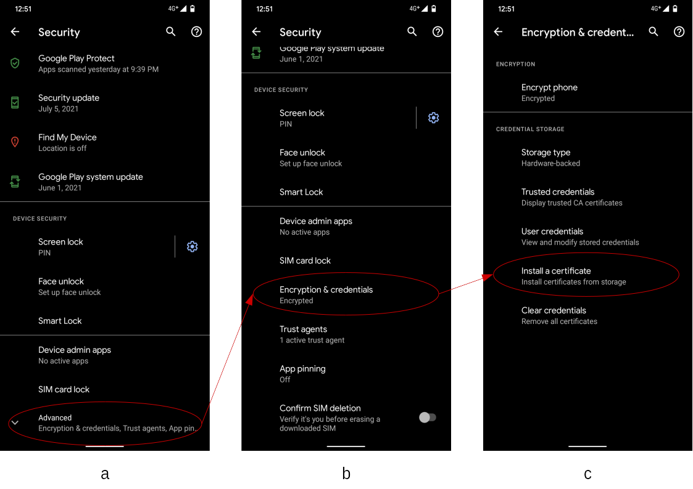
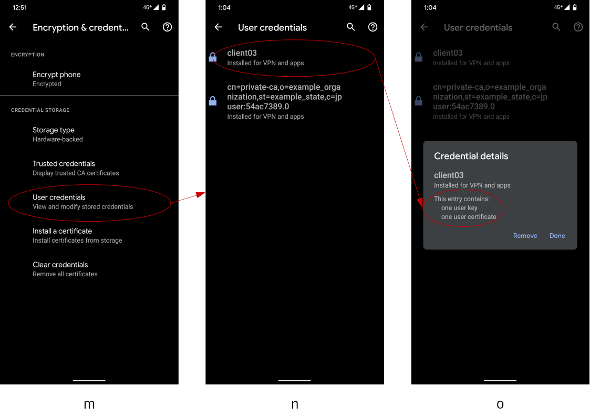

<!--
Copyright (C) 2021 National Institute of Informatics

Licensed to the Apache Software Foundation (ASF) under one
or more contributor license agreements.  See the NOTICE file
distributed with this work for additional information
regarding copyright ownership.  The ASF licenses this file
to you under the Apache License, Version 2.0 (the
"License"); you may not use this file except in compliance
with the License.  You may obtain a copy of the License at

  http://www.apache.org/licenses/LICENSE-2.0

Unless required by applicable law or agreed to in writing,
software distributed under the License is distributed on an
"AS IS" BASIS, WITHOUT WARRANTIES OR CONDITIONS OF ANY
KIND, either express or implied.  See the License for the
specific language governing permissions and limitations
under the License.
-->

[English](TUTORIAL-android-keychain.en.md)

# チュートリアル - システム秘匿領域への証明書ファイルの導入

<em>目次</em>
<pre>
1. 概要
2. 対象読者
3. 事前準備
3.1 SSL/TLS証明書ファイルの準備
3.1.1 自己署名サーバ証明書
3.1.2 クライアント証明書
3.2 ファイル管理アプリケーションの準備
3.3 Android端末の画面ロックの設定
4. SSL/TLS証明書の入手
4.1 ネットワーク経由の場合
4.2 オフライン作業の場合
5. SSL/TLS証明書ファイルの導入
5.1 証明書の設定画面への誘導
5.2 自己署名サーバ証明書の導入
5.3 クライアント証明書の導入
5.4 導入した自己署名サーバ証明書の確認
5.5 導入したクライアント証明書の確認
</pre>


## 1. 概要

Android端末と対向ブローカ間の通信路を秘匿するためSSL/TLS接続を利用する場合、
ブローカ側の設定によってはクライアント証明書や自己署名サーバ証明書（いわゆるオレオレ証明書）の提示をAndroid端末に要求します。
すなわち、所用のSSL/TLS証明書をAndroid側で事前に用意しておく必要があります。

Android端末側でのSSL/TLS証明書の持ち方として、以下の2つの選択肢があります。
<pre>
* a) アプリケーション実装時にデータとして証明書ファイルを埋め込む
* b) システム秘匿領域に証明書ファイルを事前導入しておき、それをアプリケーション実行時に参照する
</pre>

後者`b)`の場合はSSL/TLS証明書という機微情報をプログラムに内蔵する必要がないため、
<pre>
* 端末紛失や盗難などの際でも第三者に機微情報が流出する心配がない
* SSL/TLS証明書の失効時にプログラムに手を入れず証明書ファイルを更新できる
</pre>
などの利点があり、セキュリティ上の脅威を低減できます。
本書では上記`b)`に着目し、SSL/TLS証明書をAndroid端末のシステム秘匿領域(`KeyChain`)[1]に導入する方法について具体的な手順を示します。

本書に載せたAndroid端末のスクリーンショットはGoogle Pixel 4 (Android 11)で採取しました。
OSのバージョン違いにより画面構成や文言表現が多少変わるかもしれません。
お手元のAndroid端末の動作環境に合わせて適宜読み替えてください。

[1] [セキュリティ機能](https://developer.android.com/training/articles/keystore?hl=ja#SecurityFeatures)


## 2. 対象読者

ブローカとAndroid端末がSSL/TLSで接続する場合、
Android端末側でどんな証明書を用意しなければいけないかは、
当該ブローカ運用上のセキュリティ方針に依存します。

* Android端末は接続先のブローカを信頼できるか？
  * 商用の認証局[2]（VeriSign社など）が署名したサーバ証明書を購入して利用する
    --> Android端末側で対処不要
  * ブローカ自身が署名したサーバ証明書（自己署名証明書）を利用する
    --> 当該証明書をAndroid端末に導入する

* ブローカは自身に接続してくるAndroid端末を信頼できるか？
  * クライアント証明書の提示を要求しない
    --> Android端末側で対処不要
  * クライアント証明書の提示を要求する
    --> 当該証明書をAndroid端末に導入する

すなわち、Android端末の接続先ブローカのセキュリティ方針が`「商用の認証局が署名したサーバ証明書により身元提示を行い、かつAndroid端末側にクライアント証明書を要求しない」`であれば以降の作業は不要です。
さもなくば、以降の記述を参考にAndroid端末へのSSL/TLS証明書導入作業を実施してください。

[2] [認証局](https://ja.wikipedia.org/wiki/%E8%AA%8D%E8%A8%BC%E5%B1%80)

## 3. 事前準備
### 3.1 SSL/TLS証明書ファイルの準備

ブローカ管理者より、Android端末に導入すべきSSL/TLS証明書ファイルを発行してもらってください。

#### 3.1.1 自己署名サーバ証明書

* PEM形式のX.509証明書[3]（ファイル拡張子「.crt」または「.cer」）を用意してください。
* 本書では例として「vm00_cacert.crt」という証明書ファイルを扱います。

```console
PC% file ./vm00_cacert.crt
./vm00_cacert.crt: PEM certificate

PC% openssl verify vm00_cacert.crt
vm00_cacert.crt: C = JP, ST = Example_State, O = Example_Organization, CN = private-ca
error 18 at 0 depth lookup:self signed certificate
OK
```

[3] [X.509](https://ja.wikipedia.org/wiki/X.509)


#### 3.1.2 クライアント証明書

* PKCS#12形式の個人情報交換ファイル[4]（ファイル拡張子「.pfx」）、およびその内容確認のためのパスワードを用意してください。
* 本書では例として「client03.pfx」という証明書ファイル、およびそのパスワードを扱います。

```console
PC% file ./client03*
./client03.pfx: data
./client03.txt: ASCII text

PC% openssl pkcs12 -in client03.pfx -info -noout
Enter Import Password:
MAC Iteration 2048
MAC verified OK
PKCS7 Encrypted data: pbeWithSHA1And40BitRC2-CBC, Iteration 2048
Certificate bag
PKCS7 Data
Shrouded Keybag: pbeWithSHA1And3-KeyTripleDES-CBC, Iteration 2048
```

[4] [PKCS#12](https://ja.wikipedia.org/wiki/PKCS)


### 3.2 ファイル管理アプリケーションの準備

* 対象のSSL/TLS証明書ファイルを操作できれば何でも良いです。
* お手元のAndroid端末の購入時にファイル操作用アプリケーションが（ファイルマネージャなどの名前で）事前導入されているかもしれません。
* ここではGoogleの純正アプリケーション
[Files by Google](https://play.google.com/store/apps/details?id=com.google.android.apps.nbu.files)
で操作することを前提に記述します。


### 3.3 Android端末の画面ロックの設定

<em>お手元のAndroid端末のOSが10以上の場合、本項は任意です。[5]</em>

システム秘匿領域(`KeyChain`)にユーザ指定の秘密ファイルを導入するには、
画面ロックの設定が必要となります。
当該Android端末の画面ロックを解除できることをもって、正当な持ち主による
操作であるというデバイス認証を兼ねています。
画面ロックを設定せずに作業を進めることは可能ですが、
その場合はSSL/TLS証明書ファイル導入時に画面ロック設定を促されます。
<pre>
    ホーム画面(Home)
    --> 設定(Settings)
      --> セキュリティ(Security)
        --> 画面ロック(Screen lock)
          --> 適当な画面ロック方法（「なし」と「スワイプ」以外）を選択
</pre>

[5] [KeyChainの動作変更と機能強化](https://developer.android.com/about/versions/10/behavior-changes-all#keychain)


## 4. SSL/TLS証明書の入手
### 4.1 ネットワーク経由の場合

* ファイルサーバ経由

  * SSL/TLS証明書ファイルを格納したサーバにAndroid端末のブラウザ`Chrome`で
アクセスし、当該ファイルを手元にダウンロードしてください。
  * 入手に成功すれば、Android端末上の`Downloads`ディレクトリ配下に格納されます。
  * ダウンロード完了時に「この証明書ファイルを導入しますか」という旨を聞かれますが、ここでは何もしないでください。

* Google Drive経由

  * お手持ちのGmailアカウントにて、Google Drive上の適当な場所にSSL/TLS証明書ファイルを配置してください。


### 4.2 オフライン作業の場合

* SDカード経由
  * お手元のAndroid機材でSDカードを扱える場合はお手軽な手法です。
<pre>
    1) Android機材の電源を切る。
    2) Android機材からSDカードを外す。
    3) 手元の作業機材にSDカードを装着し、ファイルシステムにマウントする。
    4) 手元の作業機材からSDカードにSSL/TLSファイルをコピーする。
       コピー先は任意だが、SDカードのルートディレクトリ直下が扱いやすい。
    5) ファイルシステムからアンマウントし、手元の作業機材からSDカードを外す。
    6) Android機材にSDカードを装着する。
    7) Android機材の電源を入れる。
</pre>

* USBケーブル経由でSSL/TLS証明書ファイルを転送

  <em>本方式は開発者向けです。</em>

  * 対象のAndroid端末に`スクリーンロックがかかっていない状態`で、開発用機材とUSBケーブルで接続します。
  * Android端末でUSBデバッグが有効化されていると、Android端末制御用のツール`Android Debug Bridge (adb)`[6]により機材認証を求めるダイアログが表示されます。
  * OKボタンを押下して機材認証を了承すると、adbコマンドによりAndroid端末が認識されるようになります。
  * 以下のコマンドを実行します。
    * Android10以下と11以降でコピー先の指定方法が多少異なります。

```console
# Android10 or below
% adb push client03.pfx /mnt/sdcard
% adb push vm00_cacert.crt /mnt/sdcard
```

```console
# Android11
% adb push client03.pfx /mnt/sdcard
adb: error: stat failed when trying to push to /mnt/sdcard: Permission denied

% adb push client03.pfx /sdcard
% adb push vm00_cacert.crt /sdcard
```

[6] [Android Debug Bridge (adb)](https://developer.android.com/studio/command-line/adb)


## 5. SSL/TLS証明書ファイルの導入
### 5.1 証明書の設定画面への誘導



システム秘匿領域(`KeyChain`)で管理する証明書の扱いは、システム設定階層の深いところまで潜る必要があります。
まずは、以下の要領で証明書の設定画面に移動してください。

* Android端末のシステム設定(`Settings`)アプリケーションを開き、
「セキュリティ(`Security`)」設定画面（a）に移動します。
* 初期状態では、証明書関係は「詳細設定(`Advanced`)」項目に隠れています。
これを展開すると画面(b)のように表示されます。
* 画面(b)で「暗号化と認証情報(`Encryption & credentials`)」項目を選択し、画面(c)に遷移します。
* 画面(c)で「ストレージからのインストール(`Install a certificate`)」項目を選択し、証明書導入画面（後述）に遷移します。


### 5.2 自己署名サーバ証明書の導入


* 証明書導入画面(d)で「CA証明書(`CA certificate`)」項目を選択すると、
「あなたのデータが公開されます」旨の注意喚起ダイアログ(e)が表示されます。
* ここで「インストールする(`Install anyway`)」ボタンを押下すると、画面ロック解除と同じ方法でデバイス認証を要求されます。
* デバイス認証が通ると、ファイル選択画面(f)に遷移します。
* 事前に取り込み済みの証明書ファイル（指紋のアイコンで表現）を選択します。
  * この例ではルートファイルシステム直下に配置した`vm00_cacert.crt`を選択します。
  * SDカードやGoogle Driveなど、別のファイルシステムに証明書ファイルを配置した場合は、ファイル選択画面(f)左上にあるバーガーメニュー経由で格納場所を選択してください。
* 証明書ファイルの導入に成功すると、その旨を伝えるメッセージが一時表示され、元の画面(d)に戻ります。


### 5.3 クライアント証明書の導入


* 証明書導入画面(g)で「VPNとアプリユーザー証明書(`VPN & app user certificate`)」項目を選択すると、
ユーザ認証画面を経ることなくファイル選択画面(h)に遷移します。
* 事前に取り込み済みの証明書ファイル（指紋のアイコン）を選択します。
  * この例ではルートファイルシステム直下に配置した`client03.pfx`を選択します。
  * SDカードやGoogle Driveなど、別のファイルシステムに証明書ファイルを配置した場合は、ファイル選択画面(h)左上にあるバーガーメニュー経由で格納場所を選択してください。
* 証明書を抽出するためのパスワード入力を求めるダイアログ(i)が表示されます。
* パスワードを入力したらOKボタンを押下してください。


* 証明書抽出作業中を示すダイアログ(j)が表示されます。
  * 処理に数分以上の時間がかかる場合があるので、辛抱強くお待ちください。
* 証明書抽出が無事に完了すると、システム秘匿領域(`KeyChain`)に格納される当該証明書を識別するためのエイリアス名が示されたダイアログ(k)が表示されます。
  * エイリアス名の初期値は16進数の羅列が自動で割り当てられます。
  * 人間が識別しやすい適当な名前（ここでは証明書ファイル名と同じ`client03`）を指定したらOKボタンを押下してください。
* 証明書ファイルの導入に成功すると、その旨を伝えるメッセージが一時表示され、元の画面(l)に戻ります。


### 5.4 導入した自己署名サーバ証明書の確認


自己署名サーバ証明書がシステム秘匿領域(`KeyChain`)に正しく導入されたことは、以下の要領で確認してください。

* システム設定の証明書操作画面(p)に戻り、項目「信頼できる認証情報(`Trusted credentials`)」を選択します。
* 信頼された証明書一覧画面(q)では`SYSTEM`と`USER`の2つのタブが並んでいます。
  * `SYSTEM`は一般公開されたルート証明書であり、Androidシステムで維持管理されています。
  * `USER`はユーザが管理するルート証明書であり、本書で記述している自己署名サーバ証明書が該当します。
* 画面(q)の`USER`タブの初期値は空欄ですが、ここでは導入した自己署名サーバ証明書（ファイル：`vm00_cacert.crt`）の組織名とコモンネームが表示されています。
* 表示された要素（コモンネーム：`private-ca`）を選択すると、当該証明書の詳細情報がダイアログ(r)で表示されます。


### 5.5 導入したクライアント証明書の確認



クライアント証明書がシステム秘匿領域(`KeyChain`)に正しく導入されたことは、以下の要領で確認してください。

* システム設定の証明書操作画面(m)に戻り、項目「ユーザー認証情報(`User credentials`)」を選択します。
* 導入された証明書一覧画面(n)において、証明書導入時に指定したエイリアス名がその用途と共に表示されます。
  * 画面(n)の初期値は空欄ですが、この例では導入済みのクライアント証明書（エイリアス名：`client03`）の要素が表示されます。
  * 画面(n)には自己署名サーバ証明書の要素も表示されています。こちらに関しては後述します。
* 表示された要素（エイリアス名：`client03`）を選択すると、当該証明書の詳細情報がダイアログ(o)で表示されます。


画面(n2)で自己署名サーバ証明書（エイリアス名なし）の要素を選択すると、当該証明書の詳細情報がダイアログ(o2)で表示されます。
画面(o)と(o2)を見比べて、赤丸で囲った内容の違いに着目ください。

