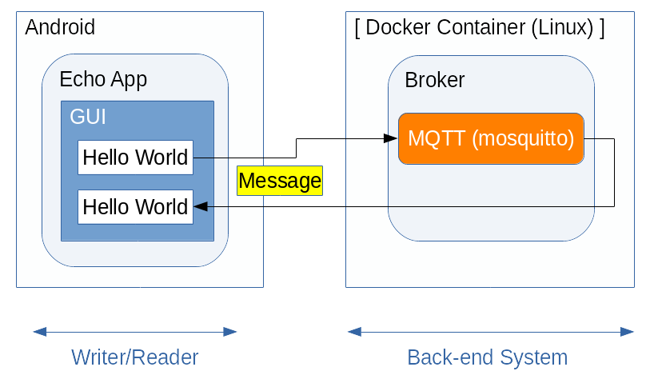

<!--
Copyright (C) 2020-2021 National Institute of Informatics

Licensed to the Apache Software Foundation (ASF) under one
or more contributor license agreements.  See the NOTICE file
distributed with this work for additional information
regarding copyright ownership.  The ASF licenses this file
to you under the Apache License, Version 2.0 (the
"License"); you may not use this file except in compliance
with the License.  You may obtain a copy of the License at

  http://www.apache.org/licenses/LICENSE-2.0

Unless required by applicable law or agreed to in writing,
software distributed under the License is distributed on an
"AS IS" BASIS, WITHOUT WARRANTIES OR CONDITIONS OF ANY
KIND, either express or implied.  See the License for the
specific language governing permissions and limitations
under the License.
--->

[English](TUTORIAL-ANDROID-SAMPLE1-OVERVIEW.en.md)

# チュートリアル - ANDROID-SAMPLE1-OVERVIEW

## 1. 概要

Android版のSINETStreamライブラリを使うサンプルプログラム第一弾として、
簡単なシステム構成での使用例を示します。  
Android端末上のGUI操作でユーザが入力した任意の文字列（例えば「Hello 
World」）を`Broker`折り返しでGUIに表示します。


## 2. システム全体構成

本チュートリアルでは、下図のようにAndroid端末側に`Writer`と`Reader`
機能、バックエンド側に`Broker`機能を配置します。



本チュートリアルの見通しを良くするため、以降の記述はAndroid端末側の
作業とバックエンド側の作業という2部構成とします。
どちらから進めても大丈夫ですが、Android端末のアプリケーションを実際
に動かす前に対向`Broker`との接続情報を設定する箇所があります。
お手元のネットワーク構成に合わせて調整してください。

本チュートリアルの見通しを良くするため、以降は

* Android端末側の作業
* バックエンド側の作業

という機能要素ごとに細分化して記述します。内容に沿って作業を進めて
ください。  
一通り環境構築を済ませ、Android端末のサンプルアプリケーションを
実際に動かす前に、対向`Broker`との接続情報を設定する箇所があります。
お手元のネットワーク構成に合わせて調整してください。

## 3. Android端末側の作業

手元のAndroid端末へのサンプルアプリケーションの導入と設定、操作方法
などの手順に関して記述します。  
詳細は別紙
[Android端末側の作業](TUTORIAL-android-sample1.md)
を参照ください。

## 4. バックエンド側の作業

本チュートリアル用のAndroidサンプルアプリケーションは、`Writer`と
`Reader`の双方が同じ`Broker`接続パラメータ（アドレス/ポート、トピッ
ク名）を使用します。
したがって、本チュートリアルに関して`Broker`に特別な作業は不要です。  
Android端末から対向`Broker`に接続さえできれば十分です。

すでに他のチュートリアルで用意した`Broker`があれば、それをそのまま
流用できます。ここでは、Android版のもう一つのチュートリアル(SAMPLE2)
で用いるバックエンドシステムはそのままにして、MQTTの`Broker`機能だけ
を流用する例を示します。

もしまだSAMPLE2のバックエンド機能を立ち上げていない場合、別紙
[チュートリアル DOCKER-CONTAINER](sinetstreamhelper-tutorial-container/TUTORIAL-docker-container.md)
の案内に従い`Docker Engine`の導入、およびコンテナイメージの導入と
起動作業を実施してください。

```console
     % sudo docker run -d --name broker -p 1883:1883 -p 80:80 harbor.vcloud.nii.ac.jp/sinetstream/android-tutorial:latest
```
この`docker run`コマンド実行により、バックエンド側の導入とサーバ群
の起動が自動的に実施されます。


## 5. 制約事項

システム動作を体験していただくチュートリアルという性質上、Android版
`SINETStream`ライブラリの提供する全ての機能を網羅しているわけでは
ありません。

ここで示したチュートリアル用の`Broker`を用いる場合、以下のような
機能制限があることにご留意ください。

* `Broker`との接続方法
  * ユーザ認証、SSL/TLS接続、データ暗号化のいずれも実施せず、最も簡易
な方法で接続します。

  * 処理の簡素化のため、`Broker`に接続される個々のAndroid端末を区別
しません。複数台のAndroid端末を同じトピックで同時に`Broker`に接続し
ても問題ありません。チャットシステムのように、ある`Writer`が送信した
内容が全ての`Reader`宛てに一斉配信されます。


## 6. うまくいかないときは
### 6.1 Androidアプリケーションの設定内容を初期化したい

* いったん全初期化して、設定をやり直したい
    * 以下の手順でアプリケーションのローカルデータを消去してください。
```
    Settings
    --> Apps & notifications
      --> App info
        --> SINETStream Sample
          --> Storage & cache
            --> Clear storage
```

### 6.2 Androidアプリケーションが`Broker`と接続できない

* `Broker`接続失敗のエラーダイアログが表示される
    * 携帯電話網またはWiFiが有効（= 機内モードでない）ことを確認してください。
    * バックエンド側で`Broker`が稼働中であることを確認してください。

* `Broker`との接続タイムアウトになる
    * 接続先`Broker`のIPアドレス(またはFQDN)とポート番号を確認してください。
    * Android端末と`Broker`間のIP経路設定が正しいことを確認してください。
    * 途中でファイアウォールが設定されている場合はその内容を確認してください。


### 6.3 Androidアプリケーション実行中にエラー発生する

* 「EOF例外」エラーメッセージが表示される
    * `Broker`との接続が切れたことを示します。
    * バックエンド機材のコンテナ動作状況を確認してください。

