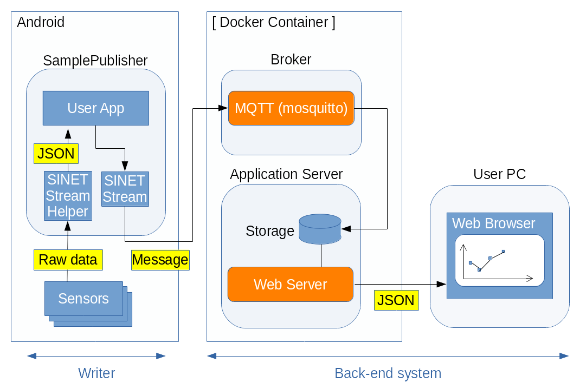

<!--
Copyright (C) 2020-2021 National Institute of Informatics

Licensed to the Apache Software Foundation (ASF) under one
or more contributor license agreements.  See the NOTICE file
distributed with this work for additional information
regarding copyright ownership.  The ASF licenses this file
to you under the Apache License, Version 2.0 (the
"License"); you may not use this file except in compliance
with the License.  You may obtain a copy of the License at

  http://www.apache.org/licenses/LICENSE-2.0

Unless required by applicable law or agreed to in writing,
software distributed under the License is distributed on an
"AS IS" BASIS, WITHOUT WARRANTIES OR CONDITIONS OF ANY
KIND, either express or implied.  See the License for the
specific language governing permissions and limitations
under the License.
--->

[English](TUTORIAL-ANDROID-SAMPLE2-OVERVIEW.en.md)

# チュートリアル - ANDROID-SAMPLE2-OVERVIEW

## 1. 概要

Android版のSINETStreamライブラリを使うサンプルプログラム第二弾として、
少し複雑な構成を例示します。
一般的なAndroid端末は加速度計や照度計などのセンサーデバイスを実装して
おり、ネットワークへの接続手段も備えています。そこで、Android端末で
測定したセンサー読取値を周期的にクラウドに上げて蓄積し、可視化するよ
うなシステムを構築します。


## 2. システム全体構成



この例では`Reader`機能は使いません。  
上図左側が`Writer`機能を示しており、Android端末で計測したセンサー値
を収集してSINETStream経由で`Broker`に送信します。上図右側が`Broker`
機能および背後のバックエンドシステムを示しており、後者が可視化処理を
担当します。

本チュートリアルの見通しを良くするため、以降は

* Android端末側の作業
* バックエンド側の作業
* 観測用PC側の作業

という機能要素ごとに細分化して記述します。内容に沿って作業を進めて
ください。  
一通り環境構築を済ませ、Android端末のサンプルアプリケーションを
実際に動かす前に、対向`Broker`との接続情報を設定する箇所があります。
お手元のネットワーク構成に合わせて調整してください。

## 3. Android端末側の作業

手元のAndroid端末へのサンプルアプリケーションの導入と設定、操作方法
などの手順に関して記述します。  
詳細は別紙
[Android端末側の作業](TUTORIAL-android-sample2.md)
を参照ください。

## 4. バックエンド側の作業

商用クラウドサービスあるいは手元機材上に仮想マシンを用意し、その上で
サーバプログラム群の導入と設定、操作方法などの手順に関して記述します。  

ホスト機材において、まずは動作基盤`Docker Engine`を導入してください。
次に`docker run`コマンドによりSAMPLE2用のコンテナイメージを導入し、
続けて所用のサーバ群の一括起動を実施してください。  
これらの具体的な手順は別紙
[チュートリアル DOCKER-CONTAINER](sinetstreamhelper-tutorial-container/TUTORIAL-docker-container.md)
を参照ください。

```console
     % sudo docker run -d --name broker -p 1883:1883 -p 80:80 harbor.vcloud.nii.ac.jp/sinetstream/android-tutorial:latest
```
この`docker run`コマンド実行により、バックエンド側の導入とサーバ群
の起動が自動的に実施されます。

なお、バックエンド側のシステム的な詳細に関しては別紙
[SINETStreamHelperのチュートリアルのためのコンテナイメージ](sinetstreamhelper-tutorial-container/README.md)
を参照ください。

## 5. 観測用PC側の作業

前述のバックエンド側のシステムが起動すると、専用のウェブサーバが接続
待ち状態となります。
お手元のウェブブラウザで以下のURLに接続成功すると、グラフ画面が表示
される（新たなセンサー情報を受け取ると自動更新される）はずです。

```
    http://<server_address>/chart.html
```

サーバのアドレスは、バックエンドシステムが稼動するホスト機材のものを
指定してください。ポート番号は標準の80番を使いますが、変更する場合は
上記`docker run`の引数「-p 80:80」で調整してください。

グラフ表示画面の構成や表示対象の編集など、詳細に関しては別紙
[チュートリアル - ANDROID-SAMPLE2-WEBBROWSER](TUTORIAL-android-sample2-webbrowser.md)
を参照ください。

## 6. 制約事項

システム動作を体験していただくチュートリアルという性質上、Android版
`SINETStream`ライブラリの提供する全ての機能を網羅しているわけでは
ありません。

以下のような機能制限があることにご留意ください。

* `Broker`との接続方法
  * ユーザ認証、SSL/TLS接続、データ暗号化のいずれも実施せず、最も簡易な
方法で接続します。

* センサー情報取得時の制約
  * Android端末のセンサーデバイスの実装状況により、取得可能なセンサー
種別は異なり得ます。
  * このチュートリアルでは「歩数計、照度計、加速度計」を可視化する
ことを目指していますが、Android端末によってはこれらの値が得られず
グラフも更新されない状況があり得ます。

* バックエンド側の制約
  * 処理の簡素化のため、ベクター値（ここでは加速度が該当）は各要素の
ノルムを計算したスカラー値で表示します。

> ノルム計算に関する注記：
> ベクトルのノルム計算方法として以下の３種類がある。
>
> * 一次元ノルム
>     * 各要素の絶対値の総和
> * ユークリッド(二次元)ノルム
>     * 「各要素の二乗の総和」の平方根
> * 最大値(無限大)ノルム
>     * 絶対値が最大となる要素の値
>
> ここではユークリッド（二次元）ノルムで計算する。

  * 処理の簡素化のため、`Broker`に接続される個々のAndroid端末を区別
しません。複数台のAndroid端末を同時に`Broker`に接続しても問題ありま
せんが、グラフ表示上はそれらのセンサー値が合成されたものとなります。


## 7. うまくいかないときは
### 7.1 Androidアプリケーションの設定内容を初期化したい

* いったん全初期化して、設定をやり直したい
    * 以下の手順でアプリケーションのローカルデータを消去してください。
```
    Settings
    --> Apps & notifications
      --> App info
        --> SamplePublisher
          --> Storage & cache
            --> Clear storage
```

### 7.2 Androidアプリケーションが`Broker`と接続できない

* `Broker`接続失敗のエラーダイアログが表示される
    * 携帯電話網またはWiFiが有効（= 機内モードでない）ことを確認して
ください。
    * バックエンド側で`Broker`が稼働中であることを確認してください。

* `Broker`との接続タイムアウトになる
    * 接続先`Broker`のIPアドレス(またはFQDN)とポート番号を確認して
ください。
    * Android端末と`Broker`間のIP経路設定が正しいことを確認してくだ
さい。
    * 途中でファイアウォールが設定されている場合はその内容を確認して
ください。


### 7.3 Androidアプリケーション実行中にエラー発生する

* 「EOF例外」エラーメッセージが表示される
    * `Broker`との接続が切れたことを示します。
    * バックエンド機材のコンテナ動作状況を確認してください。


### 7.4 観測用PCのウェブ画面でセンサー読取値がグラフ表示されない

* 利用者が権限を許可していないセンサー種別を指定した
    * センサー種別によっては利用者が明示的に権限を設定する必要があり
ます。
    * 現状では「step_counter, step_detector」が該当します。
    * 以下の手順でアプリケーションの`Phisical activity`権限を許可して
ください。
```
    Settings
    --> Apps & notifications
      --> SamplePublisher
        --> Permissions
          --> Physical activity: ALLOWED
```

* `Broker`接続パラメータのトピック名が正しくない
    * `Broker`の背後のバックエンドシステムは、トピック名`sensor-data`
で届いたメッセージを抽出します。
    * 設定画面の`Broker`項目でトピック名が`sensor-data`であることを
確認してください。


* センサー読取データが古すぎて表示期間の描画範囲に入らない
    * 観測用PCのウェブブラウザでグラフ表示用URLに接続中は実時間で描画
領域を更新しています。
    * 現在Androidアプリケーションが稼働していることを確認してください。

* Android端末の画面スリープ状態のときセンサー読取データが存在しない
    * 電力節約のため、画面スリープ時はセンサーを停止させています。
    * 本アプリケーションが他のアプリケーションの背後に回ったときも同様
です。
    * 端末設定により、無操作時の画面スリープ移行時間を調整してください。

