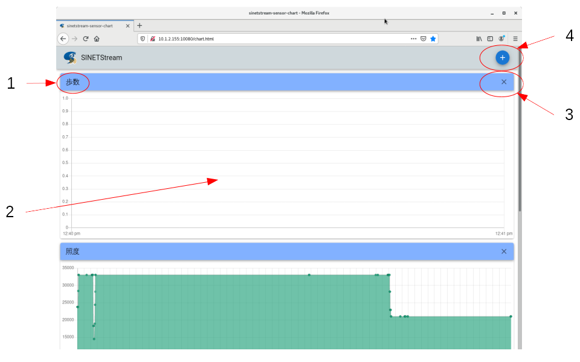
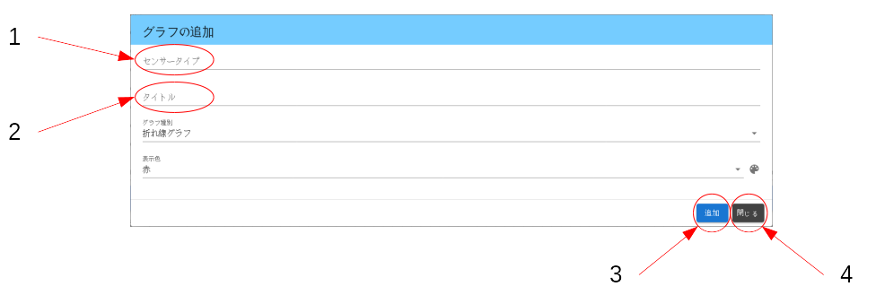

<!--
Copyright (C) 2020-2021 National Institute of Informatics

Licensed to the Apache Software Foundation (ASF) under one
or more contributor license agreements.  See the NOTICE file
distributed with this work for additional information
regarding copyright ownership.  The ASF licenses this file
to you under the Apache License, Version 2.0 (the
"License"); you may not use this file except in compliance
with the License.  You may obtain a copy of the License at

  http://www.apache.org/licenses/LICENSE-2.0

Unless required by applicable law or agreed to in writing,
software distributed under the License is distributed on an
"AS IS" BASIS, WITHOUT WARRANTIES OR CONDITIONS OF ANY
KIND, either express or implied.  See the License for the
specific language governing permissions and limitations
under the License.
--->

[English](TUTORIAL-ANDROID-SAMPLE2-WEBBROWSER.en.md)

# チュートリアル - ANDROID-SAMPLE2-WEBBROWSER

## 1. 概要

Android版のSINETStreamライブラリを使うサンプルプログラム第二弾では、
バックエンド側にウェブブラウザでアクセスして、センサー情報を時系列
でグラフ表示する仕掛けを用意しています。


## 2. サーバへの接続

バックエンド側のシステムが稼働中の状態で、観測用PCのウェブブラウザ
から以下のURLに接続してください。

```
    http://<server_address>/chart.html
```

URLのサーバアドレスは、チュートリアル用のコンテナイメージが稼働して
いるホスト機材のものを指定してください。
ウェブサーバのポート番号を標準(80)以外のものを指定した場合は、それも
併せて`<address>:<port>`形式で指定してください。

URLが正しいはずなのにウェブサーバに接続できない場合、一般的なTCP/IP
通信レベルの接続失敗が考えられます。経路制御やファイアウォールの設定
などを見直してください。


## 3. 主画面
### 3.1 画面構成

主画面はヘッダ部とボディ部に分かれ、ボディ部はセンサー種別ごとの
時系列グラフ表示領域が縦に並ぶ構成となっています。



＜凡例＞
1. センサー種別名称
2. センサー読取値の時系列グラフ表示領域
3. グラフ表示領域の削除ボタン
4. グラフ表示領域の追加ボタン

Android端末側からは周期的にセンサーデータが送られ、バックエンド側に
逐次蓄積されます。センサーデータが追加され続けている限りグラフ表示
領域は自動更新され続けます。


### 3.2 画面構成の編集

初期画面では3つのセンサー種別（歩数、照度、加速度）の表示領域が予め
用意されています。
Android端末側でのセンサー実装状況や着目センサー種別に応じて、利用者が
ボディ部（センサー種別ごとのグラフ表示領域）の構成を編集可能です。
不要なセンサー種別の表示領域は削除し、目的のセンサー種別の表示領域を
追加するという操作内容となります。

ボディ部の画面構成はブラウザのローカルストレージ領域に保存されるので、
いったんブラウザを終了してサーバに再接続すると画面構成が再現されます。


## 4. グラフ追加画面
### 4.1 画面構成

主画面ヘッダ領域の右端にあるプラスボタンを押下すると、以下のような
グラフ追加画面がポップアップ表示されます。



＜凡例＞
1. センサー種別を文字列で指定する（内部処理でフィルタに使用）
2. グラフ表示領域の左上端に示す任意名称を文字列で指定する
3. 編集内容を確定するための「追加」ボタン
4. 編集内容を破棄してこの画面を終了するための「閉じる」ボタン

`センサータイプ`と`タイトル`は必須項目です。グラフ種別や表示色は
お好みで指定してください。
入力内容に問題なければ「追加」ボタンを、処理をキャンセルする場合は
「閉じる」ボタンをそれぞれ押下してください。


### 4.2 センサー種別一覧

本システムで対応しているセンサー種別の一覧を以下に示します。

* 表の1列目`Type`と2列目`Symbol`がAndroid開発者向け文書
[Sensor](https://developer.android.com/reference/android/hardware/Sensor)
中で定数として定義されている値です。  
* 表の3列目`TypeName`に注目ください。この値（accelerometerなど）が
前述のグラフ追加画面で`センサータイプ`として指定すべき文字列です。
タイプミスがあるとグラフ表示フィルタが効きませんのでご注意ください。
* 表中の4列目`AndroidVersion`は、記載のあるOS以降の対応を示します。
AndroidOSの開発進展により、対応センサー種別に増減があり得ます。

|Type|Symbol|TypeName|AndroidVersion|
|---|---|---|---|
|1|Sensor.TYPE_ACCELEROMETER|accelerometer||
|2|Sensor.TYPE_MAGNETIC_FIELD|magnetic_field||
|3|Sensor.TYPE_ORIENTATION|orientation||
|4|Sensor.TYPE_GYROSCOPE|gyroscope||
|5|Sensor.TYPE_LIGHT|light||
|6|Sensor.TYPE_PRESSURE|pressure||
|7|Sensor.TYPE_TEMPERATURE|temperature||
|8|Sensor.TYPE_PROXIMITY|proximity||
|9|Sensor.TYPE_GRAVITY|gravity||
|10|Sensor.TYPE_LINEAR_ACCELERATION|linear_acceleration||
|11|Sensor.TYPE_ROTATION_VECTOR|rotation_vector||
|12|Sensor.TYPE_RELATIVE_HUMIDITY|relative_humidity||
|13|Sensor.TYPE_AMBIENT_TEMPERATURE|ambient_temperature||
|14|Sensor.TYPE_MAGNETIC_FIELD_UNCALIBRATED|magnetic_field_uncalibrated||
|15|Sensor.TYPE_GAME_ROTATION_VECTOR|game_rotation_vector||
|16|Sensor.TYPE_GYROSCOPE_UNCALIBRATED|gyroscope_uncalibrated||
|17|Sensor.TYPE_SIGNIFICANT_MOTION|significant_motion||
|18|Sensor.TYPE_STEP_DETECTOR|step_detector||
|19|Sensor.TYPE_STEP_COUNTER|step_counter||
|20|Sensor.TYPE_GEOMAGNETIC_ROTATION_VECTOR|geomagnetic_rotation_vector||
|21|Sensor.TYPE_HEART_RATE|heart_rate|Android 4.4W+|
|28|Sensor.TYPE_POSE_6DOF|pose_6dof|Android 7.0+|
|29|Sensor.TYPE_STATIONARY_DETECT|stationary_detect|Android 7.0+|
|30|Sensor.TYPE_MOTION_DETECT|motion_detect|Android 7.0+|
|31|Sensor.TYPE_HEART_BEAT|heart_beat|Android 7.0+|
|34|Sensor.TYPE_LOW_LATENCY_OFFBODY_DETECT|low_latency_offbody_detect|Android 8.0+|
|35|Sensor.TYPE_ACCELEROMETER_UNCALIBRATED|accelerometer_uncalibrated|Android 8.0+|
|36|Sensor.TYPE_HINGE_ANGLE|hinge_angle|Android 11+|

