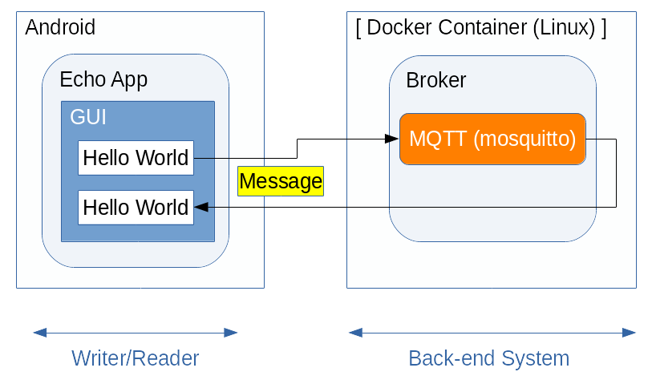

<!--
Copyright (C) 2020-2021 National Institute of Informatics

Licensed to the Apache Software Foundation (ASF) under one
or more contributor license agreements.  See the NOTICE file
distributed with this work for additional information
regarding copyright ownership.  The ASF licenses this file
to you under the Apache License, Version 2.0 (the
"License"); you may not use this file except in compliance
with the License.  You may obtain a copy of the License at

  http://www.apache.org/licenses/LICENSE-2.0

Unless required by applicable law or agreed to in writing,
software distributed under the License is distributed on an
"AS IS" BASIS, WITHOUT WARRANTIES OR CONDITIONS OF ANY
KIND, either express or implied.  See the License for the
specific language governing permissions and limitations
under the License.
-->

[English](TUTORIAL-android-step1-overview.en.md)

# チュートリアル - STEP1: テキスト送受信アプリの実行

<em>目次</em>
<pre>
1. 概要
2. システム全体構成
3. 作業の流れ
3.1 バックエンド側の作業（その1）
3.2 Android端末側の作業
3.3 バックエンド側の作業（その2）
4. 制約事項
5. うまくいかないときは
5.1 Androidアプリケーションの設定内容を初期化したい
5.2 AndroidアプリケーションがBrokerと接続できない
5.3 Androidアプリケーション実行中にエラー発生する
</pre>


## 1. 概要

Android版のSINETStreamライブラリを使うサンプルプログラム第一弾として、
簡単なシステム構成での使用例を示します。

GUI操作でユーザが入力した任意の文字列（例えば「Hello World」）がメッセージとして`Broker`に送信され、
それを`Broker`が折り返したものを受信してGUIに表示するというものです。


## 2. システム全体構成

この例では、下図のようにAndroid端末側に`Writer`と`Reader`機能、
バックエンド側に`Broker`機能を配置します。



本チュートリアルの見通しを良くするため、以降は

* バックエンド側の作業
* Android端末側の作業

という機能要素ごとに細分化して記述します。
内容に沿って作業を進めてください。

一通り環境構築を済ませ、
Android端末のテキスト送受信アプリを実際に動かす前に、
対向`Broker`との接続情報を設定する箇所があります。
お手元のネットワーク構成に合わせて調整してください。


## 3. 作業の流れ
### 3.1 バックエンド側の作業（その1）

本チュートリアル用のAndroidテキスト送受信アプリは、
`Writer`と`Reader`の双方が同じ`Broker`接続パラメータ（アドレス/ポート、
トピック名）を使用します。
したがって、本チュートリアルに関して`Broker`に特別な作業は不要です。

Android端末から対向`Broker`に接続さえできれば十分です。

すでに他のチュートリアルで用意した`Broker`があれば、
それをそのまま流用できます。
ここでは、Android版のもう一つのチュートリアル(STEP2)で用いるバックエンドシステムはそのままにして、
MQTTの`Broker`機能だけを流用する例を示します。

もしまだSTEP2のバックエンド機能を立ち上げていない場合、別紙
[チュートリアル DOCKER-CONTAINER](sinetstreamhelper-tutorial-container/TUTORIAL-docker-container.md)
の案内に従い`Docker Engine`の導入、
およびコンテナイメージの導入と起動といった一連の作業を実施してください。

```console
     % sudo docker run -d --name broker -p 1883:1883 -p 80:80 harbor.vcloud.nii.ac.jp/sinetstream/android-tutorial:latest
```
この`docker run`コマンド実行により、
バックエンド側の導入とサーバ群の起動が自動的に実施されます。


### 3.2 Android端末側の作業

お手元のAndroid端末へのテキスト送受信アプリの導入と設定、
操作方法などの手順に関して記述します。

詳細は別紙
[Android端末側の作業](TUTORIAL-android-step1.md)
を参照ください。


### 3.3 バックエンド側の作業（その2）

一通り動作の確認が終わったら、計算機資源の解放が必要です。
以下のコマンドにより、
チュートリアル用コンテナイメージの停止と削除を実施してください。

> もしAndroid端末側のアプリケーションが起動中の場合、`Broker`停止を
> 契機に接続が切られるためAndroidアプリケーションに「EOF例外」エラー
> メッセージが表示されます。

```console
     % sudo docker stop broker
     % sudo docker rm broker
```

詳細は別紙
[チュートリアル DOCKER-CONTAINER](sinetstreamhelper-tutorial-container/TUTORIAL-docker-container.md)
を参照ください。


## 4. 制約事項

システム動作を体験していただくチュートリアルという性質上、
Android版`SINETStream`ライブラリの提供する全ての機能を網羅しているわけではありません。

ここで示したチュートリアル用の`Broker`を用いる場合、
以下のような機能制限があることにご留意ください。

* `Broker`との接続方法
    * ユーザ認証、SSL/TLS接続、データ暗号化のいずれも実施せず、
最も簡易な方法で接続します。

    * 処理の簡素化のため、`Broker`に接続される個々のAndroid端末を区別しません。
複数台のAndroid端末を同じトピックで同時に`Broker`に接続しても問題ありません。
その場合は、ある`Writer`が送信した内容が全ての`Reader`宛てに一斉配信されます。


## 5. うまくいかないときは
### 5.1 Androidアプリケーションの設定内容を初期化したい

* いったん全初期化して、設定をやり直したい
    * 以下の手順でアプリケーションのローカルデータを消去してください。
    * `Storage`（AndroidOSバージョンによっては`DATA`）領域と`Cache`領域の2種類がありますが、前者が消去対象です。

```
    Settings
    --> Apps & notifications
      --> App info
        --> Echo
          [FORCE STOP]
          --> Storage & cache
            --> Clear storage (or CLEAR DATA)
```

### 5.2 Androidアプリケーションが`Broker`と接続できない

* `Broker`接続失敗のエラーダイアログが表示される
    * Android端末が外部ネットワークに到達可能、
すなわち携帯電話網またはWi-Fiが有効（= 機内モードでない）ことを確認してください。
    * バックエンド側で`Broker`が稼働中であることを確認してください。

* `Broker`との接続タイムアウトになる
    * 接続先`Broker`のIPアドレス（またはFQDN）とポート番号を確認してください。
        * FQDN: Fully Qualified Domain Name
    * Android端末と`Broker`間のIP経路設定が正しいことを確認してください。
    * 途中でファイアウォールが設定されている場合はその内容を確認してください。


### 5.3 Androidアプリケーション実行中にエラー発生する

* 「EOF例外」エラーメッセージが表示される
    * `Broker`との接続が切れたことを示します。
    * Android端末の外部ネットワーク接続状況を確認してください。
    * バックエンド機材のコンテナ動作状況を確認してください。

