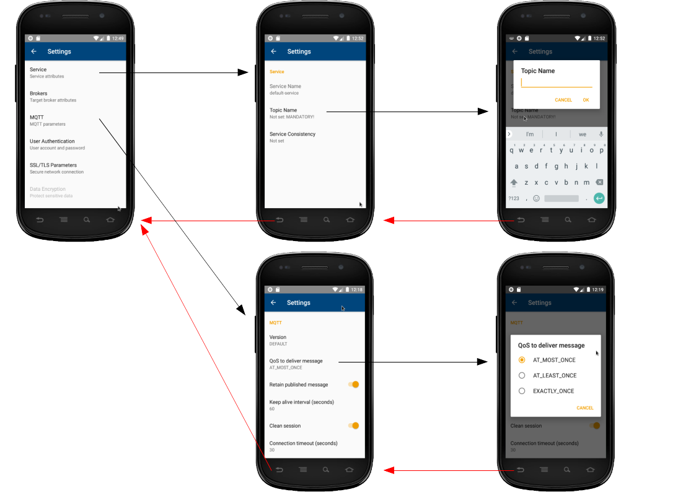

<!--
Copyright (C) 2020-2021 National Institute of Informatics

Licensed to the Apache Software Foundation (ASF) under one
or more contributor license agreements.  See the NOTICE file
distributed with this work for additional information
regarding copyright ownership.  The ASF licenses this file
to you under the Apache License, Version 2.0 (the
"License"); you may not use this file except in compliance
with the License.  You may obtain a copy of the License at

  http://www.apache.org/licenses/LICENSE-2.0

Unless required by applicable law or agreed to in writing,
software distributed under the License is distributed on an
"AS IS" BASIS, WITHOUT WARRANTIES OR CONDITIONS OF ANY
KIND, either express or implied.  See the License for the
specific language governing permissions and limitations
under the License.
-->

[日本語](TUTORIAL-android-step1.md)

# TUTORIAL - ANDROID-STEP1

<em>Table of contents</em>
<pre>
1. Introduction
1.1 Network model
1.2 Prerequisites
2. Installation of the "Echo" application
3. Operation of the "Echo" application
3.1 Screen transitions
3.2 Initial screen
3.3 Settings screen
3.4 Main screen

Appendix
A.1 Source code
A.2 Known problems
</pre>

## 1. Introduction

We implemented an Android application "Echo", as a sample usage of
the Android
[SINETStream library](../userguide/android.en.html).
The application sends and receives text messages over the SINETStream.
In this document, we briefly describe how to install this application
to an Android device, how to setup and operate it.

### 1.1 Network model

The "Echo" application has both `Writer` and `Reader` functionalities.
Once user inputs a text via GUI operations, the text will be sent to
the peer `Broker` as a SINETStream message.
The `Broker` redistributes the message, then the "Echo" application
receives it and shows its contents on the GUI.

The "Echo" application has its own "Settings" screen, and thus user
can set configuration parameters such like the `Broker` connection
or the SINETStream behaviors.
Once user has set those parameters, the Android
[SINETStream configuration file](../userguide/config-android.en.html)
will be automatically generated.

As for the `Broker` details, it is not mentioned here.
Please refer to the companion document.

### 1.2 Prerequisites

* The Android device

  * Android 8.0 (API level 26) or later
    * The Android
[SINETStream library](../userguide/android.en.html)
uses the
[MQTT(Eclipse Mosquitto)](https://mosquitto.org/)
as a messaging system.
    * The implementation of the
[Paho MQTT Android Client](https://www.eclipse.org/paho/index.php?page=clients/java/index.php)
requires `Android 8.0+` as its running condition.

* Preparations for the back-end system

  * Within the scope of this tutorial, we just need a peer `Broker`
which communicates with an Android device.
  * On the host machine for the back-end system, run `docker run` command
which installs the container image for this tutorial. Server processes
will be automatically started afterward.
  * The back-end system should be up and running before working on
the Android device.
  * Back to the previous document and see the section
[3.1 Works on the back-end side (part 1)](
TUTORIAL-android-step1-overview.en.md#31-works-on-the-back-end-side-part-1)
for details.

* Network environment

  * The Android device and the peer `Broker` is connected via IP (Internet
Protocol) network.
Make sure the end-end IP reachability via cellular or Wi-Fi network.

## 2. Installation of the "Echo" application

Currently, the "Echo" application will be available from the NII
managed server, not from Google Play.

Please see the companion document
[Installation of the sample Android application](TUTORIAL-android-install.en.md)
for details.
The procedure is the same for updating the older version.

## 3. Operation of the "Echo" application
### 3.1 Screen transitions

\<Legend\>
1. On the Android home (a), press the icon `Echo` to start.
2. On the splash screen (b), application icon and the copyright holder
will be briefly shown. Then the screen transits to the initial one (c).
3. Pressing the button `Settings` causes the initial screen (c) transit to the settings screen (d).
4. Pressing the button `BACK` causes the settings screen (d) transit to the initial screen (c).
5. Pressing the button `Run` causes the initial screen (c) transit to the main screen (e).
6. Pressing the button `BACK` causes the main screen (e) transit to the initial screen (c).
7. Pressing the button `BACK` causes the initial screen (c) transit to the Android home (a).

In the latter part of this document, each screen layout and operation
details will be addressed.

### 3.2 Initial screen

This is the initial screen after application startup.

* `Run` button
  * Start the `Main` Activity of this application.
  * Once the main screen finishes, control comes back to this screen.
* `Settings` button
  * Start the `Settings` Activity for this application.
  * Once the settings screen finishes, control comes back to this screen.
* Menu button
  * By pressing the "vertical 3-dots" on the top right corner,
a small menu will be deployed.
    * `Help`: Show help for this application.
    * `About`: Show brief information about this application.

If the
[SINETStream configuration file](../userguide/config-android.en.html)
does not yet exist (just like after the fresh installation),
or if current configuration does not meet the mandatory conditions,
`Run` button is set disabled (gray out) and a guide message will be
shown to let user take actions.
In these cases, press the `Settings` button and fill-in the mandatory
SINETStream parameters.

### 3.3 Settings screen

To use the Android
[SINETStream library](../userguide/android.en.html),
its own
[SINETStream configuration file](../userguide/config-android.html)
must be set properly, so that the user application using the library
can connect to the peer `Broker`.

We provide a GUI-based settings screen for this purpose.
As shown below, the settings screen consists of layered structure
representing each item categories.

On the initial screen, press the `Settings` button to transit to
the settings screen. Before coming back to the initial screen after
several settings operations, the `SINETStream configuration file`
will be automatically generated.
If there are some configration changes from the previous settings,
the file contents will be updated.

Following items must be set to connect to the `Broker`.
Other items can be left untouched. If so, program default values
will be used.

* Service Name: `Service -> Service Name`
* Topic Name: `Service -> Topic Name`
* `Broker` connection information (Address, Port)
    * `Brokers -> IP Address (or FQDN)`
    * `Brokers -> Port Number`

In the case of the `Broker` shown in this tutorial, above mandatory
parameters would look like as follows. Note that actual `Broker`
address must be set according to the running environment.

|Service Name|Topic Name|IP Address (or FQDN)|Port Number|
|---|---|---|---|
|test-service|test-topic|xx.xx.xx.xx|1883|

> Note that the `Topic Name` is a string used as a communication
> channel identifier. User can set any value for it, but in the
> STEP1 context, beware to **avoid** the reserved word
> `sensor-data` which conflicts with the back-end system usage.

### 3.4 Main screen

On the initial screen, press the `Run` button to transit to the
main screen which sends or receives the user-input text data.
The main screen is vertically split into two panes; the upper
pane provides the `Writer` functionality, while the lower pane
provides the `Reader` functionality.

Both the `Writer` and the `Reader` refer to the same
[SINETStream configuration file](../userguide/config-android.en.html).
Therefore, the both two share the same service and topic for the
peer `Broker`. This means that a message sent by the `Writer` is
echoed back to the `Reader`.

The Main screen roughly works as follows.

1. When the main screen is started from the initial screen, both the
`Writer` and the `Reader` independently start connecting to the peer
`Broker`.
2. Once both `Writer` and `Reader` has connected to the `Broker`,
the text input area in the upper pane is set enabled.
3. Once user inputs any text, the `SEND` button is set enabled.
4. If user presses the `SEND` button, the input text will be sent to
the `Broker`.
5. The contents received from the `Broker` will be shown in the
lower pane.
6. Before the main screen goes back to the initial screen, both the
`Writer` and the `Reader` close the connections with the `Broker`.

Note that the user input text in the upper pane is sent to the
`Broker` as the payload of a `SINETStream message v1.2` format.
On the lower pane, elements in the SINETStream message (`timestamp`,
`data`) and the topic name are combined and shown as a `Message`.

* Message
  * topic: Topic name
  * timestamp: ISO8601 style date-time expression
  * data: User input text data

## Appendix
### A.1 Source code

The source code of this application is open and available from
[GitHub](https://github.com/nii-gakunin-cloud/sinetstream-android-echo).
If you found something wrong, please contact us.

If you need to modify the source code, install the Android development
environment
[Android Studio](https://developer.android.com/studio)
to your working machine, and load the source code.

### A.2 Known problems

* Setup of SSL/TLS certification
  * As of `SINETStream v1.5`, SSL/TLS certification does not work.
  * The security functionality of the SINETStream will be released
in the next version.

* The mapping of the GUI `Settings` and the SINETStream configuration file
  * As of `SINETStream v1.5`, the GUI `Settings` does not fully cover the
[SINETStream configuration file](../userguide/config-android.en.html).

