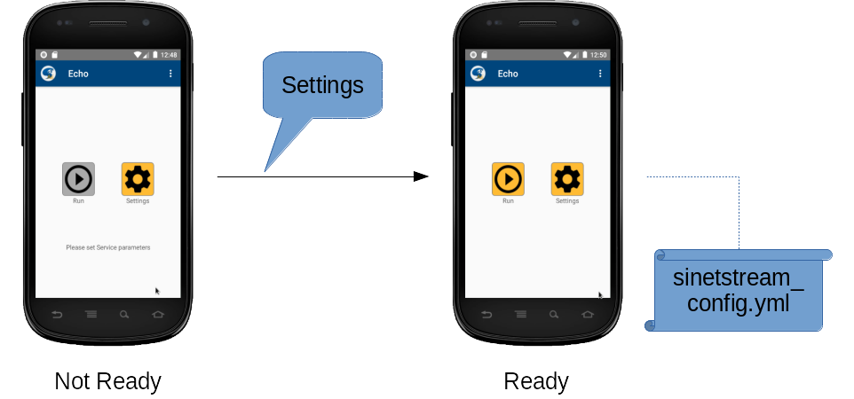

<!--
Copyright (C) 2020-2021 National Institute of Informatics

Licensed to the Apache Software Foundation (ASF) under one
or more contributor license agreements.  See the NOTICE file
distributed with this work for additional information
regarding copyright ownership.  The ASF licenses this file
to you under the Apache License, Version 2.0 (the
"License"); you may not use this file except in compliance
with the License.  You may obtain a copy of the License at

  http://www.apache.org/licenses/LICENSE-2.0

Unless required by applicable law or agreed to in writing,
software distributed under the License is distributed on an
"AS IS" BASIS, WITHOUT WARRANTIES OR CONDITIONS OF ANY
KIND, either express or implied.  See the License for the
specific language governing permissions and limitations
under the License.
-->

[English](TUTORIAL-android-step1.en.md)

# チュートリアル - ANDROID-STEP1

<em>目次</em>
<pre>
1. 概要
1.1 ネットワーク構成
1.2 前提条件
2. テキスト送受信アプリの導入
3. テキスト送受信アプリの操作
3.1 画面遷移
3.2 初期画面
3.3 設定画面
3.4 主画面

付録
A.1 ソースコード
A.2 既知の問題
</pre>

## 1. 概要

Android版の
[SINETStreamライブラリ](../userguide/android.md)
の使用例として、
GUI操作でユーザが入力した任意文字列をSINETStream経由で送受信する「テキスト送受信アプリ」（以降「本アプリ」と略記）を実装しました。
本書では、本アプリのAndroid端末への導入と設定、操作方法などについて概説します。

### 1.1 ネットワーク構成

本アプリは、`Writer`と`Reader`の両方の機能を具備します。
ユーザがGUI操作で指定した任意の文字列は、SINETStreamメッセージとして対向の`Broker`に送信されます。
`Broker`が配信した内容を再び本アプリで受信してGUI画面に表示するという動作の流れになります。
また`Broker`への接続情報やSINETStreamの動作パラメータなどの諸元をGUI操作で設定し、
その内容に応じてAndroid版の
[SINETStream設定ファイル](../userguide/config-android.md)
を自動生成するための設定画面も用意してあります。
`Broker`に関しては本書の範囲外ですので、別途記述されたものを参照ください。

### 1.2 前提条件

* Android端末の動作環境

  * Android 8.0（APIレベル26）以上であること
    * Android版の
[SINETStreamライブラリ](../userguide/android.md)
は、足回りのメッセージングシステムとして
[MQTT(Eclipse Mosquitto)](https://mosquitto.org/)
に対応しています。
    * MQTTのAndroid版の実装である
[Paho MQTT Android Client](https://www.eclipse.org/paho/index.php?page=clients/java/index.php)
ライブラリを利用しており、この動作条件（Android8.0以上）の影響です。

* バックエンドシステムの事前準備

  * 本チュートリアルの範囲では、Android端末と対向する`Broker`だけを用意すれば十分です。
  * バックエンド側のホストサーバにて、`docker run`コマンドにより本チュートリアル用のコンテナイメージの導入とサーバプログラム群の起動を実施します。
Android側の作業着手前にこちらを済ませてください。
  * 手順詳細は、前項に戻り
[4. バックエンド側の作業](TUTORIAL-android-step1-overview.md#4-バックエンド側の作業)
を参照ください。

* ネットワーク環境

  * 本アプリを実行するAndroid端末と`Broker`とはIP（Internet Protocol）ネットワークで接続されます。
携帯電話網やWi-Fiを介して両者のIP疎通を確保してください。

## 2. テキスト送受信アプリの導入

現状では、本アプリはGooglePlayからではなくNII管理サーバから配布します。

別紙
[Androidサンプルアプリケーションの導入](TUTORIAL-android-install.md)
を参照して所用のものを導入してください。アプリ更新時も同様の手順です。

## 3. テキスト送受信アプリの操作
### 3.1 画面遷移

＜凡例＞
1. Androidのホーム画面（a）にて、アイコン`Echo`を押下して本アプリを起動する。
2. 起動画面（b）にて、アイコンと著作者を一瞬表示して初期画面(c)に遷移する。
3. 初期画面(c)にて、ボタン`Settings`押下により設定画面(d)に遷移する。
4. 設定画面(d)にて、ボタン`BACK`押下により初期画面（c）に戻る。
5. 初期画面(c)にて、ボタン`Run`押下により主画面(e)に遷移する。
6. 主画面(e)にて、ボタン`BACK`押下により初期画面（c）に戻る。
7. 初期画面(c)にて、ボタン`BACK`押下によりホーム画面（a）に戻る。

各画面の構成および操作詳細は後述します。

### 3.2 初期画面

本アプリの起動直後に表示される初期画面です。

* `Run`ボタン
  * 本アプリの主画面`Main`を起動する
  * 主画面の処理が終わると、この初期画面に戻る
* `Settings`ボタン
  * 本アプリの設定画面`Settings`を起動する
  * 設定画面の処理が終わると、この初期画面に戻る
* メニューボタン
  * 画面上部のタイトル右端の「縦3つの点」を押下すると、メニューが展開される
    * `Help`：ヘルプ表示
    * `About`：このアプリについて

本アプリ導入直後のように、
[SINETStream設定ファイル](../userguide/config-android.md)
が存在していない、あるいは現在の設定内容が必須項目を満足していない場合、
`Run`ボタンが無効化（灰色表示）され、画面下部にはユーザに対応を促すメッセージが表示されます。
このような場合、まずは`Settings`ボタンを押下してSINETStreamの動作環境設定操作を実行してください。

### 3.3 設定画面

Android版の
[SINETStreamライブラリ](../userguide/android.md)
を使うためには、
[SINETStream設定ファイル](../userguide/config-android.md)
を「対向`Broker`との接続条件に適合するよう」設定する必要があります。

このためGUI操作によるSINETStream設定画面（Settings）を用意しています。
以下に示すように項目内容に応じた階層構造の画面構成となっています。

本アプリ起動後の初期画面からボタン`Settings`を押下して設定画面に遷移し、
（もろもろの設定操作を経て）初期画面に戻る際に`SINETStream設定ファイル`が自動生成されます。
既存の設定内容から変更が発生した場合は同設定ファイルが更新されます。

まずは`Broker`と接続するため、以下の項目を必ず設定してください。
他の項目は放置で構いません。プログラム既定値が使われます。
* サービス名: `Service -> Service Name`
* トピック名: `Service -> Topic Name`
* `Broker`接続情報（アドレス、ポート）
    * `Brokers -> IP Address (or FQDN)`
    * `Brokers -> Port Number`

このチュートリアルで例示した`Broker`であれば以下のように設定することになります。
実際の`Broker`のアドレスはお使いの環境に合わせてください。

|Service Name|Topic Name|IP Address (or FQDN)|Port Number|
|---|---|---|---|
|test-service|test-topic|xx.xx.xx.xx|1883|

> ここで`Topic Name`は通信チャネル識別子として使われる文字列です。
> 任意の値を指定して構わないのですが、特にSTEP1の使い方においては、
> バックエンドシステムの都合上、予約語`sensor-data`を**避けて**ください。

### 3.4 主画面

初期画面からボタン`Run`を押下して主画面（Main）を表示し、GUI操作による文字列データ送受信を実行します。
主画面は上下2段（上段が送信欄、下段が受信欄）に分割されており、それぞれ`Writer`機能と`Reader`機能を提供します。

`Writer`と`Reader`が同じ
[SINETStream設定ファイル](../userguide/config-android.md)
を参照するため、対向`Broker`に関してサービスとトピックを共有しており、
結果的に`Broker`折り返しでメッセージを送受信する動作となります。

主画面の動作概要は、以下のようになります。
1. 初期画面から主画面に遷移する際に、`Writer`と`Reader`の双方が独立に`Broker`に接続する。
2. `Writer`と`Reader`の双方が`Broker`との接続が完了すると、送信欄で文字列入力が可能になる。
3. 適当な文字列を入力すると、`SEND`ボタンが有効になる。
4. `SEND`ボタンを押下すると、入力文字列が`Broker`宛に送信される。
5. `Broker`から配信された内容が受信欄に表示される。
6. 主画面から初期画面に戻る際に、`Writer`と`Reader`の双方が`Broker`との接続を切る。

なお、主画面の送信欄でユーザが入力した内容は`SINETStreamメッセージv1.2`形式のペイロードとして`Broker`に送信されます。
受信欄では、SINETStreamメッセージの各項目（`timestamp`, `data`）と`Broker`接続時のトピック名を併せて`Message`として表示します。

* Message
  * topic: トピック名
  * timestamp: ISO8601形式の日付時刻情報
  * data: 入力したテキストデータ

## 付録
### A.1 ソースコード

本アプリのソースコードは
[GitHub](https://github.com/nii-gakunin-cloud/sinetstream-android-echo)
で公開しています。
もし何か不具合がありましたら連絡いただけると助かります。

ソース修正が必要な方は、Android開発環境
[Android Studio](https://developer.android.com/studio)
をお手元の機材に導入して、上記ソースコードを取り込んでください。

### A.2 既知の問題

* 情報セキュリティ機能の実装状況

  |機能項目|実装状況|
  |:-|:-|
  |ユーザ認証|済み|
  |SSL/TLS通信|済み|
  |データ暗号化|開発中|

* GUIの設定画面とSINETStream設定ファイルの対応
  * 実装の都合上、GUIの設定画面での対応項目は
[SINETStream設定ファイル](../userguide/config-android.md)
を網羅しておらず、サブセットとなります。

