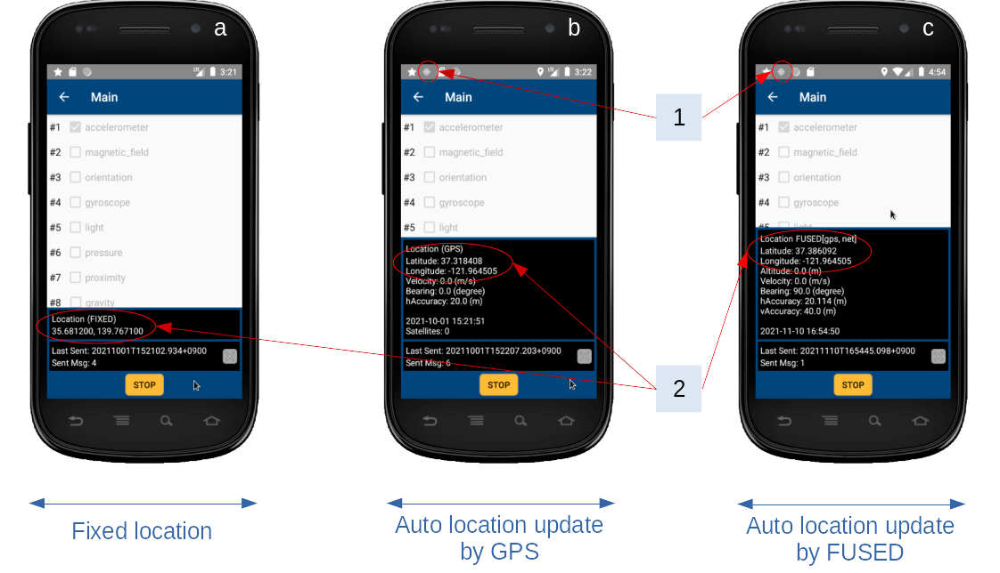
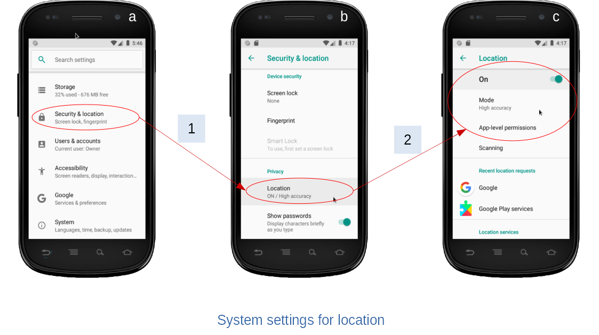
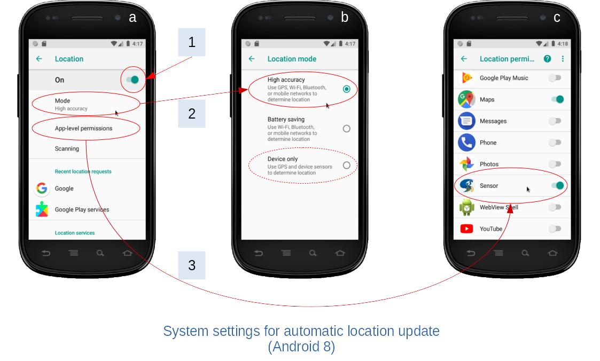
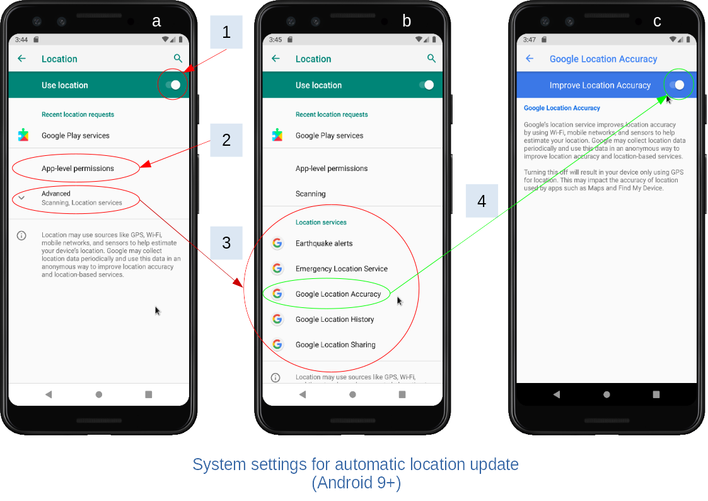
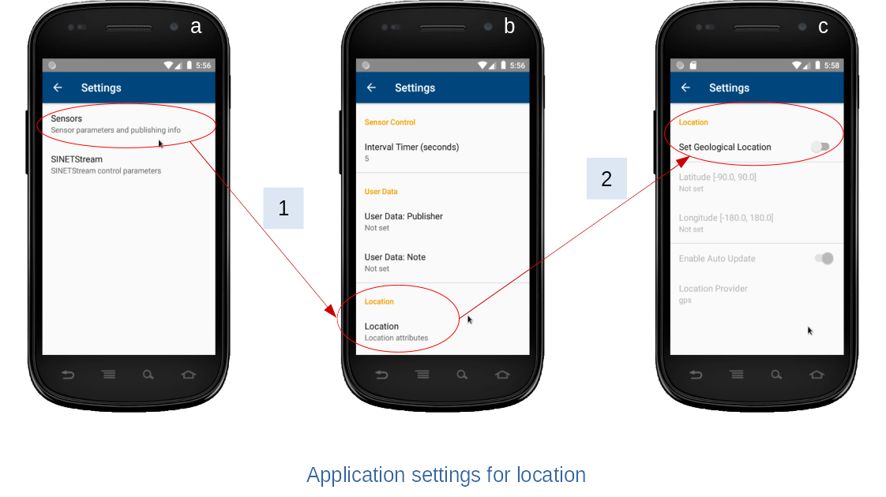
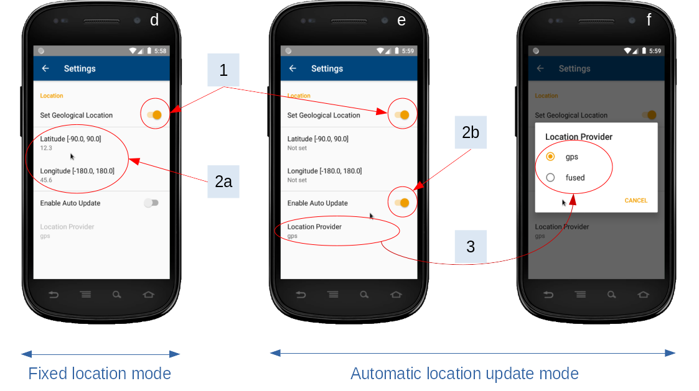

<!--
Copyright (C) 2023 National Institute of Informatics

Licensed to the Apache Software Foundation (ASF) under one
or more contributor license agreements.  See the NOTICE file
distributed with this work for additional information
regarding copyright ownership.  The ASF licenses this file
to you under the Apache License, Version 2.0 (the
"License"); you may not use this file except in compliance
with the License.  You may obtain a copy of the License at

  http://www.apache.org/licenses/LICENSE-2.0

Unless required by applicable law or agreed to in writing,
software distributed under the License is distributed on an
"AS IS" BASIS, WITHOUT WARRANTIES OR CONDITIONS OF ANY
KIND, either express or implied.  See the License for the
specific language governing permissions and limitations
under the License.
-->

[日本語](TUTORIAL-android-step2-location.md)

# TUTORIAL - Automatic update of the device location data

<em>Table of contents</em>
<pre>
1. Introduction
2. Methods for tracking the Android device location
3. Changes of the main screen layout
4. Settings to handle Android device location
4.1 Settings of the Android system
4.1.1 Move to the location menu in the system settings
4.1.2 Settings to get a more accurate location（Android 8）
4.1.3 Settings to get a more accurate location（Android 9+）
4.2 Settings on the Sensor Application side
4.2.1 Move to the location menu in the Application settings
4.2.2 Location settings per operation mode
</pre>


## 1. Introduction

Sensor readings collected by the `Sensor` application is published as a JSON format.
The JSON data has `device` section which can optionally convey the geographic position (latitude, longitude) of the Android device.


```json
{
    "device": {
        "sysinfo": {},
        "userinfo": {},
        "location": {
            "latitude": "139.767120",
            "longitude": "35.681236"
        }
    },
    "sensors": []
}
```

If the Android device which runs the `Sensor` application is placed on a fixed place, there is nothing special to set the known location manually.
On the other hand, if the Android device is placed on a vehicle, it is ideal to continuously monitor the device location and reflect the latest value to the output JSON data.
This document shows the `Sensor` application usage and required system settings to realize the latter purpose.

There may be some differences in screen layout or system message expressions, depending on the Android system version.
Please read accordingly to your Android device running environment.


## 2. Methods for tracking the Android device location

Android system has some mechanisms to track the device location, and registered user applications can get notifications of latest values at certain timings.
With this implementation of the `Sensor` application, user can specify the location source (either via `GPS` or `FLP`), to automatically update the device location.

* Location positioning by `GPS` (Global Positioning Satellite)
  * Get location data by calculating GPS reception signals \[1\].
  * Location updates will be stopped if you cannot see GPS satellites in the sky.
  * It may take some time to acquire initial location data depending on the running environment, such as the `Sensor` application has started with GPS off, or the Android device has placed indoor for a while.

* Location positioning by `FLP` (Fused Location Provider)
  * Get location data from the [Fused Location Provider](
https://developers.google.com/android/reference/com/google/android/gms/location/FusedLocationProviderClient
) \[2\], which is a part of [Google Play services](
https://support.google.com/android/answer/10546414?hl=en).
  * The best estimated location data will be taken from several sources (`GPS`, `NET`, `Bluetooth`,...), but resulting accuracy may differ by each source.
  * In some major cities, you may able to get improved GPS accuracy with help of `Google Play Service` \[3\].

<em>References</em><br>
* \[1\] [Location](https://developer.android.com/reference/android/location/Location)
* \[2\] [Simple, battery-efficient location API for Android](https://developers.google.com/location-context/fused-location-provider)
* \[3\] [Improving urban GPS accuracy for your app](https://android-developers.googleblog.com/2020/12/improving-urban-gps-accuracy-for-your.html)


## 3. Changes of the main screen layout



By enabling the location feature in the `Sensor` application settings, current location per setting mode (`FIXED`, `GPS` or `FLP`) will be displayed in the main screen, as shown 'label 2' in the figure.
If the automatic location update feature is enabled, a `compass` icon appears to indicate the location service is running ('label 1' in the figure).

* Screen (a) depicts a sample image where fixed location is being set.
  * Geographic position (latitude, longitude) which has manually set by user are shown as is.

* Screen (b) depicts a sample image where GPS is used.
  * Location values will be updated when the Android device position exceeded a certain threshold. Note that only latitude and longitude are set to JSON data.

* Screen (c) depicts a sample image where FLP is used.
  * Location values will be periodically updated about 5 seconds interval, regardless to actual device position. Note that only latitude and longitude are set to JSON data.


## 4. Settings to handle Android device location

In the Android system, device location is considered as a subject to privacy protection. Any application accessing to the device location must fulfill the following conditions simultaneously \[1\]\[2\].

* System settings
  * Use location as a whole device?
  * How strict the location accuracy limitation will be?
* Runtime permissions per application
  * Will the application being granted for accessing the device location?

<em>References</em><br>
* \[1\] [Manage your Android device’s location settings](https://support.google.com/android/answer/3467281?hl=en&ref_topic=7340598)
* \[2\] [Choose which apps use your Android phone’s location](https://support.google.com/android/answer/6179507?hl=en&ref_topic=7340598)


### 4.1 Settings of the Android system
#### 4.1.1 Move to the location menu in the system settings



In the system settings screen (a), find the location-related menu items.
Follow menu hierarchy "1 -> 2" as shown above, and move to the location settings screen (c).
There may be differences in screen structure or menu hierarchy based on Android versions, but please reach to the location settings screen in the end.


#### 4.1.2 Settings to get a more accurate location（Android 8）



To enable `automatic location update` with `Sensor` application, following 3 items must be set as specified.
Here we present operational images on Android 8 system.

|No.|Settings|Value|Notes|
|---|---|---|---|
|1|Location|ON||
|2|Mode|High accuracy|`Device only` is also OK|
|3|App-level permissions|Set ON for `Sensor` application||

System settings are applied for all applications on the device, and thus the values shown above might be different from what `Sensor` application expects.
These settings values might have been changed for any reasons.
If so, some dialogs will be shown at the `Sensor` application run time to prompt user to change system settings accordingly.
Please follow such dialogs and satisfy above settings conditions.


#### 4.1.3 Settings to get a more accurate location（Android 9+）



Starting from Android 9, traditional `location mode` selection has deprecated.
Instead, new menu item [\"Google Play services\"](
https://support.google.com/android/answer/10546414?hl=en
) collectively handles several `Location services`.
In this case, the [\"Google Location Accuracy\"](
https://support.google.com/android/answer/3467281?hl=en#location_accuracy
) is the subject of interest here.

To enable `automatic location update` with the `Sensor` application,
following 3 items must be set as specified.

|No.|Settings|Value|Notes|
|---|---|---|---|
|1|Location|ON||
|2|App-level permissions|Set ON for `Sensor` application||
|3|Location services|Set ON for `Google Location Accuracy`|Hiding under the `Advanced` menu|

System settings are applied for all applications on the device, and thus the values shown above might be different from what `Sensor` application expects.
These settings values might have been changed for any reasons.
If so, some dialogs will be shown at the `Sensor` application run time to prompt user to change system settings accordingly.
Please follow such dialogs and satisfy above settings conditions.

<em>References</em><br>
The mapping of location settings between Android 8 and 9+ is shown below.

|Android 8|Android 9+|
|---|---|
|Location: On/Off|Location: On/Off|
|Mode: Battery Saver|N/A|
|Mode: Device Only|Location: On, Google Location Accuracy: Off|
|Mode: High Accuracy|Location: On, Google Location Accuracy: On|


### 4.2 Settings on the Sensor Application side
#### 4.2.1 Move to the location menu in the Application settings



In the Application settings screen (a), find the `Sensors` menu item.
Follow the menu hierarchy "1 -> 2" as shown above, and move to the location settings screen (c).
Note that location settings is disabled as default state.


#### 4.2.2 Location settings per operation mode



To use device location, enable the global switch (1) at first.

Then you have two choices depending on the usage; whether to put the Android device on a fixed place or to move around with the Android device.

* Fixed location mode (screen d)
  * This is a usage to put the Android device on a fixed place and send its location information.
  * Pick `Latitude` and `Longitude` items (2a) and set appropriate values respectively.
  * Both `Latitude` and `Longitude` must be set.
  * In this mode, please disable the `Auto Update` switch (2b).

* Automatic location update mode (screen e)
  * This is a usage to automatically update the Android device location on the go.
  * Set the `Auto Update` switch (2b) enabled.
  * In this mode, manually set `Latitude` and `Longitude` values (2a) are ignored.
  * You may able to choose a location source (`GPS` or `FLP`), depending on the running environment.
  > `FLP` may not be available on your Android device
  * Pick the `location Provider` item (3), and pick the desired one on the dialog (screen f).

