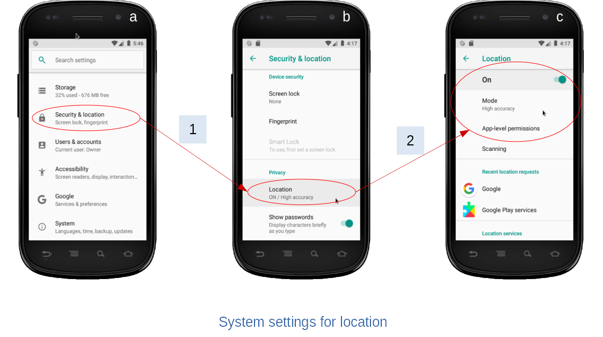
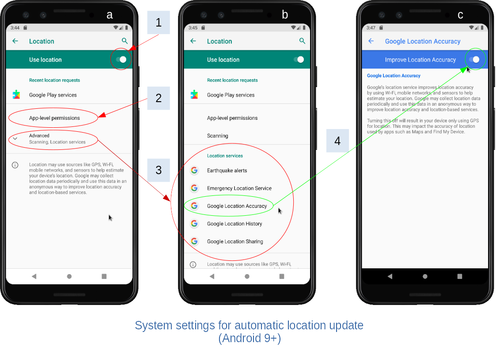
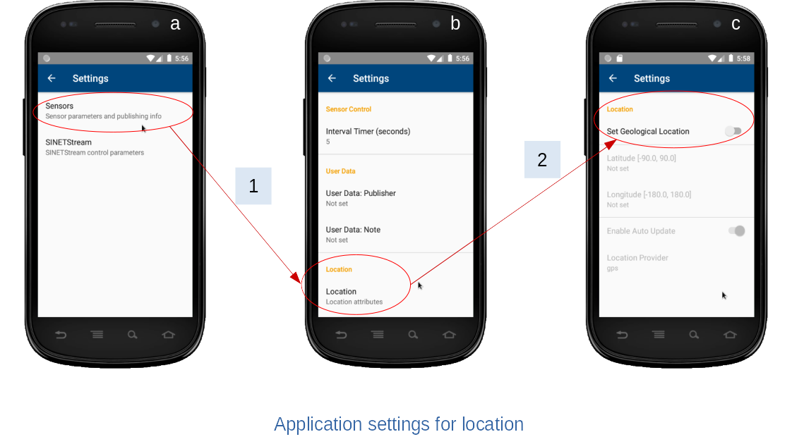
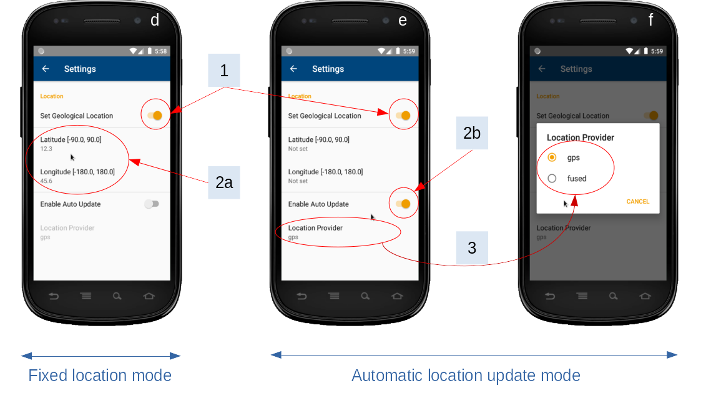

<!--
Copyright (C) 2021 National Institute of Informatics

Licensed to the Apache Software Foundation (ASF) under one
or more contributor license agreements.  See the NOTICE file
distributed with this work for additional information
regarding copyright ownership.  The ASF licenses this file
to you under the Apache License, Version 2.0 (the
"License"); you may not use this file except in compliance
with the License.  You may obtain a copy of the License at

  http://www.apache.org/licenses/LICENSE-2.0

Unless required by applicable law or agreed to in writing,
software distributed under the License is distributed on an
"AS IS" BASIS, WITHOUT WARRANTIES OR CONDITIONS OF ANY
KIND, either express or implied.  See the License for the
specific language governing permissions and limitations
under the License.
-->

<!-- NOTYET
[English](TUTORIAL-android-step2-location.en.md)
-->

# チュートリアル - 端末位置情報の自動更新

<em>目次</em>
<pre>
1. 概要
2. Android端末位置情報の自動更新方法
3. 本アプリ主画面の構成変更
4. Android端末の位置情報を扱うための設定
4.1 Androidシステム側の設定
4.1.1 システム設定における位置情報設定画面への移動
4.1.2 高精度の位置情報取得を可能とする設定（Android8）
4.1.3 高精度の位置情報取得を可能とする設定（Android9以上）
4.2 アプリケーション側の設定
4.2.1 本アプリにおける位置情報設定画面への移動
4.2.2 動作モードごとの設定方法
</pre>


## 1. 概要

本アプリで収集したセンサー情報はJSON形式に整形されて配信されます。
このJSONデータにはデバイス情報としてAndroid端末の地理的な位置情報（緯度、経度）を任意で設定できるようになっています。

```json
{
    "device": {
        "sysinfo": {},
        "userinfo": {},
        "location": {
            "latitude": "139.767120", 
            "longitude": "35.681236"
        }
    }, 
    "sensors": []
}
```
本アプリが動くAndroid端末を特定の場所に固定して使う用途であれば、
既知の位置情報を静的に設定する方法で何ら問題ありません。
しかし同Android端末を移動体に載せて使う場合、刻々と変化する端末位置を継続的に監視しつつJSON出力時に最新の位置情報を反映する方式が望ましいです。
本書では、後者の目的を実現するための本アプリの使い方、および所用のAndroid端末のシステム設定方法を紹介します。

OSのバージョン違いにより画面構成やシステムメッセージの文言表現が多少変わるかもしれません。
お手元のAndroid端末の動作環境に合わせて適宜読み替えてください。


## 2. Android端末位置情報の自動更新方法

Androidシステムでは「端末の位置情報を継続的に取得し、適当な契機でユーザアプリケーションに通知する」機構がいくつか用意されています。
本アプリの実装では下記「GPS、FLP」の何れかの方式をユーザが指定し、位置情報を自動更新できるようにしています。

* GPS（Global Positioning Satellite）経由
  * GPS受信信号から算出した位置情報\[1\]を取得します。
  * 上空にGPS衛星を見通せない場合は位置情報更新が止まります。
  * アプリケーション起動時にGPS機能が無効化されていた場合や屋内にしばらくいた場合など、動作状況によっては最初の位置情報を得るまで時間がかかることがあります。

* FLP（Fused Location Provider）経由
  * Google Play 開発者サービスが提供する「融合された位置予測プロバイダ（FLP）」から位置情報\[1\]を取得します。
  * 複数の情報源（GPS,NET,Bluetooth,...）から最善と推定される位置情報となりますが、測位制度は情報源により異なります。
  * いくつかの都市部では、Google Play 開発者サービスによる位置補正を利用したGPS測位精度向上を見込めます\[2\]。

<em>〈参考〉</em><br>
* \[1\] [Location](https://developer.android.com/reference/android/location/Location)
* \[2\] [Improving urban GPS accuracy for your app](https://android-developers.googleblog.com/2020/12/improving-urban-gps-accuracy-for-your.html)
* \[2\] [都市部でアプリのGPS精度を向上する方法](https://android-developers-jp.googleblog.com/2020/12/improving-urban-gps-accuracy-for-your-app.html)


## 3. 本アプリ主画面の構成変更


本アプリの設定画面「センサー情報」にて端末位置設定を有効に設定すると、
動作モード（固定値、あるいはGPSやFLPによる自動取得）ごとの情報表示欄が主画面下部に追加されます（図中ラベル`2`）。
端末位置を自動取得する動作モードの場合、位置情報取得サービス稼動中であることを示す「羅針盤」アイコンが表示されます（図中ラベル`1`）。

* 画面(a)は端末位置として固定値を設定する場合の表示例です。
  * 本アプリの設定画面でユーザが指定した緯度経度がそのままJSONに出力されます。

* 画面(b)はGPS経由で取得した位置情報を自動設定する場合の表示例です。
  * 端末移動による変位が閾値を超えた場合に位置情報が更新されます。なおJSONに出力されるのは緯度経度のみです。

* 画面(c)はFLP経由で取得した位置情報を自動設定する場合の表示例です。
  * 端末が実際に移動しなくても、位置情報は約5秒間隔で更新されます。なおJSONに出力されるのは緯度経度のみです。


## 4. Android端末の位置情報を扱うための設定

Androidシステムにおいて端末の位置情報はプライバシー保護対象と考えられています。
任意のアプリケーションがこれにアクセスするためには、次の各項目の要求条件を同時に満たす必要があります\[1\]\[2\]。

* システム設定
  * デバイス全体として位置情報を有効にするか？
  * 位置情報の精度をどの程度に制限するか？
* アプリケーション個別の実行時権限設定
  * 当該アプリケーションに位置情報へのアクセスを許すか？

<em>〈参考〉</em><br>
* \[1\] [Androidデバイスの位置情報の設定を管理する](https://support.google.com/android/answer/3467281?hl=ja&ref_topic=7340598)
* \[2\] [Androidスマートフォンの位置情報を使用するアプリを選択する](https://support.google.com/android/answer/6179507?hl=ja&ref_topic=7340598)


### 4.1 Androidシステム側の設定
#### 4.1.1 システム設定における位置情報設定画面への移動



システム設定画面(a)のうち位置情報関連の設定項目に着目してください。
上記「1 -> 2」の順でメニュー項目を選択し、位置情報設定用の画面(c)に移行します。
Androidシステムバージョンにより画面構成やメニュー構成が異なる可能性はありますが、最終的には位置情報設定用の画面に到達してください。


#### 4.1.2 高精度の位置情報取得を可能とする設定（Android8）


本アプリで位置情報の自動更新を有効とするには、以下の3項目を指定どおりに設定する必要があります。
ここではAndroid8での動作イメージを示します。

|項番|設定項目|値|備考|
|---|---|---|---|
|1|Location|ON||
|2|Mode|High accuracy|`Device only`も可|
|3|App-level permissions|`Sensor`アプリケーションをON||

システム設定項目は全てのアプリケーションに適用されるものであり、本アプリケーション実行時に必ずしも上記の通りになっていない可能性があります。
本アプリ実行後に上記システム設定項目が変更される可能性があるためです。
その場合、上記の各項目に対応して設定変更を促すダイアログが表示されます。
お手数ですが改めて上記の設定状態を満足するようにしてください。


#### 4.1.3 高精度の位置情報取得を可能とする設定（Android9以上）



Android9以降は、従来の位置情報モード選択が廃止され、代わりにGoogle Play 開発者サービスと連携する`Locationサービス`に`Google Location Accuracy`項目が追加されました。
本アプリで位置情報の自動更新を有効とするには、以下の3項目を指定どおりに設定する必要があります。
ここではAndroid9での動作イメージを示します。

|項番|設定項目|値|備考|
|---|---|---|---|
|1|Location|ON||
|2|App-level permissions|`Sensor`アプリケーションをON||
|3|Location services|`Google Location Accuracy`をON|初期状態は`Advanced`に隠れているのでこれを展開する|

システム設定項目は全てのアプリケーションに適用されるものであり、本アプリケーション実行時に必ずしも上記の通りでない可能性があります。
本アプリ実行後に上記システム設定項目が変更される可能性があるためです。
その場合、上記の各項目に対応して設定変更を促すダイアログが表示されます。
お手数ですが改めて上記の設定状態を満足するようにしてください。

<em>〈参考〉</em><br>
Android8と9以降の位置情報設定内容の対応関係は以下の通りです。

|Android8|Android9+|
|---|---|
|Location: On/Off|Location: On/Off|
|Mode: Battery Saver|N/A|
|Mode: Device Only|Location: On, Google Location Accuracy: Off|
|Mode: High Accuracy|Location: On, Google Location Accuracy: On|


### 4.2 アプリケーション側の設定
#### 4.2.1 本アプリにおける位置情報設定画面への移動



本アプリの設定画面(a)のうち「Sensor」関連の設定項目に着目してください。
上記「1 -> 2」の順でメニュー項目を選択し、位置情報設定用の画面(c)に移行します。
初期状態では位置情報設定は無効化されています。


#### 4.2.2 動作モードごとの設定方法



位置情報を利用する場合、まずはグローバルスイッチ（1）を有効に設定してください。
Android端末の位置を固定して使うのか、あるいは移動しながら使うのかにより以降の設定方法が分かれます。

* 位置情報の静的設定（画面d）
  * Android端末の設置場所を固定しつつ位置情報を付加する運用時の設定です。
  * 緯度経度の入力欄（2a）の各項目を選択し、適切な値を設定してください。
  * 緯度と経度は両方同時に設定してください。
  * 自動更新スイッチ（2b）は無効としてください。

* 位置情報の自動更新（画面e）
  * Android端末を移動しながら位置情報を自動的に更新する運用時の設定です。
  * 自動更新スイッチ（2b）を有効としてください。
  * 緯度経度の入力欄（2a）に設定された値は無視されます。
  * 位置情報の自動更新方法を選択できます。ロケーションプロバイダ項目(3)を選択し、ダイアログ（画面f）にて希望のものを指定してください。

