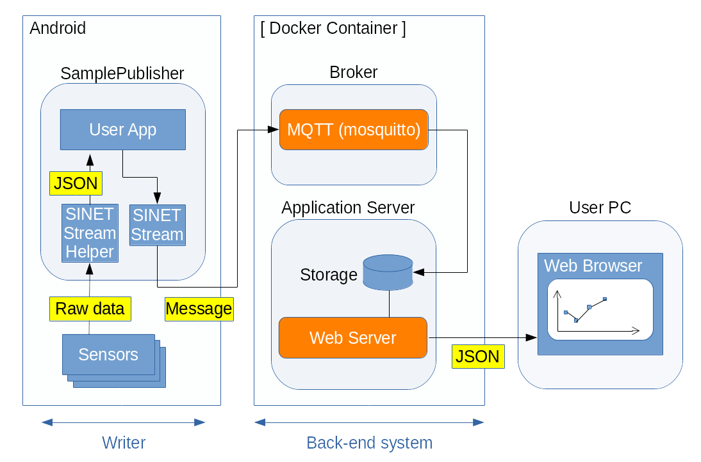

<!--
Copyright (C) 2020-2021 National Institute of Informatics

Licensed to the Apache Software Foundation (ASF) under one
or more contributor license agreements.  See the NOTICE file
distributed with this work for additional information
regarding copyright ownership.  The ASF licenses this file
to you under the Apache License, Version 2.0 (the
"License"); you may not use this file except in compliance
with the License.  You may obtain a copy of the License at

  http://www.apache.org/licenses/LICENSE-2.0

Unless required by applicable law or agreed to in writing,
software distributed under the License is distributed on an
"AS IS" BASIS, WITHOUT WARRANTIES OR CONDITIONS OF ANY
KIND, either express or implied.  See the License for the
specific language governing permissions and limitations
under the License.
-->

[日本語](TUTORIAL-android-step2-overview.md)

# TUTORIAL - STEP2: Publish Sensor readout values 

<em>Table of contents</em>
<pre>
1. Introduction
2. System configuration
3. The flow of work
3.1 Works on the back-end side (part 1)
3.2 Works on the Android side
3.3 Works on the observing PC side
3.4 Works on the back-end side (part 2)
4. Restrictions
5. If something goes wrong
5.1 Want to reset the Android application settings
5.2 The Android application cannot connect to the `Broker`
5.3 An error dialog is shown while the Android application is running
5.4 Graph cannot be displayed on the web interface
</pre>


## 1. Introduction

As the second step of a sample program which uses the Android
SINETStream library, we demonstrate a little bit complex system
configuration.

Android device normally equips sensor devices such like accelerometer
or illuminometer, and also has means to connect to the network.
Therefore, we build a system in which an Android device collects
sensor readout values and periodically send them to the cloud for
data visualization.


## 2. System configuration

In this scenario, we do not use `Reader` functionality.
As shown in the figure below, we use an Android application "Sensor",
which works as a `Writer`. Along with a `Broker`, application server
functions are used on the back-end side.

The application collects sensor readout values on the Android device,
and send them as a message to the `Broker` via SINETStream. Then the
message is processed in the back-end side for data visualization.



For better readability of this tutorial, we describe details per
functional elements as follows in the latter part of this document.

* Works on the back-end side
* Works on the Android side
* Works on the observing PC side

Please proceed along with those descriptions.

Once you went through the running environment installations,
you need to fill-in the connection settings between the Android and
the `Broker`, before actually run the Android Application.
Please set parameters to fit with your network configurations.


## 3. The flow of work
### 3.1 Works on the back-end side (part 1)

We start from how to build a virtual running environment on a host
machine, which can be either commercial cloud service or on your
desktop computer. Then we also describe how to install, setup and
operate of the server programs.

On the host machine, install the `Docker Engine` at first.
Then execute `docker run` to install the container image for STEP2.
Finally, start all required server programs.

Go through the companion document
[TUTORIAL - DOCKER-CONTAINER](sinetstreamhelper-tutorial-container/TUTORIAL-docker-container.en.md)
for the actual procedure details.

```console
     % sudo docker run -d --name broker -p 1883:1883 -p 80:80 harbor.vcloud.nii.ac.jp/sinetstream/android-tutorial:latest
```

With this `docker run` command, installation of the back-end system
and starting of server processes are automatically executed.

As for the system details on the back-end side, see the companion
document
[The container image for the SINETStream Android tutorial](sinetstreamhelper-tutorial-container/README.en.md).


### 3.2 Works on the Android side

We describe procedures such like installation, settings and operations
of the Android application "Sensor".

See the companion document
[TUTORIAL - Android:STEP2](TUTORIAL-android-step2.en.md)
for details.


### 3.3 Works on the observing PC side

Once the back-end system has started as mentioned above, a web server
for the data visualization listens for the incoming connection.
From a web browser on an observing PC, connect to the following URL.

```
    http://<server_address>/chart.html
```

For the `server_address` of the URL, specify the host machine
which runs the container image for the back-end system.
As for the port number of the web server, 80 is used as default.
If you need to change it, adjust by the argument "-p" of the
`docker run` command.

As for the topics on the web interface, such like graph layout or
preferences of those elements, see the companion document
[TUTORIAL - A web interface for the sensor data visualization](TUTORIAL-android-step2-webbrowser.en.md)
for details.


### 3.4 Works on the back-end side (part 2)

Once you have done this tutorial, computational resources for it
must be freed.
Please stop and remove the container image with the following commands.

> If the Android application is still running, you will see an error
> dialog "EOF exception", because the connection is closed by `Broker`
> shutdown.

```console
     % sudo docker stop broker
     % sudo docker rm broker
```

Please see the companion document
[TUTORIAL-DOCKER-CONTAINER](sinetstreamhelper-tutorial-container/TUTORIAL-docker-container.en.md)
for details.


## 4. Restrictions

Because of the nature of tutorial which aims to experience
the system behavior, this tutorial does not fully cover the
Android `SINETStream` library functionalities.

If you use the `Broker` shown in this tutorial, beware that
there are some functional restrictions as follows.

* Connection method with `Broker`
    * The Android application connects to the `Broker` with the
simplest way; no user authorization, no SSL/TLS, no encryption.

* Use of fixed topic name
    * The back-end system behind the `Broker` extracts the received
message with the fixed topic name `sensor-data` as the search key.
    * Note that even in the topic name mismatch cases, the message
can be received by the `Broker` but is not processed by the back-end
system.

* Collecting sensor data
    * Depending on the hardware implementation or Android version,
available sensor types may vary.
    * Depending on the Android system settings or the application
"Sensor" settings, desired sensor type values may not be notified
and thus the graph is not being updated.

* Graph display
    * For the sake of simple processing, the `Broker` does not
distinguish each Android clients. Actually, multiple Android clients
can connect to the same `Broker` at the same time.
In that case, plotted data are mixed ones from all Android clients.
    * For the sake of simple processing, sensor types generating
vector values (such like accelerometer) get special treatment.
Vector norm is calculated and displayed as a scalar value.

> **Note**:<br>
> There are 3 types in vector norm calculation.
>
> * One-dimensional norm
>     * Sum of absolute value of each element
> * Euclidean (2-dimensional) norm
>     * Square root of "Sum of squared value of each element"
> * Maximum norm
>     * Maximum of absolute value of each element
>
> In this tutorial, we take euclidean (2-dimension) norm.


## 5. If something goes wrong
### 5.1 Want to reset the Android application settings

* Reset everything to restart from scratch.
    * Exercise the following steps to clear local data of the application.
    * There are two kind of areas, `Storage` (or `DATA` in older
Android versions) and `Cache`.
    * We need to clear `Storage` area for reset operation.

```
    Settings
    --> Apps & notifications
      --> App info
        --> Sensor
          [FORCE STOP]
          --> Storage & cache
            --> Clear storage (or CLEAR DATA)
```

### 5.2 The Android application cannot connect to the `Broker`

* An error dialog something like "Cannot connect to the Broker" is shown.
    * Make sure the Android device is connected to the external network
via cellular or Wi-Fi (= not in airplane mode). 
    * Make sure the `Broker` is up and running on the back-end side.

* Connection attempt to the `Broker` timeouts.
    * Check the IP address (or FQDN) and port number of the `Broker`.
        * FQDN: Fully Qualified Domain Name
    * Check the IP routing between the Android device and the `Broker`.
    * There may exist firewall along the route. If so, check its settings.


### 5.3 An error dialog is shown while the Android application is running

* An error dialog something like "EOF exception" is shown.
    * It means the network connection with the `Broker` is lost.
    * Check the connection status of the Android device.
    * Check the status of the back-end container.


### 5.4 Graph cannot be displayed on the web interface

* Sensor type mismatch between the received data and the graph settings.
    * Initial graph settings takes following 3 sensor types.
        * step_counter
        * light
        * accelerometer
    * If you want to see other sensor types, or if some of those types
are unavailable on the Android device, choose desired ones via UI
operations on the web interface.
    * See the companion document
[TUTORIAL - A web interface for the sensor data visualization](TUTORIAL-android-step2-webbrowser.en.md)
for more info.

* User specified the sensor type that require run-time permissions.
    * User must explicitly give permissions to use some kind of sensor
types.
    * Currently, `step_counter` and `step_detector` are applicable
for this category.
    * Give permissions for `Physical activity` as follows.
```
    Settings
    --> Apps & notifications
      --> Sensor
        --> Permissions
          --> Physical activity: ALLOWED
```

* User specified an invalid topic name.
    * The back-end system behind the `Broker` extracts the received
message with the fixed topic name `sensor-data`.
    * Make sure that topic name is `sensor-data`, in the `Broker`
category of the "Sensor" application settings.

* Sensor readout values are too old and out of plot range.
    * While connecting to the URL of the web interface, graph display
regions are updated in real time.
    * Make sure that "Sensor" application on an Android device is
currently publishing sensor readout values.

* Graph data is missing while Android device screen is off.
    * To save battery consumption, all sensors are disabled while in
display sleep mode.
    * The situation is the same if "Sensor" application went into
background of other application.
    * Adjust the screen timeout in the Android system settings.

