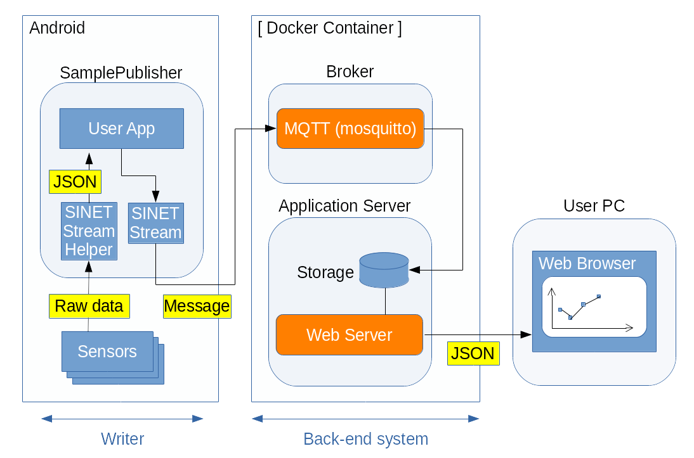

<!--
Copyright (C) 2020-2021 National Institute of Informatics

Licensed to the Apache Software Foundation (ASF) under one
or more contributor license agreements.  See the NOTICE file
distributed with this work for additional information
regarding copyright ownership.  The ASF licenses this file
to you under the Apache License, Version 2.0 (the
"License"); you may not use this file except in compliance
with the License.  You may obtain a copy of the License at

  http://www.apache.org/licenses/LICENSE-2.0

Unless required by applicable law or agreed to in writing,
software distributed under the License is distributed on an
"AS IS" BASIS, WITHOUT WARRANTIES OR CONDITIONS OF ANY
KIND, either express or implied.  See the License for the
specific language governing permissions and limitations
under the License.
-->

[English](TUTORIAL-android-step2-overview.en.md)

# チュートリアル - STEP2: センサ情報収集アプリの実行

<em>目次</em>
<pre>
1. 概要
2. システム全体構成
3. 作業の流れ
3.1 バックエンド側の作業（その1）
3.2 Android端末側の作業
3.3 観測用PC側の作業
3.4 バックエンド側の作業（その2）
4. 制約事項
5. うまくいかないときは
5.1 Androidアプリケーションの設定内容を初期化したい
5.2 AndroidアプリケーションがBrokerと接続できない
5.3 Androidアプリケーション実行中にエラー発生する
5.4 観測用PCのウェブ画面でセンサー読取値がグラフ表示されない
</pre>


## 1. 概要

Android版のSINETStreamライブラリを使うサンプルプログラム第二弾として、
少し複雑な構成を例示します。

一般的なAndroid端末は加速度計や照度計などのセンサーデバイスを実装しており、
ネットワークへの接続手段も備えています。
そこで、Android端末で測定したセンサー読取値を周期的にクラウドに上げて蓄積し、
可視化するようなシステムを構築します。


## 2. システム全体構成

この例では`Reader`機能は使いません。

下図左側が`Writer`機能を示しており、
Android端末で計測したセンサー値を収集してSINETStream経由で`Broker`に送信します。
下図右側が`Broker`機能および背後のバックエンドシステムを示しており、
後者が可視化処理を担当します。



本チュートリアルの見通しを良くするため、以降は

* バックエンド側の作業
* Android端末側の作業
* 観測用PC側の作業

という機能要素ごとに細分化して記述します。
内容に沿って作業を進めてください。

一通り環境構築を済ませ、
Android端末のセンサー情報収集アプリを実際に動かす前に、
対向`Broker`との接続情報を設定する箇所があります。
お手元のネットワーク構成に合わせて調整してください。


## 3. 作業の流れ
### 3.1 バックエンド側の作業 (その1)

商用クラウドサービスあるいは手元機材上に仮想マシンを用意し、
その上でサーバプログラム群の導入と設定、操作方法などの手順に関して記述します。

ホスト機材において、まずは動作基盤`Docker Engine`を導入してください。
次に`docker run`コマンドによりSTEP2用のコンテナイメージを導入し、
続けて所用のサーバ群の一括起動を実施してください。

これらの具体的な手順は、別紙
[チュートリアル DOCKER-CONTAINER](sinetstreamhelper-tutorial-container/TUTORIAL-docker-container.md)
を参照ください。

```console
     % sudo docker run -d --name broker -p 1883:1883 -p 80:80 harbor.vcloud.nii.ac.jp/sinetstream/android-tutorial:latest
```
この`docker run`コマンド実行により、
バックエンド側の導入とサーバ群の起動が自動的に実施されます。

なお、バックエンド側のシステム的な詳細に関しては、別紙
[SINETStream Androidのチュートリアル用コンテナイメージ](sinetstreamhelper-tutorial-container/README.md)
を参照ください。


### 3.2 Android端末側の作業

お手元のAndroid端末へのセンサー情報収集アプリの導入と設定、
操作方法などの手順に関して記述します。

詳細は別紙
[Android端末側の作業](TUTORIAL-android-step2.md)
を参照ください。


### 3.3 観測用PC側の作業

前述のバックエンド側のシステムが起動すると、
グラフ表示サービス用のウェブサーバが接続待ち状態となります。
観測用PCのウェブブラウザから以下のURLに接続してください。

```
    http://<server_address>/chart.html
```

上記URLのサーバアドレス部分は、
バックエンドシステム用のコンテナイメージが稼動するホスト機材を指定します。
ポート番号は標準の80番を使いますが、
変更する場合は上記`docker run`の引数「-p」で調整してください。

グラフ表示画面の構成や表示対象の編集など、詳細に関しては別紙
[チュートリアル - センサーデータ可視化用のウェブインタフェース](TUTORIAL-android-step2-webbrowser.md)
を参照ください。


### 3.4 バックエンド側の作業 (その2)

一通り動作の確認が終わったら、計算機資源の解放が必要です。
以下のコマンドにより、
チュートリアル用コンテナイメージの停止と削除を実施してください。

> もしAndroid端末側のアプリケーションが起動中の場合、`Broker`停止を
> 契機に接続が切られるためAndroidアプリケーションに「EOF例外」エラー
> メッセージが表示されます。

```console
     % sudo docker stop broker
     % sudo docker rm broker
```

詳細は別紙
[チュートリアル DOCKER-CONTAINER](sinetstreamhelper-tutorial-container/TUTORIAL-docker-container.md)
を参照ください。


## 4. 制約事項

システム動作を体験していただくチュートリアルという性質上、
Android版`SINETStream`ライブラリの提供する全ての機能を網羅しているわけではありません。

ここで示したチュートリアル用の`Broker`を用いる場合、
以下のような機能制限があることにご留意ください。

* `Broker`との接続方法
    * ユーザ認証、SSL/TLS接続、データ暗号化のいずれも実施せず、
最も簡易な方法で接続します。

* 固定トピック名の使用
    * `Broker`の背後にあるバックエンドシステムは、固定トピック名`sensor-data`を検索鍵にしてメッセージを抽出します。
    * トピック名が合っていないと「`Broker`には届くのにバックエンドシステムに処理されない」状態になりますのでご注意ください。

* センサー情報取得時の制約
    * Android端末のハードウェアやOSバージョンにより、Android端末側で取得可能なセンサー種別は異なり得ます。
    * Android端末や本アプリ動作時の設定状況によっては、所望のセンサー種別の値が得られずグラフも更新されない状況があり得ます。

* グラフ表示上の制約
    * 処理の簡素化のため、`Broker`に接続される個々のAndroid端末を区別しません。
複数台のAndroid端末を同時に`Broker`に接続しても問題ありませんが、
グラフ表示上はそれらのセンサー値が合成されたものとなります。
    * 処理の簡素化のため、ベクター値（ここでは加速度が該当）は各要素のノルムを計算したスカラー値で表示します。

> ノルム計算に関する注記：
> ベクトルのノルム計算方法として以下の３種類がある。
>
> * 一次元ノルム
>     * 各要素の絶対値の総和
> * ユークリッド(二次元)ノルム
>     * 「各要素の二乗の総和」の平方根
> * 最大値(無限大)ノルム
>     * 絶対値が最大となる要素の値
>
> ここではユークリッド（二次元）ノルムで計算する。


## 5. うまくいかないときは
### 5.1 Androidアプリケーションの設定内容を初期化したい

* いったん全初期化して、設定をやり直したい
    * 以下の手順でアプリケーションのローカルデータを消去してください。
    * `Storage`（AndroidOSバージョンによっては`DATA`）領域と`Cache`領域の2種類がありますが、前者が消去対象です。

```
    Settings
    --> Apps & notifications
      --> App info
        --> Sensor
          [FORCE STOP]
          --> Storage & cache
            --> Clear storage (or CLEAR DATA)
```

### 5.2 Androidアプリケーションが`Broker`と接続できない

* `Broker`接続失敗のエラーダイアログが表示される
    * Android端末が外部ネットワークに到達可能、
すなわち携帯電話網またはWi-Fiが有効（= 機内モードでない）ことを確認してください。
    * バックエンド側で`Broker`が稼働中であることを確認してください。

* `Broker`との接続タイムアウトになる
    * 接続先`Broker`のIPアドレス（またはFQDN）とポート番号を確認してください。
        * FQDN: Fully Qualified Domain Name
    * Android端末と`Broker`との間のIP経路設定が正しいことを確認してください。
    * 途中でファイアウォールが設定されている場合はその内容を確認してください。


### 5.3 Androidアプリケーション実行中にエラー発生する

* 「EOF例外」エラーメッセージが表示される
    * `Broker`との接続が切れたことを示します。
    * Android端末の外部ネットワーク接続状況を確認してください。
    * バックエンド機材のコンテナ動作状況を確認してください。


### 5.4 観測用PCのウェブ画面でセンサー読取値がグラフ表示されない

* 配信中のセンサー種別と、グラフ表示対象のセンサー種別が一致していない
    * グラフ表示画面の初期値は、以下の3種類が表示されます。
        * 歩数計（step_counter）
        * 照度計（light）
        * 加速度計（accelerometer）
    * 上記以外のセンサー種別を観測したい場合、あるいはAndroid端末側で対応していない場合は、グラフ画面操作により表示対象のセンサー種別を設定してください。
    * 詳細に関しては別紙
[チュートリアル - センサーデータ可視化用のウェブインタフェース](TUTORIAL-android-step2-webbrowser.md)
を参照ください。

* 利用者が権限を許可していないセンサー種別を指定した
    * センサー種別によっては利用者が明示的に権限を設定する必要があります。
    * 現状では「step_counter, step_detector」が該当します。
    * 以下の手順でアプリケーションの`Physical activity`権限を許可してください。
```
    Settings
    --> Apps & notifications
      --> Sensor
        --> Permissions
          --> Physical activity: ALLOWED
```

* `Broker`接続パラメータのトピック名が正しくない
    * `Broker`の背後のバックエンドシステムは、トピック名`sensor-data`で届いたメッセージを抽出します。
    * Androidアプリケーション設定画面の`Broker`項目で、トピック名が`sensor-data`であることを確認してください。


* センサー読取データが古すぎて表示期間の描画範囲に入らない
    * 観測用PCのウェブブラウザでグラフ表示用URLに接続中は実時間で描画領域を更新しています。
    * 現在Androidアプリケーションがセンサー読取値を配信中であることを確認してください。

* Android端末の画面スリープ状態のときセンサー読取データが存在しない
    * 電力節約のため、画面スリープ時はセンサーを停止させています。
    * 本アプリケーションが他のアプリケーションの背後に回ったときも同様です。
    * 端末設定により、無操作時の画面スリープ移行時間を調整してください。

