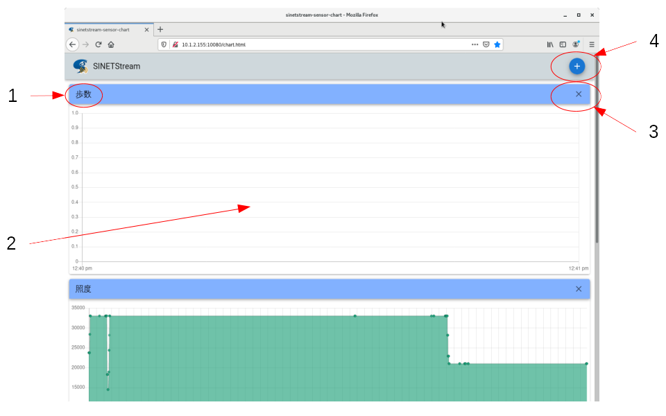
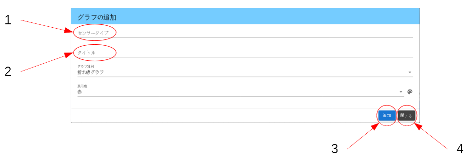

<!--
Copyright (C) 2020-2021 National Institute of Informatics

Licensed to the Apache Software Foundation (ASF) under one
or more contributor license agreements.  See the NOTICE file
distributed with this work for additional information
regarding copyright ownership.  The ASF licenses this file
to you under the Apache License, Version 2.0 (the
"License"); you may not use this file except in compliance
with the License.  You may obtain a copy of the License at

  http://www.apache.org/licenses/LICENSE-2.0

Unless required by applicable law or agreed to in writing,
software distributed under the License is distributed on an
"AS IS" BASIS, WITHOUT WARRANTIES OR CONDITIONS OF ANY
KIND, either express or implied.  See the License for the
specific language governing permissions and limitations
under the License.
-->

[English](TUTORIAL-android-step2-webbrowser.en.md)

# チュートリアル - センサーデータ可視化用のウェブインタフェース

<em>目次</em>
<pre>
1. 概要
2. サーバへの接続
3. 主画面
3.1 画面構成
3.2 画面構成の編集
4. グラフ追加画面
4.1 画面構成
4.2 センサー種別一覧
</pre>


## 1. 概要

チュートリアルSTEP2用のコンテナで展開するバックエンド側システムは、
センサーデータ可視化用のウェブインタフェースを用意しています。
手元のウェブブラウザから指定のURLに接続することで、
センサー種別ごとの読取値が時系列でグラフ表示される様子を観測できます。


## 2. サーバへの接続

バックエンド側のシステムが稼働中の状態で、
観測用PCのウェブブラウザから以下のURLに接続してください。
もちろんお手元のスマートフォンやタブレットからの接続でも構いません。

```
    http://<server_address>/chart.html
```

上記URLの`server_address`要素は、
IPアドレスまたはFQDN (Fully Qualified Domain Name) 形式で記述します。
「バックエンドシステム用のコンテナイメージが稼動する」ホスト機材のアドレスを指定してください。
コンテナ起動時の設定でウェブサーバのポート番号を標準の80番から変更した場合、
この`server_address`要素を`<address>:<port>`形式で指定してください。

URLが正しいはずなのにウェブサーバに接続できない場合、
一般的なTCP/IP通信レベルの接続失敗が考えられます。
経路制御やファイアウォールの設定などを見直してください。
`server_address`をFQDNで指定した場合、DNSが正常動作するかも見てください。


## 3. 主画面
### 3.1 画面構成

主画面はヘッダ部とボディ部に分かれ、
ボディ部はセンサー種別ごとの時系列グラフ表示領域が縦に並ぶ構成となっています。



＜凡例＞
1. センサー種別名称
2. センサー読取値の時系列グラフ表示領域
3. グラフ表示領域の削除ボタン
4. グラフ表示領域の追加ボタン

> **注意**
> <br>
> グラフ表示画面のいくつかの部品（ボタンなど）は公開サーバから取得します。
> 画面表示が上記イメージと異なって見えたり不完全だったりする場合は、
> 観測用PCからインターネットに疎通できることを確認してください。

Android端末側からは周期的にセンサーデータが送られ、
バックエンド側に逐次蓄積されます。
センサーデータが追加され続けている限りグラフ表示領域は自動更新され続けます。


### 3.2 画面構成の編集

グラフ表示画面では、既定値として以下のセンサー種別の表示領域が用意されています。
* 歩数計（step_counter）
* 照度計（light）
* 加速度計（accelerometer）

Android端末側でのセンサー実装状況あるいは所望のセンサー種別に対応するため、
利用者がボディ部（センサー種別ごとのグラフ表示領域）の構成を編集可能です。
不要なセンサー種別の表示領域は削除し、
目的のセンサー種別の表示領域を追加するという操作内容となります。

ボディ部の画面構成はウェブブラウザのローカルストレージ領域に保存されるので、
いったんブラウザを終了してサーバに再接続すると画面構成が再現されます。


## 4. グラフ追加画面
### 4.1 画面構成

主画面ヘッダ領域の右端にあるプラスボタンを押下すると、
以下のようなグラフ追加画面がポップアップ表示されます。



＜凡例＞
1. センサータイプ：データ抽出用の検索鍵としてセンサー種別を指定する
2. タイトル：グラフ表示領域の左上端に示す任意名称を文字列で指定する
3. `追加`ボタン：編集内容を確定してこの画面を終了する
4. `閉じる`ボタン：編集内容を破棄してこの画面を終了する

`センサータイプ`と`タイトル`は必須項目です。
グラフ種別や表示色はお好みで指定してください。
入力が完了したら「追加」ボタンを押下して編集内容を確定してください。
「閉じる」ボタンの押下により、いつでも編集作業をキャンセルできます。

> **注意**
> <br>
> `センサータイプ`の値は、後述するセンサー種別一覧表の項目`TypeName`
> のいずれかを設定してください。ここで誤入力があると、対象データ抽出
> に失敗して当該センサー種別のグラフが全く更新されないことになります。

### 4.2 センサー種別一覧

本システムで対応しているセンサー種別の一覧を以下に示します。

* 表の1列目`Type`と2列目`Symbol`がAndroid開発者向け文書
[Sensor](https://developer.android.com/reference/android/hardware/Sensor)
中で定数として定義されている値です。

* 表の3列目`TypeName`に注目ください。
この値（`accelerometer`など）が前述のグラフ追加画面で`センサータイプ`として指定すべき文字列です。

* 表中の4列目`AndroidVersion`は、記載のあるOS以降の対応を示します。
AndroidOSの開発進展により、対応センサー種別に増減があり得ます。

|Type|Symbol|TypeName|AndroidVersion|
|---|---|---|---|
|1|Sensor.TYPE_ACCELEROMETER|accelerometer||
|2|Sensor.TYPE_MAGNETIC_FIELD|magnetic_field||
|3|Sensor.TYPE_ORIENTATION|orientation||
|4|Sensor.TYPE_GYROSCOPE|gyroscope||
|5|Sensor.TYPE_LIGHT|light||
|6|Sensor.TYPE_PRESSURE|pressure||
|7|Sensor.TYPE_TEMPERATURE|temperature||
|8|Sensor.TYPE_PROXIMITY|proximity||
|9|Sensor.TYPE_GRAVITY|gravity||
|10|Sensor.TYPE_LINEAR_ACCELERATION|linear_acceleration||
|11|Sensor.TYPE_ROTATION_VECTOR|rotation_vector||
|12|Sensor.TYPE_RELATIVE_HUMIDITY|relative_humidity||
|13|Sensor.TYPE_AMBIENT_TEMPERATURE|ambient_temperature||
|14|Sensor.TYPE_MAGNETIC_FIELD_UNCALIBRATED|magnetic_field_uncalibrated||
|15|Sensor.TYPE_GAME_ROTATION_VECTOR|game_rotation_vector||
|16|Sensor.TYPE_GYROSCOPE_UNCALIBRATED|gyroscope_uncalibrated||
|17|Sensor.TYPE_SIGNIFICANT_MOTION|significant_motion||
|18|Sensor.TYPE_STEP_DETECTOR|step_detector||
|19|Sensor.TYPE_STEP_COUNTER|step_counter||
|20|Sensor.TYPE_GEOMAGNETIC_ROTATION_VECTOR|geomagnetic_rotation_vector||
|21|Sensor.TYPE_HEART_RATE|heart_rate|Android 4.4W+|
|28|Sensor.TYPE_POSE_6DOF|pose_6dof|Android 7.0+|
|29|Sensor.TYPE_STATIONARY_DETECT|stationary_detect|Android 7.0+|
|30|Sensor.TYPE_MOTION_DETECT|motion_detect|Android 7.0+|
|31|Sensor.TYPE_HEART_BEAT|heart_beat|Android 7.0+|
|34|Sensor.TYPE_LOW_LATENCY_OFFBODY_DETECT|low_latency_offbody_detect|Android 8.0+|
|35|Sensor.TYPE_ACCELEROMETER_UNCALIBRATED|accelerometer_uncalibrated|Android 8.0+|
|36|Sensor.TYPE_HINGE_ANGLE|hinge_angle|Android 11+|

