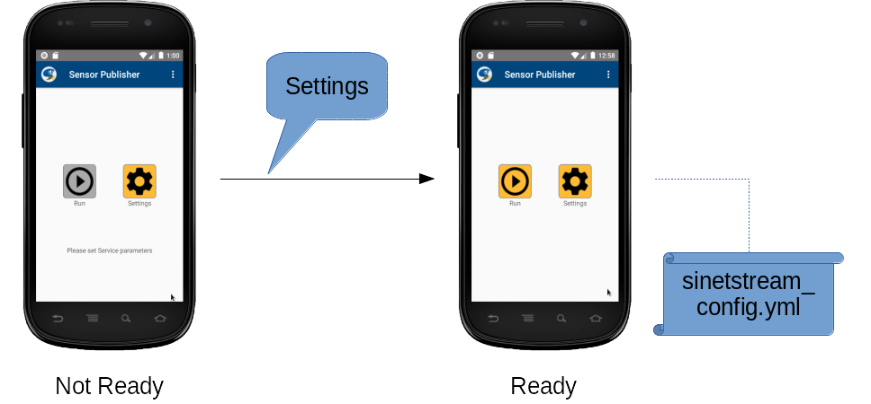
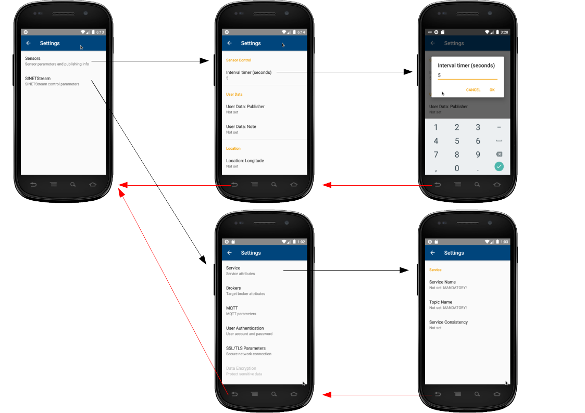

<!--
Copyright (C) 2020-2021 National Institute of Informatics

Licensed to the Apache Software Foundation (ASF) under one
or more contributor license agreements.  See the NOTICE file
distributed with this work for additional information
regarding copyright ownership.  The ASF licenses this file
to you under the Apache License, Version 2.0 (the
"License"); you may not use this file except in compliance
with the License.  You may obtain a copy of the License at

  http://www.apache.org/licenses/LICENSE-2.0

Unless required by applicable law or agreed to in writing,
software distributed under the License is distributed on an
"AS IS" BASIS, WITHOUT WARRANTIES OR CONDITIONS OF ANY
KIND, either express or implied.  See the License for the
specific language governing permissions and limitations
under the License.
-->

[日本語](TUTORIAL-android-step2.md)

# TUTORIAL - ANDROID-STEP2

<em>Table of contents</em>
<pre>
1. Introduction
1.1 Network model
1.2 Prerequisites
2. Installation of the "Sensor" application
3. Operation of the "Sensor" application
3.1 Screen transitions
3.2 Initial screen
3.3 Settings screen
3.3.1 Settings for Sensors
3.3.2 Settings for the SINETStream
3.4 Main screen
3.4.1 Layout of the main screen
3.4.2 Publishing sensor data

Appendix
A.1 Source code
A.2 Known problems
</pre>


## 1. Introduction

We implemented an Android application "Sensor", as a sample usage of
the Android
[SINETStream library](https://translate.google.com/translate?hl=en&sl=ja&tl=en&u=https://nii-gakunin-cloud.github.io/sinetstream/docs/tutorial-android/../userguide/android.html) and
[SINETStreamHelper library](https://translate.google.com/translate?hl=en&sl=ja&tl=en&u=https://nii-gakunin-cloud.github.io/sinetstream/docs/tutorial-android/../userguide/libhelper.html).
The application collects the readout values of the
[Sensor](https://developer.android.com/reference/android/hardware/Sensor)
devices, then send them as a message over the SINETStream.
In this document, we briefly describe how to install this application
to an Android device, how to setup and operate it.


### 1.1 Network model


The "Sensor" application has only `Writer` functionality.
This application uses the
[SINETStreamHelper library](https://translate.google.com/translate?hl=en&sl=ja&tl=en&u=https://nii-gakunin-cloud.github.io/sinetstream/docs/tutorial-android/../userguide/libhelper.html)
to collect sensor readout values in JSON format. Then the JSON data
will be sent to the peer `Broker` as a SINETStream message.

On the other hand, the back-end system behind the `Broker` parses
the JSON contents and stores it in the database. User can view the
plotted sensor data via Web interface.

The "Sensor" application has its own "Settings" screen, and thus user
can set configuration parameters such like the `Broker` connection
or the SINETStream behaviors.
Once user has set those parameters, the Android
[SINETStream configuration file](../userguide/config-android.en.md)
will be automatically generated.


### 1.2 Prerequisites

* The Android device

  * Android 8.0 (API level 26) or later
    * The Android
[SINETStream library](https://translate.google.com/translate?hl=en&sl=ja&tl=en&u=https://nii-gakunin-cloud.github.io/sinetstream/docs/tutorial-android/../userguide/android.html)
uses the
[MQTT(Eclipse Mosquitto)](https://mosquitto.org/)
as a messaging system.
    * The implementation of the
[Paho MQTT Android Client](https://www.eclipse.org/paho/index.php?page=clients/java/index.php)
requires `Android 8.0+` as its running condition.

* Preparations for the back-end system

  * Within the scope of this tutorial, we just need a peer `Broker`
which communicates with an Android device.
  * On the host machine for the back-end system, run `docker run` command
which installs the container image for this tutorial. Server processes
will be automatically started afterward.
  * The back-end system should be up and running before working on
the Android device.
  * Back to the previous document and see the section
[3.1 Works on the back-end side (part 1)](
TUTORIAL-android-step2-overview.en.md#31-works-on-the-back-end-side-part-1)
for details.

* Network environment

  * The Android device and the peer `Broker` is connected via IP (Internet
Protocol) network.
Make sure the end-end IP reachability via cellular or Wi-Fi network.


## 2. Installation of the "Sensor" application

Currently, the "Sensor" application will be available from the NII
managed server, not from Google Play.

Please see the companion document
[Installation of the sample Android application](TUTORIAL-android-install.en.md)
for details.
The procedure is the same for updating the older version.


## 3. Operation of the "Sensor" application
### 3.1 Screen transitions


\<Legend\>
1. On the Android home (a), press the icon `Sensor` to start.
2. On the splash screen (b), application icon and the copyright holder
will be briefly shown. Then the screen transits to the initial one (c).
3. Pressing the button `Settings` causes the initial screen (c) transit to the settings screen (d).
4. Pressing the button `BACK` causes the settings screen (d) transit to the initial screen (c).
5. Pressing the button `Run` causes the initial screen (c) transit to the main screen (e).
6. Pressing the button `BACK` causes the main screen (e) transit to the initial screen (c).
7. Pressing the button `BACK` causes the initial screen (c) transit to the Android home (a).


In the latter part of this document, each screen layout and operation
details will be addressed.


### 3.2 Initial screen



This is the initial screen after application startup.

* `Run` button
  * Start the `Main` Activity of this application.
  * Once the main screen finishes, control comes back to this screen.
* `Settings` button
  * Start the `Settings` Activity for this application.
  * Once the settings screen finishes, control comes back to this screen.
* Menu button
  * By pressing the "vertical 3-dots" on the top right corner,
a small menu will be deployed.
    * `Help`: Show help for this application.
    * `About`: Show brief information about this application.

If the
[SINETStream configuration file](../userguide/config-android.en.md)
does not yet exist (just like after the fresh installation),
or if current configuration does not meet the mandatory conditions,
`Run` button is set disabled (gray out) and a guide message will be
shown to let user take actions.
In these cases, press the `Settings` button and fill-in the mandatory
SINETStream parameters.


### 3.3 Settings screen

The settings screen is being split for Sensors and SINETStream,
where both of those are hierarchically deployed.



### 3.3.1 Settings for Sensors

The sensor readout values from the Android device will be formatted
as JSON data, which is defined in the companion document
[SINETStreamHelper#JSON data format](https://github.com/nii-gakunin-cloud/sinetstream-android-helper).

As for the DeviceInfo element of the above JSON format, `User Info` and
`Location` values (both are optional) must be externally specified.

* User Info
  * Multiple Android devices running this "Sensor" application may
connect to the same `Broker` with the same topic name.
If so, it is convenient to have sender identification information.
  * The sub-item `Publisher` describes the sender information,
and `Notes` describes supplementary information.
* Location
  * This item represents the geographical location (latitude, longitude)
of the Android device running this "Sensor" application.
  * As of version 1.5, this item is provided for setting the initial
value manually. Automatic setting and updating is not supported.


Note that user can set an optional item `Interval timer`
(default value is 10 seconds).
Its intention is as follows.

The readout values of active sensor devices will be asynchronously
notified by the Android system
[SensorManager](https://developer.android.com/reference/android/hardware/SensorManager), but those timing differs per sensor types. Some are continuously
notified, and others are notified only at the value changes.
Therefore, if you activate multiple sensor devices at the same time,
you will likely to get frequent notifications.

To suppress the network overload, each sensor readout values are
cached in the
[SINETStreamHelper library](https://translate.google.com/translate?hl=en&sl=ja&tl=en&u=https://nii-gakunin-cloud.github.io/sinetstream/docs/tutorial-android/../userguide/libhelper.html)
as the latest ones. At the certain sampling timing (not shorter
than `Interval timer`), JSON data is generated in the library.

```
    [SensorA] [SensorB]
       |         :
       +-----------------++---------------+
       |         :       ||               |
       |   ......:.......||...............|..
       |   :          :  ||   :    :      | :
       V   V          V  VV   V    V      V V

   ----o---x----------o--xx---x----o------x-x---------> t
       |<-------->|   |            |
       |    T         |<-------->| |
       V              |    T       |<-------->|
      JSON#1          V            |    T
                     JSON#2        V
                                  JSON#3
```

The figure showed above depicts the timing relationship of two events.
1. The notification timing (o/x) from the Android system for sensor
readout values (in this case, two sensors A/B)
2. The timing (o) that JSON data is actually generated

In the first place, the notification timing of each sensor readout
values is not periodic.

Assume that a JSON data is generated at "o", any sensor readout values
notified at "x", which is shorter than "o + T", are simply cached as
the latest value of the sensor type without generating a JSON data.

If the next notification timing is equal or longer than "o + T",
new JSON data is generated by collecting the latest values per sensor
type (values at "o" and the last "x").


```yaml
{
   ...
   "sensors": [
     { # Sensor A with a scalar value
         ...
         "timestamp": "20210101T012312.345+0900",  # Timing 'x'
         "values": 1
     },
     { # Sensor B with vector values
         ...
         "timestamp": "20210101T012345.678+0900",  # Timing 'o'
         "values": [
           1.0,
           -2.3,
           4.5
         ]
     }
   ...
   ]
}
```

To summarize, the minimum interval of `SINETStream` messages sent
from this "Echo" application to the `Broker` is restricted by the
value "T" (settings item `Interval timer`).


### 3.3.2 Settings for the SINETStream

To use the Android
[SINETStream library](https://translate.google.com/translate?hl=en&sl=ja&tl=en&u=https://nii-gakunin-cloud.github.io/sinetstream/docs/tutorial-android/../userguide/android.html),
its own
[SINETStream configuration file](../userguide/config-android.md)
must be set properly, so that the user application using the library
can connect to the peer `Broker`.

We provide a GUI-based settings screen for this purpose.
On the initial screen, press the `Settings` button to transit to
the settings screen. Before coming back to the initial screen after
several settings operations, the `SINETStream configuration file`
will be automatically generated.
If there are some configuration changes from the previous settings,
the file contents will be updated.

Following items must be set to connect to the `Broker`.
Other items can be left untouched. If so, program default values
will be used.

* Service Name: `Service -> Service Name`
* Topic Name: `Service -> Topic Name`
* `Broker` connection information (Address, Port)
    * `Brokers -> IP Address (or FQDN)`
    * `Brokers -> Port Number`

In the case of the `Broker` shown in this tutorial, above mandatory
parameters would look like as follows. Note that actual `Broker`
address must be set according to the running environment.

|Service Name|Topic Name|IP Address (or FQDN)|Port Number|
|---|---|---|---|
|service-tutorial-mqtt|sensor-data|xx.xx.xx.xx|1883|

> Note that the `Topic Name` is a string used as a communication
> channel identifier. User can set any value for it, but in the
> STEP2 context, beware to **exactly set** the reserved word
> "sensor-data" as is.
> On `Broker` side, the `Topic Name` is treated as the filter to
> pass the received SINETStream message to the back-end system.
> If the `Topic Name` does not match with "sensor-data", received
> JSON data dos not stored in the database, and thus the graph
> does not updated.


### 3.4 Main screen

On the initial screen, press the button `Run` to transit to the
main screen which controls the publishing of sensor readout values.

#### 3.4.1 Layout of the main screen

In the middle of the screen is the list of sensor types, the black
belt under the screen is the statistics panel, and the lowermost
blue belt is the control panel.


\<Legends\>
1. Sensor status indicator
* The star icon shows that the internal `SensorService` of the
[SINETStreamHelper library](https://translate.google.com/translate?hl=en&sl=ja&tl=en&u=https://nii-gakunin-cloud.github.io/sinetstream/docs/tutorial-android/../userguide/libhelper.html)
is up and running.

2. List of sensor types
* The list of sensor types implemented on the Android device is
displayed.
* By picking up the desired sensor types, the `RUN` button on the
bottom of the screen is set enabled.

3. The execution (RUN/STOP) button
* Disabled at initial status. Enabled if any sensor type is selected.
* By pressing the `RUN` button, target sensor devices are activated
and start sending the sensor readout values to the `Broker`.
* To avoid mishandling, additional operations for pickup or release
of sensor types are blocked during `RUN` state.
* By pressing the `STOP` button, all sensor devices are deactivated
and user can pickup desired sensor types again.

4. Statistics information
* During the `RUN` state, following statistics values will be updated.
  * The date-time of the last sent
  * The number of sent messages

5. Statistics reset button
* Disabled during the `RUN` state.


#### 3.4.2 Publishing sensor data

The sensor data publishing process are controlled as follows.


\<Legends\>
1. Pickup desired sensor types (a), then press `RUN` button to start.
2. During `RUN` state (b), statistics information will be updated.
Those values remain after pressing the `STOP` button.
3. If not in `RUN` state (c), statistics can be cleared by pressing
the reset button.
4. You can restart while holding the previous statistics information.


## Appendix
### A.1 Source code

The source code of this application is open and available from
[GitHub](https://github.com/nii-gakunin-cloud/sinetstream-android-sensor-publisher).
If you found something wrong, please contact us.

If you need to modify the source code, install the Android development
environment
[Android Studio](https://developer.android.com/studio)
to your working machine, and load the source code.


### A.2 Known problems

* Implementation status of information security

  |Functionality Item|Status|
  |:-|:-|
  |User Authentication|DONE|
  |SSL/TLS communication|DONE|
  |Data encryption/decription|Work in progress|

* The mapping of the GUI `Settings` and the SINETStream configuration file
  * The GUI `Settings` does not fully cover the items described in
[SINETStream configuration file](../userguide/config-android.en.md).

