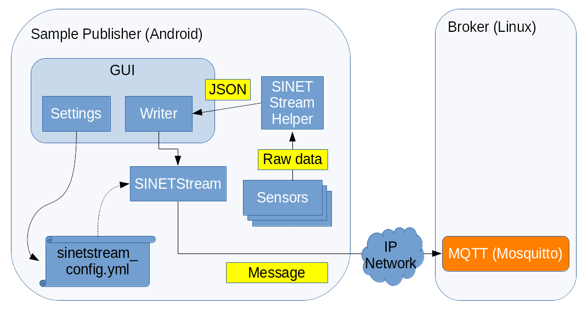
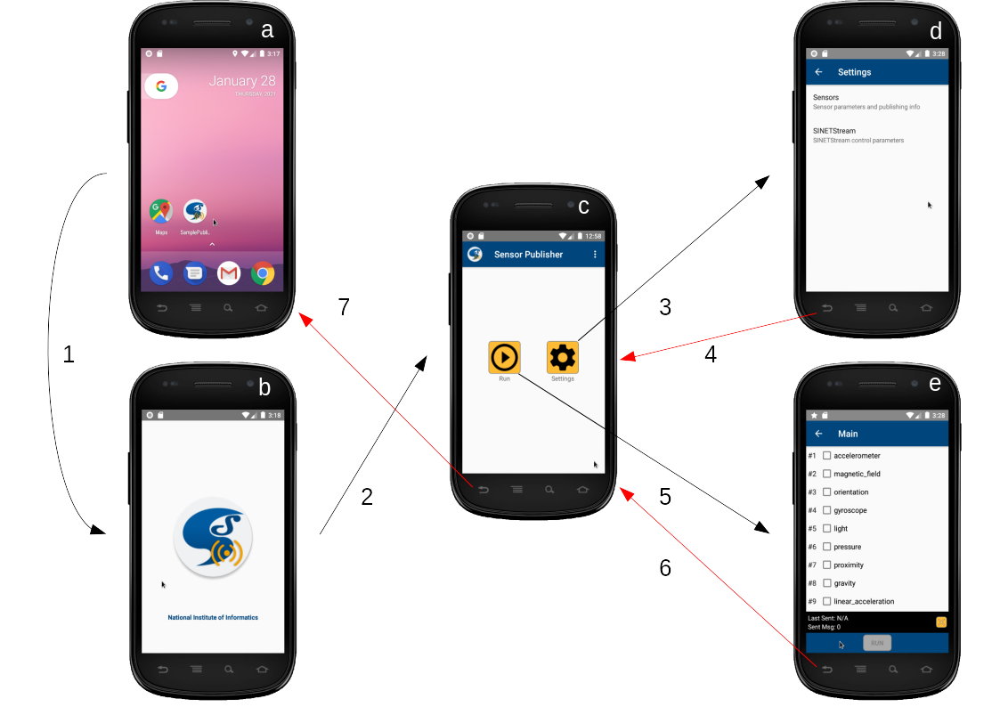
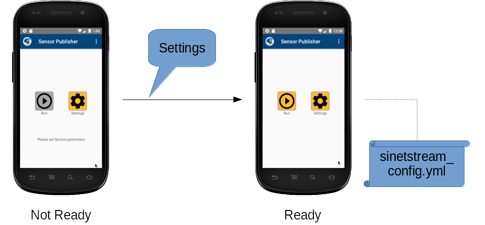
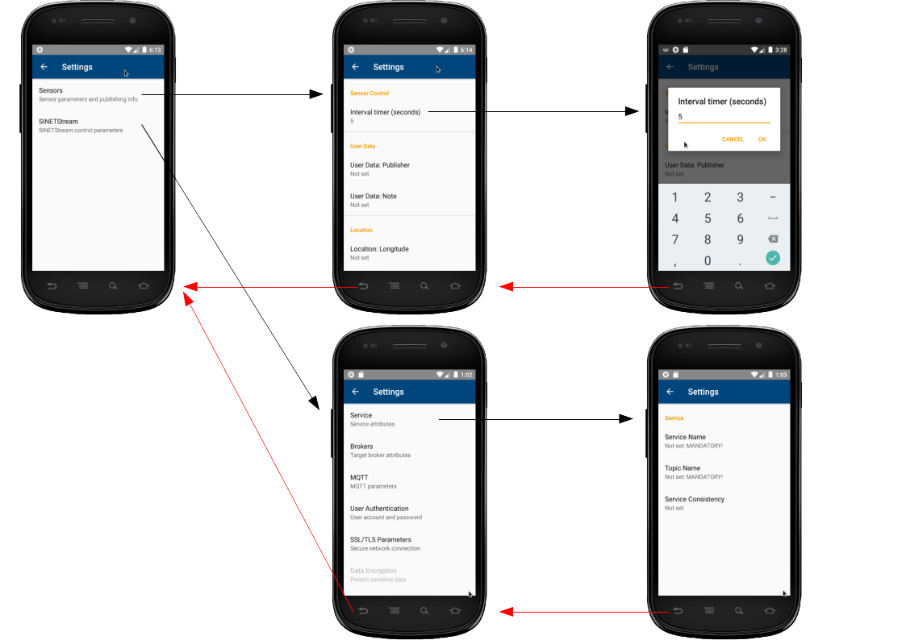
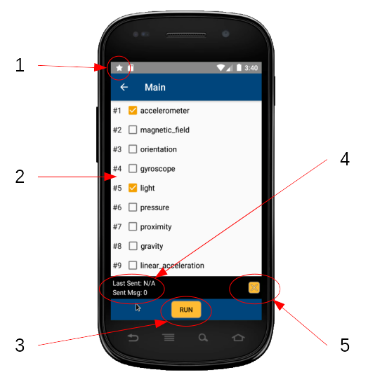
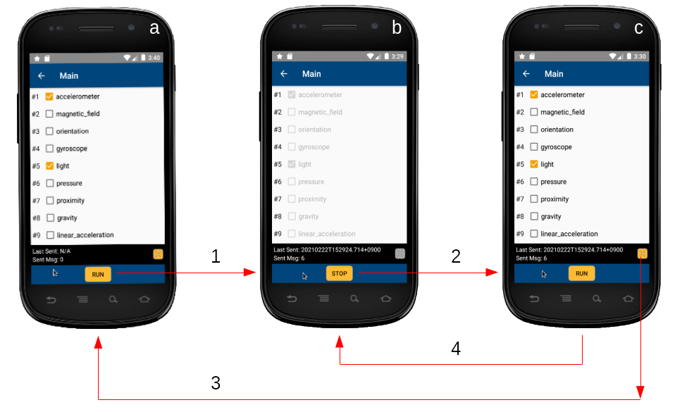

<!--
Copyright (C) 2020-2021 National Institute of Informatics

Licensed to the Apache Software Foundation (ASF) under one
or more contributor license agreements.  See the NOTICE file
distributed with this work for additional information
regarding copyright ownership.  The ASF licenses this file
to you under the Apache License, Version 2.0 (the
"License"); you may not use this file except in compliance
with the License.  You may obtain a copy of the License at

  http://www.apache.org/licenses/LICENSE-2.0

Unless required by applicable law or agreed to in writing,
software distributed under the License is distributed on an
"AS IS" BASIS, WITHOUT WARRANTIES OR CONDITIONS OF ANY
KIND, either express or implied.  See the License for the
specific language governing permissions and limitations
under the License.
-->

[English](TUTORIAL-android-step2.en.md)

# チュートリアル - ANDROID-STEP2

<em>目次</em>
<pre>
1. 概要
1.1 ネットワーク構成
1.2 前提条件
2. センサー情報収集アプリの導入
3. センサー情報収集アプリの操作
3.1 画面遷移
3.2 初期画面
3.3 設定画面
3.3.1 センサー情報配信用
3.3.2 SINETStream動作設定用
3.4 主画面
3.4.1 主画面の画面構成
3.4.2 センサー情報の配信処理

付録
A.1 ソースコード
A.2 既知の問題
</pre>


## 1. 概要

Android版の
[SINETStreamライブラリ](../userguide/android.md)
および
[SINETStreamHelperライブラリ](../userguide/libhelper.md)
の使用例として、Android端末上の
[センサーデバイス](https://developer.android.com/reference/android/hardware/Sensor)
の読取値をSINETStream経由で送信する「センサー情報収集アプリ」
（以降「本アプリ」と略記）を実装しました。
本書では、本アプリのAndroid端末への導入と設定、操作方法などについて
概説します。


### 1.1 ネットワーク構成



本アプリは、`Writer`機能のみを具備します。
当該Android端末上で収集したセンサー値は
[SINETStreamHelperライブラリ](../userguide/libhelper.md)
によりJSON形式に成形されて本アプリ制御部に非同期通知されます。
これをSINETStreamメッセージとして対向の`Broker`に送信します。

一方、`Broker`側では同メッセージ内容を解析してサーバ側のデータベースに蓄積するとともに、
Webインタフェースでグラフ化するという動作の流れになります。


また`Broker`への接続情報やSINETStreamの動作パラメータなどの諸元をGUI操作で設定し、その内容に応じてAndroid版の
[SINETStream設定ファイル](../userguide/config-android.md)
を自動生成するための設定画面も用意してあります。


### 1.2 前提条件

* Android端末の動作環境

  * Android 8.0（APIレベル26）以上であること
    * Android版の
[SINETStreamライブラリ](../userguide/android.md)
は、足回りのメッセージングシステムとして
[MQTT(Eclipse Mosquitto)](https://mosquitto.org/)
に対応しています。
    * MQTTのAndroid版の実装である
[Paho MQTT Android Client](https://www.eclipse.org/paho/index.php?page=clients/java/index.php)
ライブラリを利用しており、この動作条件（Android8.0以上）の影響です。

* バックエンドシステムの事前準備

  * 本チュートリアルでは、MQTTの`Broker`に後処理を組み合わせます。
  * バックエンド側のホストサーバにて、`docker run`コマンドにより本チュートリアル用のコンテナイメージの導入とサーバプログラム群の起動を実施します。
Android側の作業着手前にこちらを済ませてください。
  * 手順詳細は、前項に戻り
[4. バックエンド側の作業](
TUTORIAL-android-step2-overview.md#4-バックエンド側の作業)
を参照ください。

* ネットワーク環境

  * 本アプリを実行するAndroid端末と`Broker`とはIP（Internet Protocol）ネットワークで接続されます。
携帯電話網やWi-Fiを介して両者のIP疎通を確保してください。


## 2. センサー情報収集アプリの導入

現状では、本アプリはGooglePlayからではなくNII管理サーバから配布します。

別紙
[Androidサンプルアプリケーションの導入](TUTORIAL-android-install.md)
を参照して所用のものを導入してください。アプリ更新時も同様の手順です。


## 3. センサー情報収集アプリの操作
### 3.1 画面遷移



＜凡例＞
1. Androidのホーム画面（a）にて、アイコン`Sensor`を押下して本アプリを起動する。
2. 起動画面（b）にて、アイコンと著作者を一瞬表示して初期画面(c)に遷移
する。
3. 初期画面(c)にて、ボタン`Settings`押下により設定画面(d)に遷移する。
4. 設定画面(d)にて、ボタン`BACK`押下により初期画面（c）に戻る。
5. 初期画面(c)にて、ボタン`Run`押下により主画面(e)に遷移する。
6. 主画面(e)にて、ボタン`BACK`押下により初期画面（c）に戻る。
7. 初期画面(c)にて、ボタン`BACK`押下によりホーム画面（a）に戻る。

各画面の構成および操作詳細は後述します。


### 3.2 初期画面



本アプリの起動直後に表示される初期画面です。

* `Run`ボタン
  * 本アプリの主画面`Main`を起動する
  * 主画面の処理が終わると、この初期画面に戻る
* `Settings`ボタン
  * 本アプリの設定画面`Settings`を起動する
  * 設定画面の処理が終わると、この初期画面に戻る
* メニューボタン
  * 画面上部のタイトル右端の「縦3つの点」を押下すると、メニューが展開される
    * `Help`：ヘルプ表示
    * `About`：このアプリについて

本アプリ導入直後のように、
[SINETStream設定ファイル](../userguide/config-android.md)
が存在していない、あるいは現在の設定内容が必須項目を満足していない場合、
`Run`ボタンが無効化（灰色表示）され、画面下部にはユーザに対応を促すメッセージが表示されます。
このような場合、まずは`Settings`ボタンを押下してSINETStreamの動作環境設定操作を実行してください。


### 3.3 設定画面

設定画面はセンサー情報配信用、SINETStream動作設定用に分割されており、
それぞれ階層的に展開されます。




#### 3.3.1 センサー情報配信用

Android端末で収集したセンサー情報は、別紙
[SINETStreamHelper#JSONデータ形式](https://github.com/nii-gakunin-cloud/sinetstream-android-helper#json%E3%83%87%E3%83%BC%E3%82%BF%E5%BD%A2%E5%BC%8F)
で定義されたJSONデータ形式に成形されます。

上記JSONを構成するデバイス情報のうち、`User Info`と`Location`（いずれも任意）は外部から指定する必要があります。

* User Info
  * 本アプリを実行する複数のAndroid端末群が同じトピック名で`Broker`に接続する場合、送信者の識別情報があると便利。
  * 子要素の`Publisher`に送信者情報、`Notes`に補足情報をそれぞれ指定する。
* Location
  * 本アプリを実行するAndroid端末の位置情報（緯度、経度）を指定する。
  * v1.5では初期値の手動設定を想定する。自動設定と更新には未対応。

また、ネットワーク送出間隔`Interval timer`を指定可能（省略時は10秒）です。
この意図するところは以下の通りです。

動作中のセンサーデバイスの読取値はAndroidの
[SensorManager](https://developer.android.com/reference/android/hardware/SensorManager)
から非同期的に通知されますが、その契機はセンサー種別ごとにまちまち（継続的に出力されたり、値の変化時に出力されたりなど）であり、
複数のセンサー種別を同時に観測する場合は高頻度の通知となる可能性があります。
ネットワーク負荷を抑止するため、個々のセンサーデータは
[SINETStreamHelperライブラリ](../userguide/libhelper.md)
内部に最新データとして蓄積しつつ、本アプリの設定画面で指定した標本化間隔を下回らない頻度でJSONデータを生成するようにしています。

```
    [SensorA] [SensorB]
       |         :
       +-----------------++---------------+
       |         :       ||               |
       |   ......:.......||...............|..
       |   :          :  ||   :    :      | :
       V   V          V  VV   V    V      V V

   ----o---x----------o--xx---x----o------x-x---------> t
       |<-------->|   |            |
       |    T         |<-------->| |
       V              |    T       |<-------->|
      JSON#1          V            |    T
                     JSON#2        V
                                  JSON#3
```
上図は、以下の2つの事象の時間関係を示しています。
1. Androidシステム側からセンサー読取値（例としてA/Bの2種類）が`SINETStreamHelper`に通知される契機「o/x」
2. 実際にJSONデータが生成される契機「o」

そもそも、個々のセンサー読取値の生起タイミングは一定周期ではありません。

契機「o」でJSONデータが生成されたとき、その時点から指定時間「T」が経過するまでの間に通知された契機「x」時点のセンサー読取値はJSON生成対象とせず、
センサー種別ごとの最新値として蓄積されます。

次にセンサー読取通知が発生した契機「o」の時点が「T」を超えている場合、
各センサー種別ごとの最新値（「o」および最後の「x」時点の値）を集計してJSONデータを生成します。

```yaml
{
   ...
   "sensors": [
     { # Sensor A with a scalar value
         ...
         "timestamp": "20210101T012312.345+0900",  # Timing 'x'
         "values": 1
     },
     { # Sensor B with vector values
         ...
         "timestamp": "20210101T012345.678+0900",  # Timing 'o'
         "values": [
           1.0,
           -2.3,
           4.5
         ]
     }
   ...
   ]
}
```

すなわち、本アプリが`Broker`に送信する`SINETStream`メッセージの最小送信間隔は「T」（設定項目`Interval timer`）により律速されます。


#### 3.3.2 SINETStream動作設定用

Android版の
[SINETStreamライブラリ](../userguide/android.md)
を使うためには、
[SINETStream設定ファイル](../userguide/config-android.md)
を「対向`Broker`との接続条件に適合するよう」設定する必要があります。

このためGUI操作によるSINETStream設定画面（Settings）を用意しています。
本アプリ起動後の初期画面からボタン`Settings`を押下して設定画面に遷移し、
（もろもろの設定操作を経て）初期画面に戻る際に`SINETStream設定ファイル`が自動生成されます。
既存の設定内容から変更が発生した場合は同設定ファイルが更新されます。

まずは`Broker`と接続するため、以下の項目を必ず設定してください。
他の項目は放置で構いません。プログラム既定値が使われます。
* サービス名: `Service -> Service Name`
* トピック名: `Service -> Topic Name`
* `Broker`接続情報（アドレス、ポート）
    * `Brokers -> IP Address (or FQDN)`
    * `Brokers -> Port Number`

このチュートリアルで例示した`Broker`であれば以下のように設定することになります。
実際の`Broker`のアドレスはお使いの環境に合わせてください。

|Service Name|Topic Name|IP Address (or FQDN)|Port Number|
|---|---|---|---|
|service-tutorial-mqtt|sensor-data|xx.xx.xx.xx|1883|

> ここで`Topic Name`は通信チャネル識別子として使われる文字列です。
> 任意の値を指定して構わないのですが、特にSTEP2の使い方においては、
> バックエンドシステムの都合上、予約語`sensor-data`を**指定して**
> ください。
> この予約語が後段処理に渡されるフィルターとなっているため、指定の
> 値と異なるとJSONデータがデータベースに蓄積されず、グラフ表示に
> 反映できません。


### 3.4 主画面

初期画面からボタン`Run`を押下して主画面（Main）を表示し、センサー情報の配信操作を実行します。

#### 3.4.1 主画面の画面構成

画面中央がセンサー種別のリスト表示欄、画面下部の黒帯が統計情報表示パネル、
最下部の青帯が操作パネルという構成です。



＜凡例＞
1. センサー稼動状態表示
* 星のアイコンは、
[SINETStreamHelperライブラリ](../userguide/libhelper.md)
内部の`SensorService`が稼働中であることを示す。

2. センサー種別一覧
* 当該Android端末で実装されているセンサーデバイスの種別一覧が列挙される。
* チェックボックスで操作対象のものを選択すると、画面下部の配信動作ボタンが操作可能になる。

3. 配信動作（RUN/STOP）切換ボタン
* 初期状態で無効。センサー種別が選択されると有効となる。
* `RUN`ボタンを押下すると、実際にセンサー情報の取得および対向`Broker`への周期的なメッセージ送信が開始される。
* 誤操作を避けるため、配信動作中はセンサー種別の追加的な選択／解除操作が抑止される。
* `STOP`ボタン押下によりセンサー情報の配信が停止するとともに、センサー種別を再び選択／解除できるようになる。

4. 統計情報表示欄
* センサー情報の配信中は「送信時刻、送信メッセージ数」が随時更新される。

5. 統計情報のリセットボタン
* センサー情報の配信中は無効となる。


#### 3.4.2 センサー情報の配信処理

センサー情報の配信処理は以下のように制御されます。



＜凡例＞
1. 主画面を起動後にセンサー種別を指定(a)し、RUNボタン押下で実行開始。
2. 実行中(b)は統計情報が随時更新される。STOP後も値は保持。
3. 待機中(c)はリセットボタン押下により統計情報を再初期化できる。
4. 前回実行時の統計情報を維持したまま、次の実行を開始しても良い。


## 付録
### A.1 ソースコード

本アプリのソースコードは
[GitHub](https://github.com/nii-gakunin-cloud/sinetstream-android-sensor-publisher)
で公開しています。
もし何か不具合がありましたら連絡いただけると助かります。

ソース修正が必要な方は、Android開発環境
[Android Studio](https://developer.android.com/studio)
をお手元の機材に導入して、上記ソースコードを取り込んでください。


### A.2 既知の問題
* SSL/TLS証明書の配置
  * v1.5ではSSL/TLS証明書の利用は未対応です。
  * SINETStreamのセキュリティ機能は次期バージョンでリリース予定です。

* GUIの設定画面とSINETStream設定ファイルの対応
  * 実装の都合上、GUIの設定画面での対応項目は
[SINETStream設定ファイル](../userguide/config-android.md)
を網羅しておらず、サブセットとなります。

