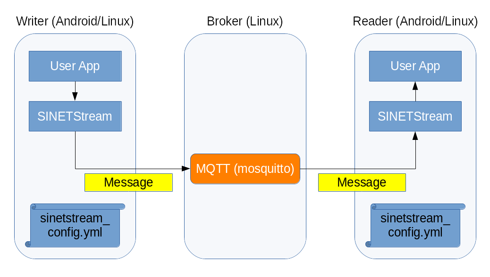
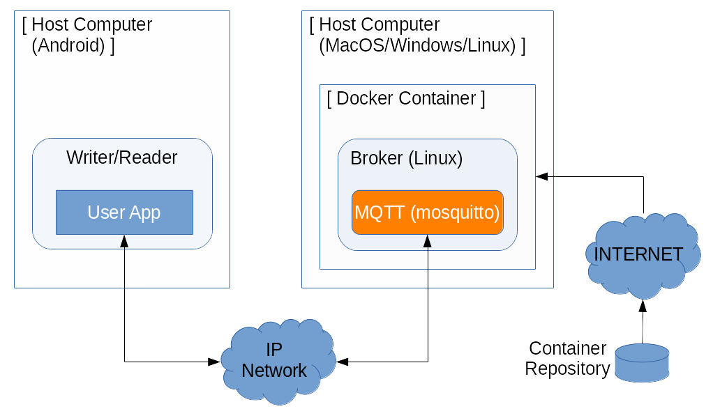

<!--
Copyright (C) 2020-2021 National Institute of Informatics

Licensed to the Apache Software Foundation (ASF) under one
or more contributor license agreements.  See the NOTICE file
distributed with this work for additional information
regarding copyright ownership.  The ASF licenses this file
to you under the Apache License, Version 2.0 (the
"License"); you may not use this file except in compliance
with the License.  You may obtain a copy of the License at

  http://www.apache.org/licenses/LICENSE-2.0

Unless required by applicable law or agreed to in writing,
software distributed under the License is distributed on an
"AS IS" BASIS, WITHOUT WARRANTIES OR CONDITIONS OF ANY
KIND, either express or implied.  See the License for the
specific language governing permissions and limitations
under the License.
-->

[日本語](index.md)

# Quick Start Guide (Android)

<em>Table of contents</em>
<pre>
1. Introduction
2. Operation environment
3. Prerequisites
3.1 Android client
3.2 Back-end system
3.3 Observatory PC (applicable only for the `STEP2` shown below)
4. Run tutorial scenarios
</pre>

## 1. Introduction

The generalized form of system components, which is depicted in
the `Quick Start Guide (Python/Java)` looks like as follows.

Note that `Writer` and `Reader` functionalities on client side
can be Android version, Linux version or the mix of them.
In this tutorial, we focus on cases in which Android application
works as both `Writer` and `Reader`, or either of them.

## 2. Operation environment

Just like the tutorials for Python/Java version, we setup `Broker`
functionality on a `Docker` container, which is a virtual running
environment for applications.
For this purpose, you will take following steps; 1) install the
`Docker Engine` on a host machine, 2) download and run the `Docker`
container prepared for this tutorial.

On the other hand, install our sample Android application on your
Android device so that it work as `Writer` or `Reader`.
Once you have set proper running parameters, the Android application
can co-operate with the `Broker`.

In short, there are several steps to build the operation environment
for this tutorial. You need to prepare the back-end system, install
the client application on your Android device, and set connection
parameters for the two of them.
Detailed work procedures will be shown on latter parts.

## 3. Prerequisites

Following conditions must be fulfilled to run this tutorial.

### 3.1 Android client

* The Android device must be IP reachable with the back-end system.
    * Example#1) An Android device with SINET SIM connects to the
back-end system.
    > This is a connection model that the Android device connects
to the `Broker` via cellular network.

    * Example#2) An Android device connects to the host running
the `Broker` via LAN.
    > This is a connection model that the back-end system is built
on your desktop PC.

### 3.2 Back-end system

* The host running `Broker` must be Internet reachable.
    * The host downloads the target container image from our container
repository.

* A `Docker Engine` must have installed on the host which runs `Broker`.
    * The `Docker Engine` is the platform for a container image.
    * As an example, we use a commercial cloud service `Amazon AWS`
as our platform.
    * We also show how to install `Docker Engine` on a desktop PC,
as an casual test environment.

### 3.3 Observatory PC (applicable only for the `STEP2` shown below)

* The observatory PC must be able to connect to the back-end system by HTTP.
    * Beware routing and firewall settings for the connectivity.
* The observatory PC must be INTERNET reachable.
    * Some of element parts displayed on the web screen will be fetched from open server.

## 4. Run tutorial scenarios

To show sample usages of
[SINETStream for Android](../userguide/android.en.html),
we provide two scenarios below.

* [STEP1: Send and receive text messages (sinetstream-android-echo)](TUTORIAL-android-step1-overview.en.md)
    - Send a GUI input text to the peer `Broker`, then receive it.
* [STEP2: Publish sensor readout values (sinetstream-android-sensor-publisher)](TUTORIAL-android-step2-overview.en.md)
    - Send sensor readout values collected on the Android to the peer `Broker`.
    - The back-end system behind the `Broker` stores the sensor readout values to the database.
    - A web browser on an observatory PC shows the graph image of sensor readout values.

Detailed procedures are shown in the links above.
Both two of steps are independent, and thus you can try one of them only,
or run each of them sequentially.

> **NOTE**:
>
> If you are going to run above two samples sequentially, try STEP2 first
> for smooth operations.
>
> In STEP1, the `Broker` can be anything. But in STEP2, the dedicated
> container image must be used so that the back-end system to couple with
> the `Broker` for sequential processing.
> That is, if you run STEP2 first and leave the container image running,
> you can reuse the `Broker` as is in STEP1.
>
> Of course, you can use the `Broker`, which is in the tutorial container
> for the Python/Java version, as the back-end system of STEP1.
> In this case, beware not to forget to replace container image before
> running STEP2.
