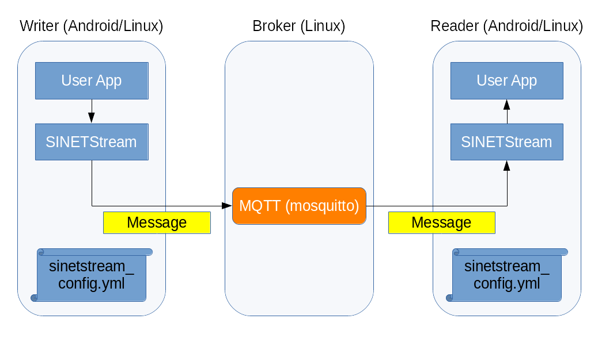

<!--
Copyright (C) 2020-2021 National Institute of Informatics

Licensed to the Apache Software Foundation (ASF) under one
or more contributor license agreements.  See the NOTICE file
distributed with this work for additional information
regarding copyright ownership.  The ASF licenses this file
to you under the Apache License, Version 2.0 (the
"License"); you may not use this file except in compliance
with the License.  You may obtain a copy of the License at

  http://www.apache.org/licenses/LICENSE-2.0

Unless required by applicable law or agreed to in writing,
software distributed under the License is distributed on an
"AS IS" BASIS, WITHOUT WARRANTIES OR CONDITIONS OF ANY
KIND, either express or implied.  See the License for the
specific language governing permissions and limitations
under the License.
-->

[English](index.en.md)

# Android版クイックスタートガイド

<em>目次</em>
<pre>
1. はじめに
2. 動作環境について
3. 前提条件
3.1 Androidクライアント
3.2 バックエンドシステム
3.3 観測用PC（後述のチュートリアル「STEP2」限定）
4. チュートリアルの実行
</pre>

## 1. はじめに

`クイックスタートガイド (Python/Java版)`で想定するコンポーネント構成図を一般化すると、以下のようになります。

すなわち、クライアント側の`Writer`および`Reader`の機能は、AndroidまたはLinuxのいずれかのものを組み合わせて使えることに注目ください。
本チュートリアルでは、`Writer`と`Reader`の両方、またはそのいずれかをAndroidアプリケーションが担当する場合に関して紹介します。

## 2. 動作環境について

Python/Java版のチュートリアルと同様に、`Broker`機能はアプリケーション仮想実行環境である`Docker`コンテナ上に構築します。
適当なホスト機材上に`Docker Engine`を導入し、チュートリアル用に用意
された`Docker`コンテナイメージを取得して実行するという作業の流れです。
一方、`Writer`や`Reader`機能は、お手元のAndroid機材にサンプルアプリ
ケーションを導入します。動作パラメータを適切に設定することにより前述
の`Broker`機能と協調動作することになります。

すなわち、このチュートリアルの実行環境を整えるためには、バックエンド
システム用の環境構築、Android端末へのクライアントアプリケーション導入、
および両者の接続パラメータ設定といういくつかの作業工程が必要です。
詳細な作業手順に関しては後述します。

## 3. 前提条件

このチュートリアルを実行するためには、以下の条件を満たす必要があります。

### 3.1 Androidクライアント

* Android端末がバックエンドシステムとIPネットワークで接続できること
    * 例1）Android端末にSINET SIMを挿入してMobile SINET経由で`Broker`
に接続する
    > 携帯電話網を経由して`Broker`と接続する場合の接続形態です。

    * 例2）Android端末と`Broker`稼働ホストとの間をLANで接続する
    > 机上のPC機材にバックエンドシステムを構築した場合の接続形態です。

### 3.2 バックエンドシステム

* `Broker`稼働ホストがインターネットに接続できること
    * コンテナリポジトリから所用のコンテナイメージ等を導入します。

* `Broker`稼働ホストに`Docker Engine`が導入されていること
    * コンテナイメージの動作基盤となります。
    * 実行例として商用クラウドサービスの`Amazon AWS`を使う場合を示します。
    * お手軽な実行環境として、机上のPC機材に`Docker Engine`を導入する
      方式も併記します。

### 3.3 観測用PC（後述のチュートリアル「STEP2」限定）

* 観測用PCからバックエンドシステムにHTTP接続できること
    * 経路設定やファイアウォール設定に留意して接続性を確保してください。
* 観測用PCからインターネットに接続できること
    * ウェブ画面に表示する部品要素のいくつかは公開サーバから取得します。

## 4. チュートリアルの実行

Android版の
[SINETStreamライブラリ](../userguide/android.md)
の使用例として、2種類のサンプルアプリ
ケーションを用意しました。

* [STEP1: テキスト送受信アプリの実行(sinetstream-android-echo)](TUTORIAL-android-step1-overview.md)
    - GUI操作で入力した任意文字列を`Broker`折り返しで送受信する
* [STEP2: センサ情報収集アプリの実行(sinetstream-android-sensor-publisher)](TUTORIAL-android-step2-overview.md)
    - Android端末上のセンサー読取値を`Broker`に送信する
    - `Broker`背後のバックエンドシステムがセンサー読取値をデータベースに
蓄積する
    - 観測用PCのウェブブラウザからバックエンドに接続するとセンサー読取値
がグラフ表示される

それぞれの手順は上記のリンク先のページに記されています。
2つの手順は独立していますので、どちらか一方のみを試すこともできますし、
順々に両方を試すこともできます。

> **注記**：
>
> 上記2種類のサンプルを続けて試す場合は、STEP2を先に実行した方が
> 作業が円滑に進むと思います。
>
> STEP1では`Broker`は何を使っても良いのですが、STEP2では`Broker`
> 背後のバックエンド側と接続して逐次処理する必要があります。このため
> STEP2のコンテナイメージは専用のものを使います。
> すなわち、STEP2を先に実行して、そのコンテナイメージを動作させた
> ままにしておけば、STEP1でその`Broker`を流用できます。
>
> STEP1のバックエンドシステム用にPython/Java版チュートリアルのコンテナ
> イメージを起動してその`Broker`を相手にすることも、もちろん可能です。
> その場合はSTEP2を実行する前にコンテナイメージの入れ替えを忘れず
> 実施してください。
