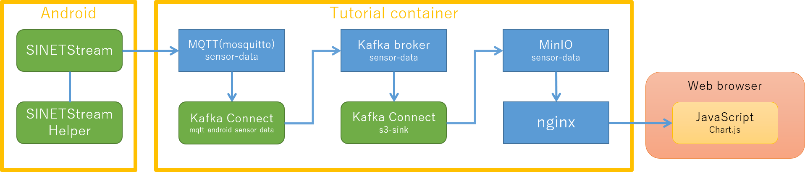
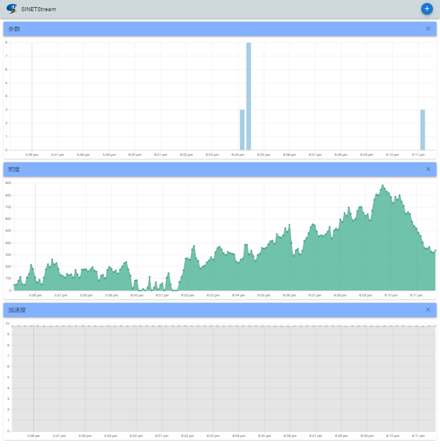

<!--
Copyright (C) 2021 National Institute of Informatics

Licensed to the Apache Software Foundation (ASF) under one
or more contributor license agreements.  See the NOTICE file
distributed with this work for additional information
regarding copyright ownership.  The ASF licenses this file
to you under the Apache License, Version 2.0 (the
"License"); you may not use this file except in compliance
with the License.  You may obtain a copy of the License at

  http://www.apache.org/licenses/LICENSE-2.0

Unless required by applicable law or agreed to in writing,
software distributed under the License is distributed on an
"AS IS" BASIS, WITHOUT WARRANTIES OR CONDITIONS OF ANY
KIND, either express or implied.  See the License for the
specific language governing permissions and limitations
under the License.
-->

[日本語](README.md)

# SINETStream Android Tutorial Container

The container image for the SINETStream Android tutorial

## Overview



Followings are brief descriptions for each functional components
depicted in the figure.

* The `SINETStream` sends the sensor data, which has collected at
the `SINETStreamHelper` in the Android device, to the MQTT broker.
* The MQTT broker (mosquitto) on the tutorial container receives
a message (= sensor data) sent from an Android device.
* The message received by the MQTT broker is relayed to the Kafka
broker by Kafka Connect (`mqtt-android-sensor-data`).
* The message received by the Kafka broker is relayed to the object
storage (MinIO) by Kafka Connect(`s3-sink`).
* The object storage (MinIO) contents are published by the reverse
proxy (nginx) for HTTP access.
* The sensor data published by the nginx can be visualized as graph
images on a web browser.


### Software components on the tutorial container

#### Message broker

| Broker Type | Topic Name | Listen Port |
|---|---|---|
| MQTT(mosquitto) | sensor-data | TCP/1883 |
| Apache Kafka | sensor-data | TCP/9092 |

On the tutorial container, both MQTT and Kafka brokers are running.
But only the MQTT broker receives messages from Android devices.


#### Kafka Connect

| Name | Direction | Target |
|---|---|---|
| mqtt-android-sensor-data | source | MQTT |
| s3-sink | sink | Amazon S3 compatible object storage |

The received sensor data is handled by Kafka Connect so that the
data is either sent to the Kafka broker (source), or sent from the
Kafka broker (sink).
On the tutorial container, the Kafka Connect sends data from the
MQTT broker to the Kafka broker, and from the Kafka broker to the
S3 compatible object storage (MinIO).


#### Object Storage

| Software | Bucket Name |
|---|---|
| MinIO | sensor-data |

The sensor data sent from an Android device to the tutorial container
is eventually stored in the Amazon S3 compatible object storage (MinIO).


### Prerequisites for the tutorial container

* The `Docker Engine` must have installed on the host node to run this
tutorial container.
* Port numbers TCP/1883 and TCP/80 must be available on the host node
to run this tutorial container.
    - The MQTT broker listens on TCP/1883.
    - The nginx listens on TCP/80.
    - You can change these port numbers by container execution parameter.
* The port TCP/1883 on the host node must be reachable from Android devices.
    - The communication between the two should not be blocked by firewall.
* The port TCP/80 on the host node must be reachable from a client Web browser.
    - The communication between the two should not be blocked by firewall.


### About the run example

In the following descriptions, we note the IP address of the host node
to run this tutorial container as `192.168.1.XXX`.
Read it accordingly to fit to your running environment.


## Prepare the running environment

### Installation and operation of the tutorial container

Run group of services like MQTT broker as a Docker container.
For detailed operations, see the companion document
[TUTORIAL DOCKER-CONTAINER](TUTORIAL-docker-container.en.md).


### Setup the SINETStream configuration on an Android device

To send messages from the SINETStream to the MQTT broker running on the
tutorial container, set the SINETStream configuration as follows.

```yaml
header:
    version: 3
config:
    service-tutorial-mqtt:
        type: mqtt
        brokers: "192.168.1.XXX:1883"
        topic: sensor-data
        value_type: text
```

Adjust the `brokers` value so that it fits to your running environment.


### Display collected sensor data as graph images

Access to the following URL to display collected sensor data as graph
images on your Web browser.

http://192.168.1.XXX/

Set the address `192.168.1.XXX` to fit to your running envirionment.

This tutorial container provides three types of graph images
(`step_count`, `light` and `accelerometer`) as default.



