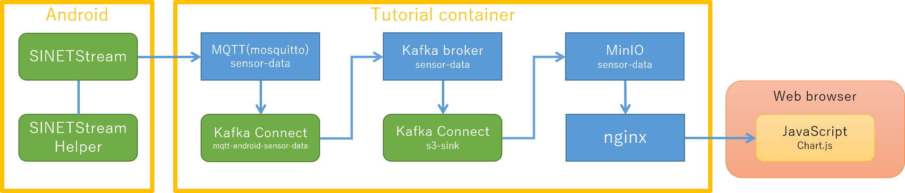
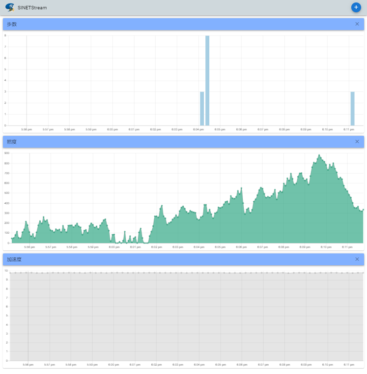

<!--
Copyright (C) 2021 National Institute of Informatics

Licensed to the Apache Software Foundation (ASF) under one
or more contributor license agreements.  See the NOTICE file
distributed with this work for additional information
regarding copyright ownership.  The ASF licenses this file
to you under the Apache License, Version 2.0 (the
"License"); you may not use this file except in compliance
with the License.  You may obtain a copy of the License at

  http://www.apache.org/licenses/LICENSE-2.0

Unless required by applicable law or agreed to in writing,
software distributed under the License is distributed on an
"AS IS" BASIS, WITHOUT WARRANTIES OR CONDITIONS OF ANY
KIND, either express or implied.  See the License for the
specific language governing permissions and limitations
under the License.
-->

[English](https://translate.google.com/translate?hl=en&sl=ja&tl=en&u=https://nii-gakunin-cloud.github.io/sinetstream/docs/tutorial-android/sinetstreamhelper-tutorial-container/README.html "google translate")

# SINETStream Android Tutorial Container

SINETStream Androidのチュートリアル用コンテナイメージ

## 概要



上図で示した各コンポーネントの役割を、以下に記します。

* `SINETStream`は`SINETStreamHelper`が収集したAndroid端末のセンサー情報をMQTTブローカーに送信します
* チュートリアルコンテナのMQTTブローカー(mosquitto)はAndroid端末から送られたセンサー情報を受け取ります
* MQTTブローカーが受け取ったメッセージはKafka Connect(`mqtt-android-sensor-data`)によってKafkaブローカーに送られます
* Kafkaブローカーが受け取ったメッセージはKafka Connect(`s3-sink`)によってオブジェクトストレージ(MinIO)に送られます
* オブジェクトストレージ(MinIO)に保存されたデータはリバースプロキシ(nginx)によってHTTPで外部に公開されます
* nginx経由で公開されたセンサーデータをJavaScriptによってWebブラウザ上でグラフ表示します

### チュートリアルコンテナのソフトウェアコンポーネント

#### メッセージブローカー

| ブローカー種別 | トピック名 | 待ち受けポート番号 |
|---|---|---|
| MQTT(mosquitto) | sensor-data | TCP/1883 |
| Apache Kafka | sensor-data | TCP/9092 |

チュートリアルコンテナではMQTT,Kafkaブローカーが実行されています。Android端末からはMQTTブローカーのみにアクセスします。

#### Kafka Connect

| 名前 | 方向 | 対象 |
|---|---|---|
| mqtt-android-sensor-data | source | MQTT |
| s3-sink | sink | Amazon S3互換オブジェクトストレージ |

送信されたセンサー情報はKafkaコネクタによって
Kafkaブローカへの送信(source)、あるいはKafkaブローカーからの送信(sink)
が行われます。チュートリアルコンテナではMQTTブローカーからKafka
ブローカーへの送信、KafkaブローカーからS3互換オブジェクトストレージ(MinIO)
への送信を行っています。

#### オブジェクトストレージ

| ソフトウェア | バケット名 |
|---|---|
| MinIO | sensor-data |

Android端末からチュートリアルコンテナに送信されたセンサー情報は最終的にAmazon S3互換のオブジェクトストレージ(MinIO)に記録されます。


### チュートリアルを実行する前提条件

* チュートリアルコンテナを実行するノードに`Docker Engine`がインストールされていること
* チュートリアルコンテナを実行するノードでTCP/1883, TCP/80のポートが利用可能なこと
    - MQTTブローカーがTCPの待ち受けポートとしてTCP/1883を利用します
    - nginxがTCPの待ち受けポートとしてTCP/80を利用します
    - コンテナ起動時の指定で待ち受けポート番号を変更することができます
* Android端末からチュートリアルコンテナを実行するノードのTCP/1883にアクセス可能なこと
    - ファイアウォールなどで通信がブロックされないように設定してください
* Webブラウザからチュートリアルコンテナを実行するノードのTCP/80にアクセス可能なこと
    - ファイアウォールなどで通信がブロックされないように設定してください

### 実行例について

この文書で実行例を示す際に、チュートリアルコンテナを実行するノードのIPアドレスを`192.168.1.XXX`と表記します。
実際の操作を行う際は、環境に合わせて適宜読み替えて実行してください。

## 実行環境を準備する

### チュートリアルコンテナの導入および操作

MQTTブローカーなどのサービスをDockerコンテナとして実行します。

具体的な手順詳細は、別紙「
[チュートリアル DOCKER-CONTAINER](TUTORIAL-docker-container.md)
」を参照してください。

### Android端末の SINETStream 設定について

チュートリアルコンテナで実行しているMQTTブローカーをSINETStreamから利用する場合、以下のように設定ファイルを記述してください。

```yaml
service-tutorial-mqtt:
    type: mqtt
    brokers: "192.168.1.XXX:1883"
    topic: sensor-data
    value_type: text
```

`brokers`の値は環境に合わせて適宜変更してください。

### 収集したセンサー情報のグラフ表示

チュートリアルコンテナで収集したセンサー情報をWebブラウザでグラフ表示するには、以下のアドレスにアクセスしてください。

http://192.168.1.XXX/

ただし、ホスト名`192.168.1.XXX`は環境に合わせて適宜変更してください。

チュートリアルコンテナでは、Andorid端末から送信されたセンサー情報のうち歩数(`step_count`)、照度(`light`)、加速度(`accelerometer`)をグラフ表示
しています。



