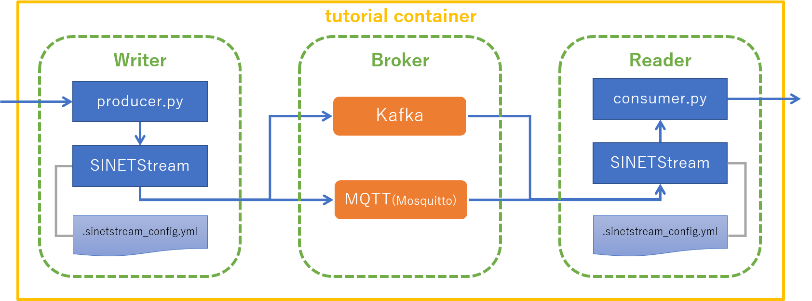

**準備中** (2019-12-12 12:59:06 JST)

<!--
Copyright (C) 2019 National Institute of Informatics

Licensed to the Apache Software Foundation (ASF) under one
or more contributor license agreements.  See the NOTICE file
distributed with this work for additional information
regarding copyright ownership.  The ASF licenses this file
to you under the Apache License, Version 2.0 (the
"License"); you may not use this file except in compliance
with the License.  You may obtain a copy of the License at

  http://www.apache.org/licenses/LICENSE-2.0

Unless required by applicable law or agreed to in writing,
software distributed under the License is distributed on an
"AS IS" BASIS, WITHOUT WARRANTIES OR CONDITIONS OF ANY
KIND, either express or implied.  See the License for the
specific language governing permissions and limitations
under the License.
--->

# チュートリアル - STEP1

## 1. 概要

このチュートリアルで実行するコンポーネントを以下の図に示します。




[index.md](index.md)に示した各コンポーネントの役割を、以下に再掲します。

* `Writer` は `SINETStream` を用いてメッセージを `Broker` に送信します
* `Reader` は `SINETStream` を用いて `Broker` からメッセージを受信します
* `Broker` は `Writer`と`Reader`の間でメッセージの集約、配送などを行い、エンドポイント間の分離を行います

STEP1のチュートリアルでは、`Writer`、`Reader`、`Broker` の全てを一つのマシンで実行します。具体的には、チュートリアルの実行環境で一つのコンテナを起動し、その中でチュートリアルの全てのコンポーネントを実行します。

### 前提条件

チュートリアルを実行するマシンに Docker Engine がインストールされている必要があります。Docker Engine のインストールについてはindex.mdの前提条件の節に[参考情報](index.md#前提条件)があります。


### 実行例について

以降の説明では、コマンドの実行例を表記する箇所があります。このチュートリアルでは Docker コンテナを利用するので、ホスト環境と、コンテナ環境の実行例を区別する必要があります。そのために表記に以下の規則を設けます。

* ホスト環境でコマンドを実行する場合
    - コマンドプロンプトを `$` とします
```
$ ls
```
* コンテナ環境でコマンドを実行する場合
    - コマンドプロンプトを `[user01@broker]$` とします
```
[user01@broker]$ ls
```
> コンテナ環境のプロンプトのプレフィックスに `[user01@broker]`と記すのは、コンテナのホスト名が `broker` であり、ユーザ名が `user01` であることを示しています。

## 2. 実行環境を準備する

### 2.1. バックエンドシステムを準備する

SINETStreamが利用するバックエンドのメッセージングシステム(Kafka, MQTT)をdockerコンテナで実行します。

ホスト環境で以下のコマンドを実行してください。

```console
$ docker run -d --name tutorial --hostname broker sinetstream/tutorial:1.0.0
```

コンテナが正常に起動したことを確認するために、状態を表示させます。


```console
$ docker ps -l
CONTAINER ID        IMAGE                        COMMAND                  CREATED              STATUS              PORTS                NAMES
xxxxxxxxxxxx        sinetstream/tutorial:1.0.0   "/usr/local/bin/supe…"   About a minute ago   Up About a minute   1883/tcp, 9092/tcp   tutorial
```

`STATUS` が `Up` と表示されていれば、コンテナが正常に起動しています。

起動したコンテナでは、SINETStreamが利用するメッセージングシステム Kafka, MQTT(Mosquitto) のブローカーが実行されています。

### 2.2. SINETStreamをインストールする

`Reader`, `Writer` が利用する SINETStream のPython3 ライブラリをコンテナ環境にインストールします。

まず、ホスト環境からコンテナ環境に入ります。以下のコマンドを実行してください。

```console
$ docker exec -it -u user01 tutorial bash
```

次にコンテナ環境で SINETStream のライブラリをインストールします。以下のコマンドを実行してください。

```console
[user01@broker]$ pip3 install --user sinetstream-kafka sinetstream-mqtt
Collecting sinetstream-kafka
(中略)
Successfully installed kafka-python-1.4.7 paho-mqtt-1.5.0 pycryptodome-3.9.4 sinetstream-1.0.0 sinetstream-kafka-1.0.0 sinetstream-mqtt-1.0.0
```

最後に `Successfully installed ...`と表示されていれば、ライブラリのインストールに成功しています。確認のためインストールされている Python3　ライブラリの一覧を表示してみます。

```console
[user01@broker]$ pip3 list
Package           Version
----------------- --------
kafka-python      1.4.7
paho-mqtt         1.5.0
pip               19.3.1
pycryptodome      3.9.4
PyYAML            3.12
setuptools        42.0.2
sinetstream       1.0.0
sinetstream-kafka 1.0.0
sinetstream-mqtt  1.0.0
supervisor        4.1.0
```

> SINETStream以外のライブラリの `Version` 表示については上記と異なる場合があります。

### 2.3. Readerを準備する

コンテナ環境に `Reader` を準備します。手順を以下に示します。

1. `Reader`用のディレクトリを作成する
2. SINETStream の設定ファイルを準備する
3. `Reader`のプログラムを準備する

> この節ではコンテナ環境にてコマンドの実行を行います。`2.2` でコンテナ環境の操作を行っていた状態が継続されていることを想定しています。

ディレクトリを作成し、そのディレクトリに移動します。

```console
[user01@broker]$ mkdir -p ~/sinetstream/reader
[user01@broker]$ cd ~/sinetstream/reader
```

SINETStreamの設定ファイルを準備します。このチュートリアルのための設定ファイルを GitHub に用意していますので、それを取得します。

```console
[user01@broker]$ ss_url=https://raw.githubusercontent.com/nii-gakunin-cloud/sinetstream/master
[user01@broker]$ curl -O ${ss_url}/docs/tutorial/.sinetstream_config.yml
```

SINETStreamのPython3 APIを用いて作成された`Reader`のサンプルプログラムをGitHubから取得します。取得したプログラムには実行権限を付与します。

```console
[user01@broker]$ curl -O ${ss_url}/python/sample/text/consumer.py
[user01@broker]$ chmod a+x consumer.py
```

ここまでの手順が正しく行われたことを確認します。ディレクトリとファイルが以下の実行例と同じになっていることを確認してください。

```console
[user01@broker]$ pwd
/home/user01/sinetstream/reader
[user01@broker]$ ls -a
.  ..  .sinetstream_config.yml  consumer.py
```

### 2.4. Writerを準備する

コンテナ環境に `Writer` を準備します。手順を以下に示します。

1. `Writer`用のディレクトリを作成する
2. SINETStream の設定ファイルを準備する
3. `Writer`のプログラムを準備する

ディレクトリを作成し、そのディレクトリに移動します。

```console
[user01@broker]$ mkdir -p ~/sinetstream/writer
[user01@broker]$ cd ~/sinetstream/writer
```

GitHubからSINETStreamの設定ファイルを取得します。

```console
[user01@broker]$ curl -O ${ss_url}/docs/tutorial/.sinetstream_config.yml
```

SINETStreamのPython3 APIを用いて作成された`Writer`のサンプルプログラムをGitHubから取得します。取得したプログラムには実行権限を付与します。

```console
[user01@broker]$ curl -O ${ss_url}/python/sample/text/producer.py
[user01@broker]$ chmod a+x producer.py
```

ここまでの手順が正しく行われたことを確認します。ディレクトリとファイルが以下の実行例と同じになっていることを確認してください。

```console
[user01@broker]$ pwd
/home/user01/sinetstream/writer
[user01@broker]$ ls -a
.  ..  .sinetstream_config.yml  producer.py
```

## 3. Reader, Writerを実行する

`Reader`と`Writer`を実行して SINETStream を利用したメッセージの送受信が行えることを確認します。

SINETStream v1.0では、利用可能なメッセージングシステムとして[Kafka](https://kafka.apache.org/) と [MQTT(Mosquitto)](https://mosquitto.org/)をサポートしています。ここでは、まず Kafkaブローカーとメッセージの送受信が行えることを確認します。その後、設定変更のみでプログラムを変更することなくMQTTブローカーともメッセージの送受信が行えることを確認します。

### 3.1. Kafkaブローカーとの間でメッセージの送受信を行う

ここからは、`Reader`と`Writer`のプログラムを同時に実行します。それぞれを実行するためのターミナルをホスト環境で開いてください。

#### Readerの実行

`Reader`用のターミナルにて、ホスト環境からコンテナ環境に入ります。以下のコマンドを実行してください。

```console
$ docker exec -it -u user01 tutorial bash
```

`Reader`用のディレクトリに移動してください。

```console
[user01@broker]$ cd ~/sinetstream/reader
```

`Reader`のプログラムを実行します。引数に指定している`service-tutorial-kafka`はKafkaブローカーを指定するサービス名です。

```console
[user01@broker]$ ./consumer.py -s service-tutorial-kafka
Press ctrl-c to exit the program.
: service=service-tutorial-kafka
```

コマンドラインで指定したサービス名が `:` の後に表示されます。

#### Writerの実行

`Writer`用のターミナルにて、ホスト環境からコンテナ環境に入ります。以下のコマンドを実行してください。

```console
$ docker exec -it -u user01 tutorial bash
```

`Writer`用のディレクトリに移動してください。

```console
[user01@broker]$ cd ~/sinetstream/writer
```

`Writer`のプログラムを実行します。引数に指定している`service-tutorial-kafka`はKafkaブローカーを指定するサービス名です。

```console
[user01@broker]$ ./producer.py -s service-tutorial-kafka
Press ctrl-c to exit the program.
: service=service-tutorial-kafka
```

コマンドラインで指定したサービス名が `:` の後に表示されます。

#### メッセージの送受信

`Writer`用のターミナルにて、メッセージとなるテキストを入力し最後に改行を打ち込んでください。改行までに入力された文字列がメッセージとして Kafka ブローカーに送信されます。

`Reader`のプログラムは Kafkaブローカーに送られたメッセージを受信してターミナルに表示しています。先ほど `Writer` で送信したメッセージが表示されていることを確認してください。

#### Reader, Writer の停止

メッセージの送受信が行えたことを確認したら `Reader` と `Writer`のサンプルプログラムを停止させます。それぞれのターミナルで ctrl-c を打ち込んでください。

### 3.2. MQTTブローカー(Mosquitto)との間でメッセージの送受信を行う

Kafkaブローカーと同じ操作を行い、MQTTブローカーを利用した場合もメッセージの送受信が行えることを確認します。
先ほどはプログラムの引数に Kafka ブローカーを指定するサービス名として `service-tutorial-kafka`を指定しました。ここでは代わりに MQTTブローカーを指定するためのサービス名 `service-tutorial-mqtt`を指定します。

#### Readerの実行

`Reader`のターミナルにて、以下のコマンドを実行してください。

```console
[user01@broker]$ ./consumer.py -s service-tutorial-mqtt
Press ctrl-c to exit the program.
: service=service-tutorial-mqtt
```

> `Reader`のターミナルは、コンテナ環境の`Reader`用ディレクトリにいることを想定しています。

#### Writerの実行

`Writer`のターミナルにて、以下のコマンドを実行してください。

```console
[user01@broker]$ ./producer.py -s service-tutorial-mqtt
Press ctrl-c to exit the program.
: service=service-tutorial-mqtt
```

> `Writer`ターミナルは、コンテナ環境の`Writer`用ディレクトリにいることを想定しています。


#### メッセージの送受信

Kafkaブローカーの場合と同様の操作を行い、MQTTブローカーを用いた場合もメッセージの送受信が行えることを確認します。
`Writer`のターミナルから文字列を入力して改行を打ち込むと`Reader`のターミナルに入力した文字列に対応するメッセージが表示されることを確認してください。

#### Reader, Writer の停止

メッセージの送受信が行えたことを確認したら `Reader` と `Writer` のサンプルプログラムを停止します。それぞれのターミナルで ctrl-c を打ち込んでください。

### 3.3. コンテナの停止、削除

最後にこのチュートリアルで使用したコンテナの停止、削除を行います。

コンテナの操作はホスト環境で実行します。コンテナ環境から、ホスト環境に戻る場合は `exit` を実行してください。

```console
[user01@broker]$ exit
exit
$
```

ホスト環境に戻ったあとで、以下のコマンドを実行してください。

```console
$ docker stop tutorial
$ docker rm tutorial
```

## 4. SINETStreamについて

チュートリアルで使用した SINETStream の設定ファイルとAPIについて簡単な説明を行います。

### 4.1. 設定ファイル

`Reader`, `Writer` で使用した SINETStream の設定ファイル `.sinetstream_config.yml` の内容を以下に示します。

```yaml
service-tutorial-kafka:
    type: kafka
    brokers: "broker:9092"
    topic: topic-tutorial-kafka
    value_type: text

service-tutorial-mqtt:
    type: mqtt
    brokers: "broker:1883"
    topic: topic-tutorial-mqtt
    value_type: text
```

設定ファイルは階層化したキー、バリューをYAMLの形式で記述しています。

トップレベルのキーには SINETStreamでサービス名と呼んでいる名前を記しています。
上記の例では `service-tutorial-kafka`、 `service-tutorial-mqtt` がこれにあたります。
サービス名はブローカーとの接続に関する種々のパラメータをまとめて扱うためのラベル名になります。
`Reader`, `Writer`のサンプルプログラムを実行する際に指定したサービス名は、設定ファイルに記述した、この値に対応しています。

サービス名の子要素にブローカーとの接続に関する具体的なパラメータを記述します。サービス名`service-tutorial-kafka` に対応するパラメータは以下の部分になります。

```yaml
    type: kafka
    brokers: "broker:9092"
    topic: topic-tutorial-kafka
    value_type: text
```

各パラメータに関する簡単な説明を以下に記します。

* type
    - メッセージングシステムの種別を指定します
    - SINETStream v1.0 で指定できる値は `kafka`, `mqtt` のどちらかになります
* brokers
    - ブローカーのアドレスを指定します
    - アドレスの書式はホスト名とポート番号を `:` で繋げたものとします
* topic
    - メッセージを送受信する対象となるトピックを指定します
* value_type
    - メッセージの種別を指定します
    - 指定できる値は以下のいずれかになります
        - text
        - byte_array
    - チュートリアルで用いた `text` はメッセージが文字列型であることの指定になります

設定ファイルに関する詳細については[ユーザガイド](../userguide/config.md)を参照してください。

### 4.2. SINETStream API

#### Reader

`Reader`のサンプルプログラムconsumer.py で SINETStream API を使用している箇所を以下に示します。

```python
with MessageReader(service) as reader:
    for message in reader:
        print(f"topic={message.topic} value='{message.value}'")
```

> サンプルプログラムconsumer.py 全体のコードは[GitHub](https://github.com/nii-gakunin-cloud/sinetstream/blob/master/python/sample/text/consumer.py)で確認できます。

はじめにメッセージを受信するための `MessageReader` のオブジェクトを作成します。その際、引数としてサービス名を指定します。
`MessageReader`は通常Pythonのwith文で実行します。
これにより、ブローカーとの接続、切断が with文のブロックの境界で実行されます。
with文が返した値 `reader` はイテラブルなオブジェクトになっています。for文などにより`reader`から順次取得した値が、ブローカーから受信したメッセージとなります。

#### Writer

`Writer`のサンプルプログラムproducer.py で SINETStream API を使用している箇所を以下に示します。

```python
with MessageWriter(service) as writer:
    while True:
        message = get_message()
        writer.publish(message)
```

> サンプルプログラムproducer.py 全体のコードは[GitHub](https://github.com/nii-gakunin-cloud/sinetstream/blob/master/python/sample/text/producer.py)で確認できます。

メッセージを送信するための `MessageWriter` のオブジェクトを作成します。その際、引数としてサービス名を指定します。
`MessageWriter`は通常Pythonのwith文で実行します。
これにより、ブローカーとの接続、切断が with文のブロックの境界で実行されます。
with文が返した値 `writer` に対して `.publish(message)`を呼び出すことでメッセージをブローカーに送信することができます。

SINETStreamのPython APIに関する詳細については[ユーザガイド](../userguide/api-python.md)を参照してください。
