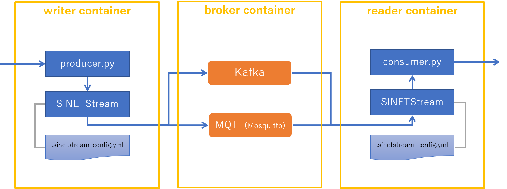

**準備中** (2019-12-12 12:59:06 JST)

<!--
Copyright (C) 2019 National Institute of Informatics

Licensed to the Apache Software Foundation (ASF) under one
or more contributor license agreements.  See the NOTICE file
distributed with this work for additional information
regarding copyright ownership.  The ASF licenses this file
to you under the Apache License, Version 2.0 (the
"License"); you may not use this file except in compliance
with the License.  You may obtain a copy of the License at

  http://www.apache.org/licenses/LICENSE-2.0

Unless required by applicable law or agreed to in writing,
software distributed under the License is distributed on an
"AS IS" BASIS, WITHOUT WARRANTIES OR CONDITIONS OF ANY
KIND, either express or implied.  See the License for the
specific language governing permissions and limitations
under the License.
--->

# チュートリアル - STEP2

## 1. 概要

このチュートリアルで実行するコンポーネントを以下の図に示します。




[index.md](index.md)に示した各コンポーネントの役割を、以下に再掲します。

* `Writer` は `SINETStream` を用いてメッセージを `Broker` に送信します
* `Reader` は `SINETStream` を用いて `Broker` からメッセージを受信します
* `Broker` は `Writer`と`Reader`の間でメッセージの集約、配送などを行い、エンドポイント間の分離を行います

STEP1のチュートリアルでは、`Writer`、`Reader`、`Broker` を同一のマシンで実行しましたが、
このチュートリアルでは、`Writer`、`Reader`、`Broker` を別々のマシンで実行します。

### 前提条件

1. チュートリアルを実行するマシン(`Writer`, `Reader`, `Broker`)に Docker Engine がインストールされていること
    - Docker Engine のインストールについてはindex.mdの前提条件の節に[参考情報](index.md#前提条件)があります。
1. `Broker`となるマシンで TCP/1883, TCP/9092 のポートが利用可能なこと
    - ブローカーがTCPの待ち受けポートとして利用します
1. `Writer`, `Reader`のマシンから`Broker`のマシンの TCP/1883, TCP/9092 にアクセス可能なこと
    - ファイアウォールなどで通信がブロックされないように設定してください

### 実行例について

このチュートリアルでは`Writer`, `Reader`, `Broker` が別のマシンになり、それぞれにホスト環境、コンテナ環境があるので６つの環境での実行例がでてきます。実行例におけるホスト名、ユーザ名などを以下の表のように定めます。

| 役割 | 環境 | ホスト名 | ユーザ名 | IPアドレス |
|---|---|---|---|---|
| Broker | ホスト環境 | host-broker | user00 | `192.168.1.XXX` |
| Reader | ホスト環境 | host-reader | user00 | - |
| Writer | ホスト環境 | host-writer | user00 | - |
| Broker | コンテナ環境 | broker | user01 | - |
| Reader | コンテナ環境 | reader | user01 | - |
| Writer | コンテナ環境 | writer | user01 | - |

ホスト環境の値については、実際にチュートリアルを実行する環境に合わせて適宜読み替えてください。

実行例を示す際は、コマンドプロンプトにホスト名、ユーザ名を示すことで、どの環境で実行しているのかを区別できるように表記しています。たとえば、`Writer`のコンテナ環境での実行例は以下のように表記します。

```console
[user01@writer]$ ls
```

プロンプトの`[]` の中の`@`の前の部分がユーザ名を、後の部分がホスト名を表しています。

`Writer` のホスト環境の場合は以下のようになります。

```console
[user00@host-writer]$ ls
```

## 2. 実行環境を準備する

`Broker`, `Reader`, `Writer` のそれぞれの環境を順に準備します。それぞれのマシンのターミナルを開き操作を行ってください。

### 2.1. Brokerを準備する

#### 2.1.1. バックエンドシステムを準備する

SINETStreamが利用するバックエンドのメッセージングシステム(Kafka, MQTT)をdockerコンテナで実行します。

`Broker`のホスト環境で以下のコマンドを実行してください。

```console
[user00@host-broker]$ docker run -d --name broker --hostname broker \
                      -p 1883:1883 -p 9092:9092 sinetstream/tutorial:1.0.0
```

コンテナが正常に起動したことを確認するために、状態を表示させます。

```console
[user00@host-broker]$ docker ps -l
CONTAINER ID        IMAGE                        COMMAND                  CREATED              STATUS              PORTS                                            NAMES
xxxxxxxxxxxx        sinetstream/tutorial:1.0.0   "/usr/local/bin/supe…"   About a minute ago   Up About a minute   0.0.0.0:1883->1883/tcp, 0.0.0.0:9092->9092/tcp   broker

```

`STATUS` が `Up` と表示されていれば、コンテナが正常に起動しています。

起動したコンテナでは、SINETStreamが利用するメッセージングシステム Kafka, MQTT(Mosquitto) のブローカーが実行されています。
コンテナで実行しているプロセスを確認してみると以下のようになります。

```console
[user00@host-broker]$ docker exec -t broker ps ax
  PID TTY      STAT   TIME COMMAND
    1 ?        Ss     0:00 /usr/bin/python3 /usr/local/bin/supervisord -n -c /et
    9 ?        Sl     0:05 java -Xmx1G -Xms1G -server -XX:+UseG1GC -XX:MaxGCPaus
   10 ?        S      0:00 /usr/sbin/mosquitto -c /etc/mosquitto/mosquitto.conf
   12 ?        Sl     0:01 java -Xmx512M -Xms512M -server -XX:+UseG1GC -XX:MaxGC
  822 pts/0    Rs+    0:00 ps ax
```

上記の実行例に表示された、それぞれのプロセスの役割を以下に示します。

* PID 1
    - いわゆる `init` プロセス
    - コンテナ内で実行するサービスの管理を行う
* PID 9
    - Kafkaブローカー
* PID 10
    - MQTT(Mosquitto)ブローカー
* PID 12
    - ZooKeeper
    - Kafkaが設定、構成情報などを保存するために利用しているサービス
* PID 822
    - プロセスリストを表示するために実行した ps コマンド

### 2.2. Readerを準備する

`Reader`を実行する環境をコンテナで用意します。

#### 2.2.1. Readerの実行環境となるコンテナを起動する

`Reader`のホスト環境で以下のコマンドを実行してください。

```console
[user00@host-reader]$ docker run -d --name reader --hostname reader -e ENABLE_BROKER=false \
                      --add-host=broker:192.168.1.xxx sinetstream/tutorial:1.0.0
```

> `192.168.1.XXX`には実際に使用する環境の`Broker`のIPアドレスを指定してください。

コンテナが正常に起動したことを確認するために、状態を表示させます。

```console
[user00@host-reader]$ docker ps -l
CONTAINER ID        IMAGE                        COMMAND                  CREATED             STATUS              PORTS                NAMES
xxxxxxxxxxxx        sinetstream/tutorial:1.0.0   "/usr/local/bin/supe…"   About a minute ago  Up About a minute   1883/tcp, 9092/tcp   reader
```

`STATUS` が `Up` と表示されていれば、コンテナが正常に起動しています。

ここで実行したコンテナイメージは`Broker`と同じものですが、コンテナ起動時に`-e ENABLE_BROKER=false`を指定することで、ブローカーが実行されないようになっています。コンテナ内のプロセスの一覧を表示してそのことを確認してみます。

```console
[user00@host-reader]$ docker exec -t reader ps ax
  PID TTY      STAT   TIME COMMAND
    1 ?        Ss     0:00 /usr/bin/python3 /usr/local/bin/supervisord -n -c /et
   30 pts/0    Rs+    0:00 ps ax
```

`Broker`コンテナでプロセス一覧を確認した時の結果と異なり、Kafkaブローカー、MQTTブローカー、ZooKeeperが実行されていないことがわかります。

`Reader`用のコンテナを起動する際に指定した `--add-host` は　`Reader`コンテナの /etc/hosts に、`Broker` の IPアドレスを登録するためのものです。Kafkaブローカーを利用するためにはサーバアドレスの名前解決が必要となるため、このパラメータの指定を追加しています。
`Reader`コンテナの /etc/hosts を表示して `Broker` のIPアドレスが登録されていることを確認します。

```console
[user00@host-reader]$ docker exec -t reader cat /etc/hosts
127.0.0.1       localhost
::1     localhost ip6-localhost ip6-loopback
fe00::0 ip6-localnet
ff00::0 ip6-mcastprefix
ff02::1 ip6-allnodes
ff02::2 ip6-allrouters
192.168.1.XXX   broker
172.17.0.3      reader
```

> `192.168.1.XXX`にはコンテナ起動時に指定した`Broker`のIPアドレスが表示されます。また reader のIPアドレスは実行環境によって異なる値が表示されます。

#### 2.2.2. SINETStreamをインストールする

SINETStreamのPython3ライブラリをコンテナ環境にインストールします。 まず`Reader`のホスト環境からコンテナ環境にはいります。

```console
[user00@host-reader]$ docker exec -it -u user01 reader bash
```

次にコンテナ環境で SINETStream のライブラリをインストールします。以下のコマンドを実行してください。

```console
[user01@reader]$ pip3 install --user sinetstream-kafka sinetstream-mqtt
Collecting sinetstream-kafka
(中略)
Successfully installed kafka-python-1.4.7 paho-mqtt-1.5.0 pycryptodome-3.9.4 sinetstream-1.0.0 sinetstream-kafka-1.0.0 sinetstream-mqtt-1.0.0
```

最後に `Successfully installed ...`と表示されていれば、ライブラリのインストールに成功しています。確認のためインストールされている Python3　ライブラリの一覧を表示してみます。

```console
[user01@reader]$ pip3 list
Package           Version
----------------- --------
kafka-python      1.4.7
paho-mqtt         1.5.0
pip               19.3.1
pycryptodome      3.9.4
PyYAML            3.12
setuptools        42.0.2
sinetstream       1.0.0
sinetstream-kafka 1.0.0
sinetstream-mqtt  1.0.0
supervisor        4.1.0
```

> SINETStream以外のライブラリの `Version` 表示については上記と異なる場合があります。

#### 2.2.3. Readerのプログラムと設定ファイルを準備する

手順を以下に示します。

1. `Reader`用のディレクトリを作成する
2. SINETStream の設定ファイルを準備する
3. `Reader`のプログラムを準備する

> この節ではコンテナ環境にてコマンドの実行を行います。`2.2.2` でコンテナ環境の操作を行っていた状態が継続されていることを想定しています。

ディレクトリを作成し、そのディレクトリに移動します。

```console
[user01@reader]$ mkdir -p ~/sinetstream/reader
[user01@reader]$ cd ~/sinetstream/reader
```

SINETStreamの設定ファイルを準備します。このチュートリアルのための設定ファイルを GitHub に用意していますので、それを取得します。

```console
[user01@reader]$ ss_url=https://raw.githubusercontent.com/nii-gakunin-cloud/sinetstream/master
[user01@reader]$ curl -O ${ss_url}/docs/tutorial/.sinetstream_config.yml
```

SINETStreamのPython3 APIを用いて作成された`Reader`のサンプルプログラムをGitHubから取得します。取得したプログラムには実行権限を付与します。

```console
[user01@reader]$ curl -O ${ss_url}/python/sample/text/consumer.py
[user01@reader]$ chmod a+x consumer.py
```

ここまでの手順が正しく行われたことを確認します。ディレクトリとファイルが以下の実行例と同じになっていることを確認してください。

```console
[user01@reader]$ pwd
/home/user01/sinetstream/reader
[user01@reader]$ ls -a
.  ..  .sinetstream_config.yml  consumer.py
```

### 2.3. Writerを準備する

`Writer`を実行する環境をコンテナで用意します。

#### 2.3.1. Writerの実行環境となるコンテナを起動する

`Writer`のホスト環境で以下のコマンドを実行してください。

```console
[user00@host-writer]$ docker run -d --name writer --hostname writer -e ENABLE_BROKER=false \
                      --add-host=broker:192.168.1.xxx sinetstream/tutorial:1.0.0
```

> `192.168.1.XXX`には実際に使用する環境の`Broker`のIPアドレスを指定してください。

コンテナが正常に起動したことを確認するために、状態を表示させます。

```console
[user00@host-writer]$ docker ps -l
CONTAINER ID        IMAGE                        COMMAND                  CREATED             STATUS              PORTS                NAMES
xxxxxxxxxxxx        sinetstream/tutorial:1.0.0   "/usr/local/bin/supe…"   About a minute ago  Up About a minute   1883/tcp, 9092/tcp   writer
```

`STATUS` が `Up` と表示されていれば、コンテナが正常に起動しています。

`Reader`コンテナの場合と同様、起動時に `-e ENABLE_BROKER=false`を指定したので、コンテナ内ではブローカーが実行されません。そのことを確認します。

```console
[user00@host-writer]$ docker exec -t writer ps ax
  PID TTY      STAT   TIME COMMAND
    1 ?        Ss     0:00 /usr/bin/python3 /usr/local/bin/supervisord -n -c /et
   31 pts/0    Rs+    0:00 ps ax
```

また`--add-host` の指定により `Writer`コンテナの /etc/hosts に `Broker` のIPアドレスが登録されていることを確認します。

```console
[user00@host-writer]$ docker exec -t writer cat /etc/hosts
127.0.0.1       localhost
::1     localhost ip6-localhost ip6-loopback
fe00::0 ip6-localnet
ff00::0 ip6-mcastprefix
ff02::1 ip6-allnodes
ff02::2 ip6-allrouters
192.168.1.XXX   broker
172.17.0.4      writer
```

> `192.168.1.XXX`にはコンテナ起動時に指定した`Broker`のIPアドレスが表示されます。また writer のIPアドレスは実行環境によって異なる値が表示されます。

#### 2.3.2. SINETStreamをインストールする

SINETStreamのPython3ライブラリをコンテナ環境にインストールします。 まず`Writer`のホスト環境からコンテナ環境にはいります。

```console
[user00@host-writer]$ docker exec -it -u user01 writer bash
```

次にコンテナ環境で SINETStream のライブラリをインストールします。以下のコマンドを実行してください。

```console
[user01@writer]$ pip3 install --user sinetstream-kafka sinetstream-mqtt
Collecting sinetstream-kafka
(中略)
Successfully installed kafka-python-1.4.7 paho-mqtt-1.5.0 pycryptodome-3.9.4 sinetstream-1.0.0 sinetstream-kafka-1.0.0 sinetstream-mqtt-1.0.0
```

最後に `Successfully installed ...`と表示されていれば、ライブラリのインストールに成功しています。確認のためインストールされている Python3　ライブラリの一覧を表示してみます。

```console
[user01@writer]$ pip3 list
Package           Version
----------------- --------
kafka-python      1.4.7
paho-mqtt         1.5.0
pip               19.3.1
pycryptodome      3.9.4
PyYAML            3.12
setuptools        42.0.2
sinetstream       1.0.0
sinetstream-kafka 1.0.0
sinetstream-mqtt  1.0.0
supervisor        4.1.0
```

> SINETStream以外のライブラリの `Version` 表示については上記と異なる場合があります。

#### 2.3.3. Writerのプログラムと設定ファイルを準備する

手順を以下に示します。

1. `Writer`用のディレクトリを作成する
2. SINETStream の設定ファイルを準備する
3. `Writer`のプログラムを準備する

> この節ではコンテナ環境にてコマンドの実行を行います。`2.3.2` でコンテナ環境の操作を行っていた状態が継続されていることを想定しています。

ディレクトリを作成し、そのディレクトリに移動します。

```console
[user01@writer]$ mkdir -p ~/sinetstream/writer
[user01@writer]$ cd ~/sinetstream/writer
```

SINETStreamの設定ファイルを準備します。このチュートリアルのための設定ファイルを GitHub に用意していますので、それを取得します。

```console
[user01@writer]$ ss_url=https://raw.githubusercontent.com/nii-gakunin-cloud/sinetstream/master
[user01@writer]$ curl -O ${ss_url}/docs/tutorial/.sinetstream_config.yml
```

SINETStreamのPython3 APIを用いて作成された`Writer`のサンプルプログラムをGitHubから取得します。取得したプログラムには実行権限を付与します。

```console
[user01@writer]$ curl -O ${ss_url}/python/sample/text/producer.py
[user01@writer]$ chmod a+x producer.py
```

ここまでの手順が正しく行われたことを確認します。ディレクトリとファイルが以下の実行例と同じになっていることを確認してください。

```console
[user01@writer]$ pwd
/home/user01/sinetstream/writer
[user01@writer]$ ls -a
.  ..  .sinetstream_config.yml  producer.py
```

## 3. Reader, Writerを実行する

`Reader`と`Writer`を実行して SINETStream を利用したメッセージの送受信が行えることを確認します。

SINETStream v1.0では、利用可能なメッセージングシステムとして[Kafka](https://kafka.apache.org/) と [MQTT(Mosquitto)](https://mosquitto.org/)をサポートしています。ここでは、まず Kafkaブローカーとメッセージの送受信が行えることを確認します。その後、設定変更のみでプログラムを変更することなくMQTTブローカーともメッセージの送受信が行えることを確認します。

### 3.1. Kafkaブローカーとの間でメッセージの送受信を行う

ここからは、`Reader`と`Writer`のプログラムを同時に実行します。実行するためのターミナルをそれぞれのマシンで開いてください。

#### Readerの実行

`Reader`のターミナルにて、ホスト環境からコンテナ環境に入ります。以下のコマンドを実行してください。
> 既にコンテナ環境に入っている場合は実行する必要はありません。

```console
[user00@host-reader]$ docker exec -it -u user01 reader bash
```

`Reader`用のディレクトリに移動してください。

```console
[user01@reader]$ cd ~/sinetstream/reader
```

`Reader`のプログラムを実行します。引数に指定している`service-tutorial-kafka`はKafkaブローカーを指定するサービス名です。

```console
[user01@reader]$ ./consumer.py -s service-tutorial-kafka
Press ctrl-c to exit the program.
: service=service-tutorial-kafka
```

コマンドラインで指定したサービス名が `:` の後に表示されます。

#### Writerの実行

`Writer`のターミナルにて、ホスト環境からコンテナ環境に入ります。以下のコマンドを実行してください。
> 既にコンテナ環境に入っている場合は実行する必要はありません。

```console
[user00@host-writer]$ docker exec -it -u user01 writer bash
```

`Writer`用のディレクトリに移動してください。

```console
[user01@writer]$ cd ~/sinetstream/writer
```

`Writer`のプログラムを実行します。引数に指定している`service-tutorial-kafka`はKafkaブローカーを指定するサービス名です。

```console
[user01@writer]$ ./producer.py -s service-tutorial-kafka
Press ctrl-c to exit the program.
: service=service-tutorial-kafka
```

コマンドラインで指定したサービス名が `:` の後に表示されます。

#### メッセージの送受信

`Writer`のターミナルにて、メッセージとなるテキストを入力し最後に改行を打ち込んでください。改行までに入力された文字列がメッセージとして Kafka ブローカーに送信されます。

`Reader`のプログラムは Kafkaブローカーに送られたメッセージを受信してターミナルに表示します。先ほど `Writer` で送信したメッセージが表示されていることを確認してください。

#### メッセージがブローカーによって配送されていることを確認する

`Writer`から送信したメッセージが `Broker` によって`Reader`に配送されていることを確認するために、ブローカーを一時的に停止してみます。

`Broker`のホスト環境で以下のコマンドを実行し`Broker`コンテナを停止させてください。

```console
[user00@host-broker]$ docker stop broker
```

`Broker`コンテナが停止した状態で `Writer` のターミナルから実行中のサンプルプログラム producer.pyでメッセージの送信を行ってください。
Kafkaブローカーが停止しているため、`Reader`側でメッセージの受信ができず`Writer`側で入力した文字列が表示されないことが確認できます。

確認が済んだら`Broker`のホスト環境で以下のコマンドを実行して`Broker`コンテナを再開させてください。

```console
[user00@host-broker]$ docker start broker
```

#### Reader, Writer の停止

`Reader` と `Writer` のサンプルプログラムを停止します。サンプルプログラムを実行しているそれぞれのターミナルで ctrl-c を打ち込んでください。

### 3.2. MQTTブローカー(Mosquitto)との間でメッセージの送受信を行う

Kafkaブローカーと同じ操作を行い、MQTTブローカーを利用した場合もメッセージの送受信が行えることを確認します。
先ほどはプログラムの引数に Kafka ブローカーを指定するサービス名として `service-tutorial-kafka`を指定しました。ここでは代わりに MQTTブローカーを指定するためのサービス名 `service-tutorial-mqtt`を指定します。

#### Readerの実行

`Reader`のターミナルにて、以下のコマンドを実行してください。

```console
[user01@reader]$ ./consumer.py -s service-tutorial-mqtt
Press ctrl-c to exit the program.
: service=service-tutorial-mqtt
```

> `Reader`のターミナルでは、コンテナ環境の`Reader`用ディレクトリにいることを想定しています。

#### Writerの実行

`Writer`のターミナルにて、以下のコマンドを実行してください。

```console
[user01@writer]$ ./producer.py -s service-tutorial-mqtt
Press ctrl-c to exit the program.
: service=service-tutorial-mqtt
```

> `Writer`のターミナルでは、コンテナ環境の`Writer`用ディレクトリにいることを想定しています。

#### メッセージの送受信

Kafkaブローカーの場合と同様の操作を行い、MQTTブローカーを用いた場合もメッセージの送受信が行えることを確認します。
`Writer`のターミナルから文字列を入力して改行を打ち込むと`Reader`のターミナルに入力した文字列に対応するメッセージが表示されることを確認してください。

#### Reader, Writer の停止

メッセージの送受信が行えたことを確認したら `Reader` と `Writer` のサンプルプログラムを停止します。それぞれのターミナルで ctrl-c を打ち込んでください。

### 3.3. コンテナの停止、削除

最後にこのチュートリアルで使用したコンテナの停止、削除を行います。

コンテナの操作はホスト環境で実行します。コンテナ環境からホスト環境に戻る場合は `exit` を実行してください。
例えば `Reader`のターミナルでコンテナ環境からホスト環境に戻る場合、以下のようになります。

```console
[user01@reader]$ exit
exit
[user00@host-reader]$
```

ホスト環境に戻ったら、それぞれのマシンで以下のコマンドを実行してください。

`Broker`
```console
[user00@host-broker]$ docker stop broker
[user00@host-broker]$ docker rm broker
```

`Reader`
```console
[user00@host-reader]$ docker stop reader
[user00@host-reader]$ docker rm reader
```

`Writer`
```console
[user00@host-writer]$ docker stop writer
[user00@host-writer]$ docker rm writer
```

## 4. SINETStreamについて

チュートリアルで使用した SINETStream の設定ファイルとAPIについて簡単な説明を行います。

> この章の記述は STEP1 のものと全く同じ内容になっています。

### 4.1. 設定ファイル

`Reader`, `Writer` で使用した SINETStream の設定ファイル `.sinetstream_config.yml` の内容を以下に示します。

```yaml
service-tutorial-kafka:
    type: kafka
    brokers: "broker:9092"
    topic: topic-tutorial-kafka
    value_type: text

service-tutorial-mqtt:
    type: mqtt
    brokers: "broker:1883"
    topic: topic-tutorial-mqtt
    value_type: text
```

設定ファイルは階層化したキー、バリューをYAMLの形式で記述しています。

トップレベルのキーには SINETStreamでサービス名と呼んでいる名前を記しています。
上記の例では `service-tutorial-kafka`、 `service-tutorial-mqtt` がこれにあたります。
サービス名はブローカーとの接続に関する種々のパラメータをまとめて扱うためのラベル名になります。
`Reader`, `Writer`のサンプルプログラムを実行する際に指定したサービス名は、設定ファイルに記述した、この値に対応しています。

サービス名の子要素にブローカーとの接続に関する具体的なパラメータを記述します。サービス名`service-tutorial-kafka` に対応するパラメータは以下の部分になります。

```yaml
    type: kafka
    brokers: "broker:9092"
    topic: topic-tutorial-kafka
    value_type: text
```

各パラメータに関する簡単な説明を以下に記します。

* type
    - メッセージングシステムの種別を指定します
    - SINETStream v1.0 で指定できる値は `kafka`, `mqtt` のどちらかになります
* brokers
    - ブローカーのアドレスを指定します
    - アドレスの書式はホスト名とポート番号を `:` で繋げたものとします
* topic
    - メッセージを送受信する対象となるトピックを指定します
* value_type
    - メッセージの種別を指定します
    - 指定できる値は以下のいずれかになります
        - text
        - byte_array
    - チュートリアルで用いた `text` はメッセージが文字列型であることの指定になります

設定ファイルに関する詳細については[ユーザガイド](../userguide/config.md)を参照してください。

### 4.2. SINETStream API

#### Reader

`Reader`のサンプルプログラムconsumer.py で SINETStream API を使用している箇所を以下に示します。

```python
with MessageReader(service) as reader:
    for message in reader:
        print(f"topic={message.topic} value='{message.value}'")
```

> サンプルプログラムconsumer.py 全体のコードは[GitHub](https://github.com/nii-gakunin-cloud/sinetstream/blob/master/python/sample/text/consumer.py)で確認できます。

はじめにメッセージを受信するための `MessageReader` のオブジェクトを作成します。その際、引数としてサービス名を指定します。
`MessageReader`は通常Pythonのwith文で実行します。
これにより、ブローカーとの接続、切断が with文のブロックの境界で実行されます。
with文が返した値 `reader` はイテラブルなオブジェクトになっています。for文などにより`reader`から順次取得した値が、ブローカーから受信したメッセージとなります。

#### Writer

`Writer`のサンプルプログラムproducer.py で SINETStream API を使用している箇所を以下に示します。

```python
with MessageWriter(service) as writer:
    while True:
        message = get_message()
        writer.publish(message)
```

> サンプルプログラムproducer.py 全体のコードは[GitHub](https://github.com/nii-gakunin-cloud/sinetstream/blob/master/python/sample/text/producer.py)で確認できます。

メッセージを送信するための `MessageWriter` のオブジェクトを作成します。その際、引数としてサービス名を指定します。
`MessageWriter`は通常Pythonのwith文で実行します。
これにより、ブローカーとの接続、切断が with文のブロックの境界で実行されます。
with文が返した値 `writer` に対して `.publish(message)`を呼び出すことでメッセージをブローカーに送信することができます。

SINETStreamのPython APIに関する詳細については[ユーザガイド](../userguide/api-python.md)を参照してください。
