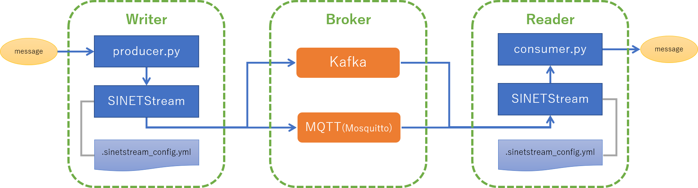

<!--
Copyright (C) 2020 National Institute of Informatics

Licensed to the Apache Software Foundation (ASF) under one
or more contributor license agreements.  See the NOTICE file
distributed with this work for additional information
regarding copyright ownership.  The ASF licenses this file
to you under the Apache License, Version 2.0 (the
"License"); you may not use this file except in compliance
with the License.  You may obtain a copy of the License at

  http://www.apache.org/licenses/LICENSE-2.0

Unless required by applicable law or agreed to in writing,
software distributed under the License is distributed on an
"AS IS" BASIS, WITHOUT WARRANTIES OR CONDITIONS OF ANY
KIND, either express or implied.  See the License for the
specific language governing permissions and limitations
under the License.
--->

[日本語](index.md)

**準備中** (2020-06-05 19:08:22 JST)

# Quick Start Guide

## Preface

In this tutorial you can try the following things.

* Installing `SINETStream`
* Send/receive messages to/from a messaging system (Kafka or MQTT) via `SINETStream`.

The following configuration will be established through this tutorial.

* `Writer` sends messages to `Broker` via `SINETStream`
* `Reader` receives messages from `Broker` via `SINETStream`
* `Broker` aggregates and delivers messages from `Writer` to `Reader`, and separates the endpoints from each other.

A Docker [container image](https://hub.docker.com/r/sinetstream/tutorial) is provided to easily prepare the above configuration.
By using this container image, you can easily set up the Kafka broker and the MQTT broker (`Mosquitto`).

## Prerequisites

To complete this tutorial, you must meet the following requirements.

* The execution environment, e.g., your laptop computer, must be connected to the Internet for downloading libraries and Docker containers.
* Docker Engine must be installed in the execution environment for preparing the execution environment of `Broker` and `SINETStream`.

If Docker Engine is not installed in the execution environment, please refer to the Docker's official website and install it.
The following links to installation instructions for Docker Engine on major platforms are provided for reference.

### Links to Docker Engine installation instructions

Below are the official Docker site that shows the installation procedure on typical platforms.

* macOS
    - [Install Docker Desktop on Mac](https://docs.docker.com/docker-for-mac/install/)
* Microsoft Windows 10
    - [Install Docker Desktop on Windows](https://docs.docker.com/docker-for-windows/install/)
* CentOS(x86_64)
    - [Get Docker Engine - Community for CentOS](https://docs.docker.com/install/linux/docker-ce/centos/)

For other operating systems, please refer to the links listed on the supported platforms on the official Docker website.

## Running the tutorial

Two procedures with different component arrangements are provided.

* [STEP1](TUTORIAL-STEP1.en.md)
    - Setup `Writer`, `Broker`, and `Reader` together in a single machine
* [STEP2](TUTORIAL-STEP2.en.md)
    - Setup `Writer`, `Broker`, and `Reader` on each separate machines

Each step is described on the linked page above.
The two steps are independent, so you can try one or both of them.
