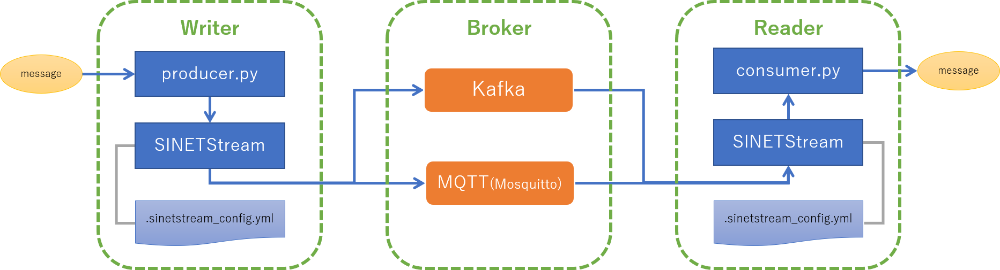

**準備中** (2019-12-12 16:54:49 JST)

<!--
Copyright (C) 2019 National Institute of Informatics

Licensed to the Apache Software Foundation (ASF) under one
or more contributor license agreements.  See the NOTICE file
distributed with this work for additional information
regarding copyright ownership.  The ASF licenses this file
to you under the Apache License, Version 2.0 (the
"License"); you may not use this file except in compliance
with the License.  You may obtain a copy of the License at

  http://www.apache.org/licenses/LICENSE-2.0

Unless required by applicable law or agreed to in writing,
software distributed under the License is distributed on an
"AS IS" BASIS, WITHOUT WARRANTIES OR CONDITIONS OF ANY
KIND, either express or implied.  See the License for the
specific language governing permissions and limitations
under the License.
--->

# クイックスタートガイド

このチュートリアルでは以下のことを試すことができます。

* SINETStreamのインストール
* メッセージングシステム(Kafka, MQTT)に対してSINETStreamを用いたメッセージの送受信を行う

チュートリアルで実行するコンポーネントは以下の図のような構成となります。

* `Writer` は `SINETStream` を用いてメッセージを `Broker` に送信します
* `Reader` は `SINETStream` を用いて `Broker` からメッセージを受信します
* `Broker` は `Writer`と`Reader`の間でメッセージの集約、配送などを行い、エンドポイント間の分離を行います

上記の構成を簡単に準備するためにdocker の[コンテナイメージ](https://hub.docker.com/r/sinetstream/tutorial)を用意しました。このコンテナイメージを利用することでKafkaブローカーやMQTTブローカー(Mosquitto)などのセットアップが簡単に行えます。

## 前提条件

このチュートリアルを実行するためには、以下の条件を満たす必要があります。

* 実行環境がインターネットに接続できること
	- ライブラリや docker コンテナを取得するためにインターネットへの接続が必要となります
* 実行環境にDocker Engine がインストールされていること
	- dockerコンテナを利用してブローカーや SINETStream の実行環境を準備します

実行環境に Docker Engine がインストールされていない場合は、Dockerの公式サイトなどを参照のうえインストールしてください。参考のために主なプラットフォームにおけるDocker Engineのインストール手順へのリンクをこのあとに記載しました。

### Docker Engine インストール手順へのリンク

代表的なプラットフォームにおけるインストール手順を示したDocker公式サイトへのリンクを以下に記します。

* macOS
    - [Install Docker Desktop on Mac](https://docs.docker.com/docker-for-mac/install/)
* Microsoft Windows 10
    - [Install Docker Desktop on Windows](https://docs.docker.com/docker-for-windows/install/)
* CentOS(x86_64)
    - [Get Docker Engine - Community for CentOS](https://docs.docker.com/install/linux/docker-ce/centos/)

その他のOSについてはDocker公式サイトの[Supported platforms](https://docs.docker.com/install/#supported-platforms) に記載されているリンク先などを参照してください。

## チュートリアルの実行

コンポーネントの配置が異なる２つの手順を用意しました。

* [STEP1](TUTORIAL-STEP1.md)
    - `Writer`, `Broker`, `Reader` の全てを１つのマシンで実行する
* [STEP2](TUTORIAL-STEP2.md)
    - `Writer`, `Broker`, `Reader` を別々のマシンで実行する

それぞれの手順は上記のリンク先のページに記されています。2つの手順は独立していますので、どちらか一方のみを試すこともできますし、順々に両方を試すこともできます。
