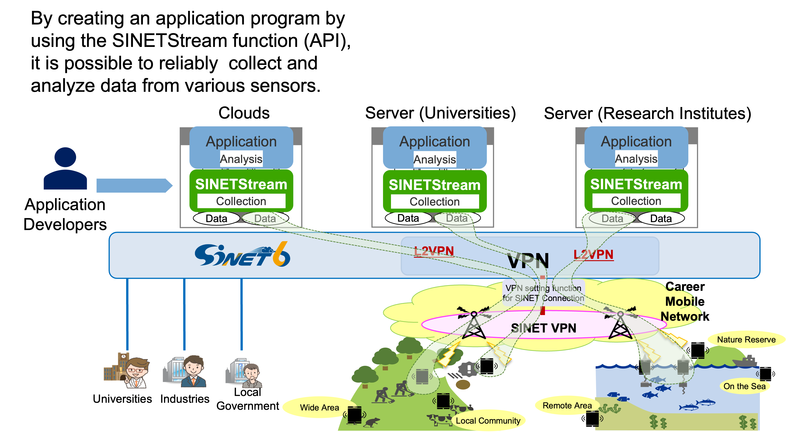

**準備中** (2020-06-05 14:26:44 JST)

<!--
Copyright (C) 2020 National Institute of Informatics

Licensed to the Apache Software Foundation (ASF) under one
or more contributor license agreements.  See the NOTICE file
distributed with this work for additional information
regarding copyright ownership.  The ASF licenses this file
to you under the Apache License, Version 2.0 (the
"License"); you may not use this file except in compliance
with the License.  You may obtain a copy of the License at

  http://www.apache.org/licenses/LICENSE-2.0

Unless required by applicable law or agreed to in writing,
software distributed under the License is distributed on an
"AS IS" BASIS, WITHOUT WARRANTIES OR CONDITIONS OF ANY
KIND, either express or implied.  See the License for the
specific language governing permissions and limitations
under the License.
--->

[日本語](index.md)

## What is SINETStream

It is required to collect data from sensors and other devices distributed over a wide area network without loss for reliable analysis in such research areas as environmental measurement, biological observation, and Internet of things (IoT).
However, advanced knowledge and skills about networking are required to develop a program that collects and analyzes data distributed over a wide area network.
It is difficult for average researchers who want to focus on their own research topics.
SINETStream is a software package that makes it easy for researchers to reliably collect and analyze data via wide area networks without loss.
SINETStream provides such functions as follows:

* Write data collected from sensors etc. to cloud servers or to on-premises servers in universities etc.
* Read the data stored in the servers into your analysis program.

A researcher can easily develop his/her own programs that collect and analyze data distributed over a wide area network using the SINETStream API.
Research data may contain sensitive information.
SINETStream also supports authentication of sensor devices and encryption of data and communication to enable a secure data collection.

## Use of SINETStream

To use SINETStream, please complete a user registration.
Registered user will be notified of new SINETStream releases, bug fixes, FAQ, etc.
Please register from the link below.

* [User registration & contact](https://reg.nii.ac.jp/m/sinetstream_user_registration)

## How SINETStream works

Please refer to the following link for details on the structure and operating environment of SINETStream.

* [Structure of SINETStream](README.en.md)

## Live demo using SINETStream

* [Live demo of SINETStream](docs/livedemo/livedemo.en.md)
