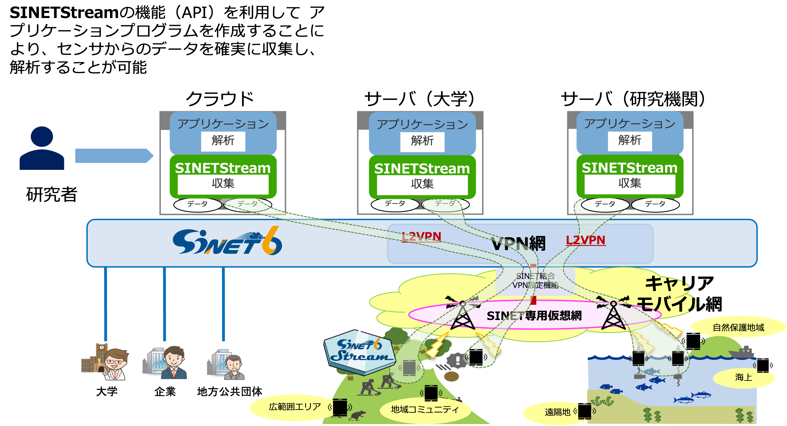

<!--
Copyright (C) 2019 National Institute of Informatics

Licensed to the Apache Software Foundation (ASF) under one
or more contributor license agreements.  See the NOTICE file
distributed with this work for additional information
regarding copyright ownership.  The ASF licenses this file
to you under the Apache License, Version 2.0 (the
"License"); you may not use this file except in compliance
with the License.  You may obtain a copy of the License at

  http://www.apache.org/licenses/LICENSE-2.0

Unless required by applicable law or agreed to in writing,
software distributed under the License is distributed on an
"AS IS" BASIS, WITHOUT WARRANTIES OR CONDITIONS OF ANY
KIND, either express or implied.  See the License for the
specific language governing permissions and limitations
under the License.
-->

[English](index.en.md)

## News

**お知らせ `2023-05-30`** [SINETStreamの1.8版を公開](docs/news/20230526-release_v18.md)いたしました。 
お知らせ `2022-09-22` [SINETStreamの1.7版を公開](docs/news/20220922-release_v17.md)いたしました。 
お知らせ `2022-04-27` [SINETStreamデモパッケージ最新版公開](docs/news/20220427-release-demo.md)いたしました。 
お知らせ `2021-12-23` [SINETStreamの1.6版を公開](docs/news/20211223-release_v16.md)いたしました。 
お知らせ `2021-03-24` [SINETStreamの1.5版を公開](docs/news/20210324-release_v15.md)いたしました。 
お知らせ `2020-10-08` [SINETStreamの1.4版を公開](docs/news/20200731-release_v14.md)いたしました。 
お知らせ `2020-10-07` SINETStreamのgithubのデフォルトブランチがmasterからmainに変わりました。 
お知らせ `2020-07-31` [SINETStreamの1.3版を公開](docs/news/20200731-release_v13.md)いたしました。 
お知らせ `2020-06-09` [SINETStreamの1.2版を公開](docs/news/20200609-release_v12.md)いたしました。 

## SINETStreamとは

環境測定、生体観測、IoTなど、広域に分散したデータを活用する研究では、広域ネットワークを介して、センサー等から取得されるデータを欠損なく確実に収集し、解析に用いることが求められます。
しかし、データの収集や解析を行いたい研究者にとって、広域ネットワークを介してデータを収集・解析するプログラムを作成することは、ネットワークに関する高度な知識やプログラミングスキルが必要とされ、容易ではありません。
SINETStreamは、広域ネットワークを介してデータを欠損なく確実に収集・解析するための機能を提供するソフトウェアパッケージです。
具体的には

* センサー等から収集されるデータをクラウドや大学などに設置されたサーバへ書き込む
* サーバに収集されたデータを解析プログラムに読み込む

といった機能を提供します。
研究者は、SINETStreamが提供するAPIを利用すると、広域ネットワークを介したデータの収集・解析を行うためのプログラムを容易に開発することができます。
また、研究に用いられるデータには機微な情報が含まれる場合もありますが、SINETStreamには通信やデータの暗号化、センサー等のデバイスの認証を行う機能も含んでいるため、安全な広域データ収集を実現できます。

 
<a href="https://www.youtube.com/watch?v=Z0wlUi4lr6c">広域データ収集基盤・SINETStream紹介ビデオ</a>
 
<iframe width="560" height="315" src="https://www.youtube.com/embed/Z0wlUi4lr6c" frameborder="0" allow="accelerometer; autoplay; encrypted-media; gyroscope; picture-in-picture" allowfullscreen></iframe>

## SINETStreamの事例紹介

 
<a href="https://www.youtube.com/watch?v=NAPdXjJIqrw">トレーラー型動物施設 [徳島大学 バイオイノベーション研究所]</a>
 
<iframe width="560" height="315" src="https://www.youtube.com/embed/NAPdXjJIqrw" frameborder="0" allow="accelerometer; autoplay; encrypted-media; gyroscope; picture-in-picture" allowfullscreen></iframe>

## SINETStreamの利用

SINETStreamのご利用にあたり、ユーザ登録をお願いしております。
ユーザ用メーリングリストからSINETStreamに関するリリース、バグフィックス情報、
FAQのご紹介等の情報提供をさせていただきます。
下記よりご登録お願いいたします。

* [ユーザ登録・問い合わせ先](https://reg.nii.ac.jp/m/sinetstream_user_registration)

## ドキュメント

SINETStreamの仕組みや動作環境などの詳細については以下のリンク先を参照してください。
* [ドキュメント](README.md)

## チュートリアル

* [クイックスタートガイド (Python/Java版)](docs/tutorial/index.md)
* [クイックスタートガイド (Android版)](docs/tutorial-android/index.md)
* [SINETStreamデモパッケージ](https://github.com/nii-gakunin-cloud/sinetstream-demo)

 
<a href="https://www.youtube.com/watch?v=2Wjjvs3fJ9g">SINETStreamチュートリアルデモ動画</a>
 
<iframe width="560" height="315" src="https://www.youtube.com/embed/2Wjjvs3fJ9g" frameborder="0" allow="accelerometer; autoplay; encrypted-media; gyroscope; picture-in-picture" allowfullscreen></iframe>

## SINETStreamを利用したライブデモ

* [SINETStreamのライブデモ](docs/livedemo/livedemo.md)

## 関連情報

- [SINETStream https://sinetstream.net/](https://sinetstream.net/)  
- A. Takefusa, J. Sun, I. Fujiwara, H. Yoshida, K. Aida and C. Pu,  
"SINETStream: Enabling Research IoT Applications with Portability, Security and Performance Requirements,"
2021 IEEE 45th Annual Computers, Software, and Applications Conference (COMPSAC), pp. 482-492, 2021.
doi: 10.1109/COMPSAC51774.2021.00073.
- [SINETStream外部発表](https://ccrd.nii.ac.jp/publications/jp.html#sinetstream)
- [国立情報学研究所 クラウド支援室](https://cloud.gakunin.jp/)
- [モバイルSINET](https://www.sinet.ad.jp/wadci)

## プライバシーポリシー

本サイトでは、より使いやすいウェブページへの改善の参考とするため、利用者のアクセス状況（アクセス日時、端末情報、ホスト名など）をアクセスログ（Google Analyticsほか）として記録しています。
これは利用者を特定できる情報ではありません。
またこれらのデータを法令に基づく場合を除き、外部の第三者に提供することはありません。
