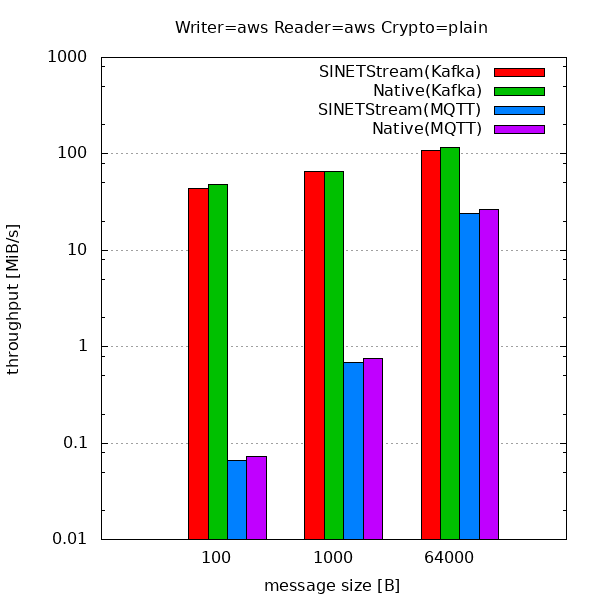
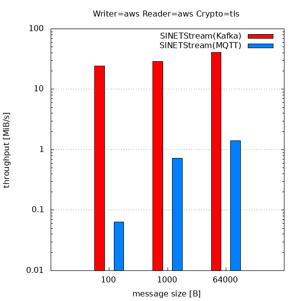
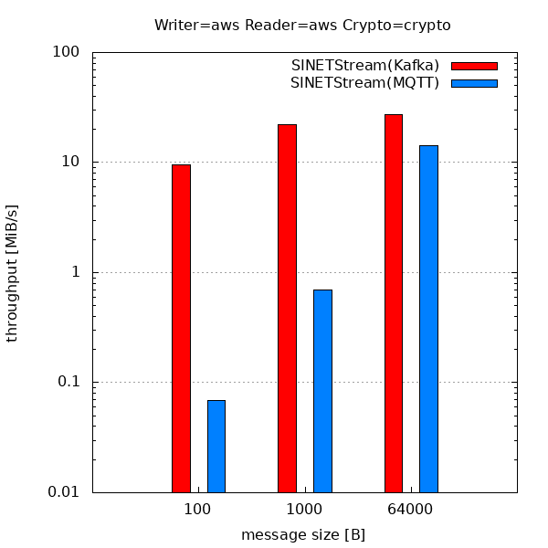
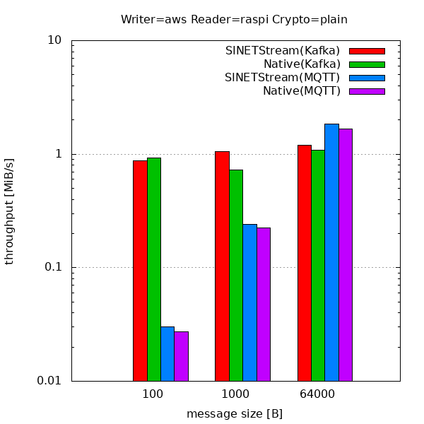
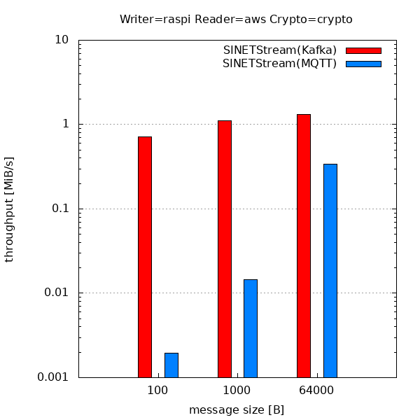
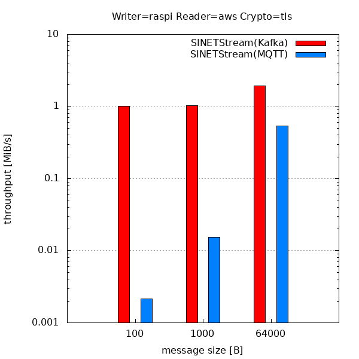

# SINETStream性能測定結果

公開日: 2019年12月13日

本サイトでは、国立情報学研究所クラウド基盤研究開発センターのSINETStream開発チームが
実施したSINETStreamの性能測定結果を掲載します。性能測定結果は順次更新していく予定です。

## 測定方法・環境

以下の3種類のプログラムを用意し、SINETStreamを介したデータの書き込みから読み込みまでの性能を測定しました。

* Writer: Brokerへのデータの書き込み
* Broker: SINETStreamのブローカーでバックエンドシステムとしてKafkaを用いるものとMQTTを用いるものを用意
* Reader: Brokerからのデータの読み込み

測定環境は以下のとおりです。

### LAN環境

Writer, Broker, Reader全てを同一のLANに接続されたサーバに配置し、全ての通信をLAN経由で実施

* サーバ仕様: Amazon EC2 m5.large AZ=ap-northeast-1a vCPU=2 CentOS7
* ネットワーク仕様: 最大10Gbps

### モバイル環境

WriterまたはReaderをSINETのモバイル網に接続されたデバイスに配置し、Writer-Broker間またはBroker-Reader間の通信をモバイル網経由で実施

* デバイス仕様: Raspberry Pi 3 Model B Plus Rev 1.3
* ブローカーの配置はLAN環境と同様

### ソフトウェア

* kafka_2.12-2.3.0 (Kafkaブローカー)
* mosquitto-1.6.2 (MQTTブローカー)
* SINETStream 0.9.7

## モバイルネットワークの通信性能

### ping(RTT)

| source → destination | 最小 | 平均 | 最大 | 標準偏差 |
| ---: | ---: | ---: | ---: | ---: |
| raspi → aws | 28.049 ms | 37.384 ms | 47.254 ms | 5.403 ms |

### iperf3(スループット)

| source → destination | 平均スループット |
| ---: | ---: |
| raspi → aws | 12.1 Mbits/s |
| aws → raspi | 9.90 Mbits/s |

## SINETStreamの性能

SINETStreamのバックエンドとして使用しているKafka、MQTTをそのまま利用する場合(Native)、
SINETStream(バックエンドとしてKafkaまたはMQTTを使用)の性能測定結果を示します。

横軸は送信するメッセージサイズ（100B, 1KB, 64KB）、縦軸はスループットを示します。

モバイル環境での評価結果は、モバイルネットワークの性能に律速されていると考えられます。

1. SINETStreamとNativeの比較 (LAN環境、暗号化なし)
   
1. SINETStreamの性能 (LAN環境、TLSによる通信暗号化)
   
1. SINETStreamの性能 (LAN環境、データの暗号化)
   
1. SINETStreamとNativeの比較 (Reader側モバイル環境、暗号化なし)
   
1. SINETStreamの性能（Reader側モバイル環境、TLSによる通信暗号化)
   
1. SINETStreamの性能（Reader側モバイル環境、データの暗号化)
   
1. SINETStreamとNativeの比較 (Writer側モバイル環境、暗号化なし)
   
1. SINETStreamの性能（Writer側モバイル環境、TLSによる通信暗号化)
   
1. SINETStreamの性能（Writer側モバイル環境、データの暗号化)
   

